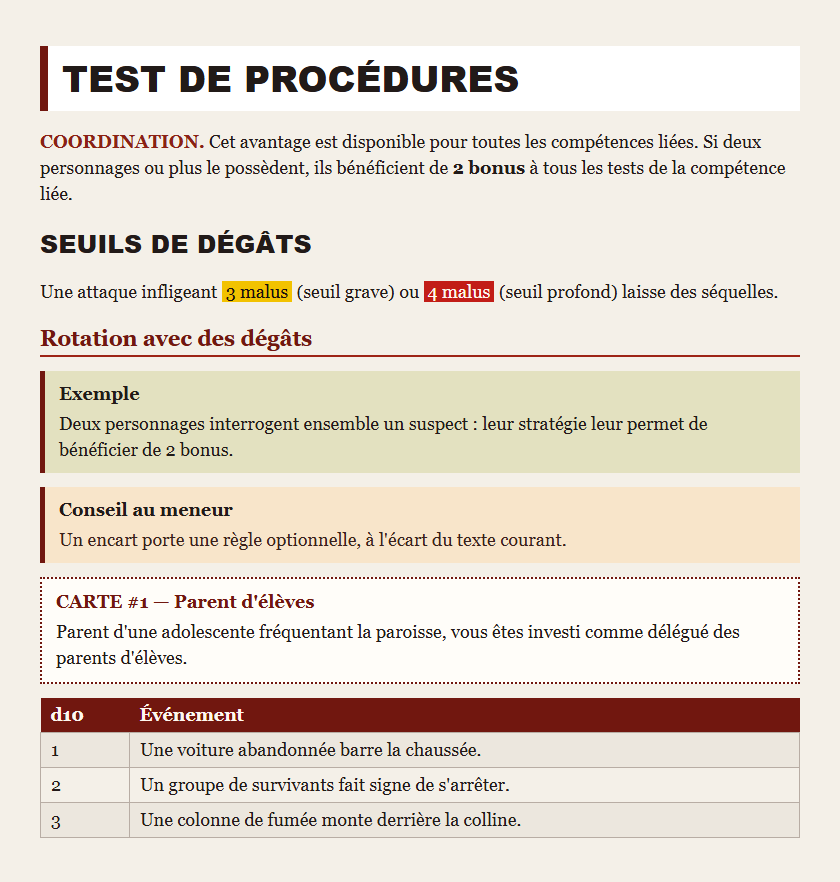
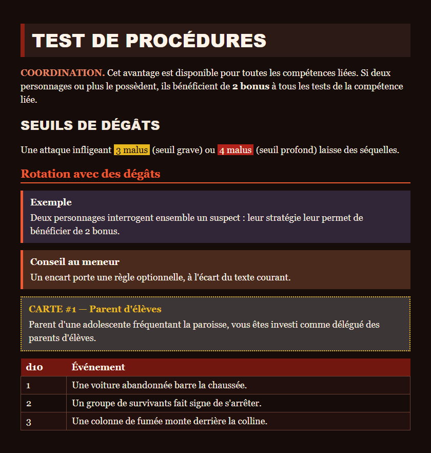

# Schema Adrenaline

_Schémas de données ouverts et versionnés pour l'Adrenaline System, le moteur d100 de Damien Coltice derrière Zombiology : fiches de personnage, PNJ et monstres échangés en JSON ou TOML entre Handbook, Lantern et les autres outils, sans format propriétaire._

## État du projet

Ce dépôt déclare `schema-adrenaline@3.3.0` et la baseline de schéma `3.1.0`
(additive au contrat 3). Les consommateurs épinglent une archive de release
publiée, pas la branche mouvante.

- _Ça marche aujourd'hui :_ trois schémas de personnage (`pj`, `pnj`, `monstre`) avec exemples JSON et TOML, un corpus de conformité partagé, des codecs TypeScript, et le pack Handbook (thèmes, polices, callouts)
- _Pas encore :_ les catalogues de jeu (formations, compétences, armes) ne sont volontairement pas énumérés ; aucun schéma n'existe pour les règles, seulement pour les fiches
- _Prochaine étape :_ l'intégration propre à Lantern vivra sous `lantern/` quand cet outil en aura besoin

## Aperçu

Le pack Handbook donne à chaque fiche la mise en page des livrets Zombiology, en polarité claire et sombre. Ces deux captures sont rendues par Playwright à partir des jetons, polices et textures de `handbook/adrenaline/pack.json` : c'est une mise en page de référence construite depuis le pack, pas une capture d'Obsidian.




## Ce que les outils apportent

Ce dépôt décrit les données. Ce sont **Handbook** et **Lantern** qui les rendent, les éditent et les rendent jouables. Chaque fonctionnalité ci-dessous vit dans l'outil indiqué, pas ici.

### Handbook (plugin Obsidian)

[Handbook](https://github.com/RebelliousSmile/obsidian-handbook) installe le pack Adrenaline depuis ce dépôt. Il fournit :

- **Thèmes clair et sombre** : couleurs, titres, tableaux, surfaces et textures de page du pack, dans les deux polarités
- **Polices du pack** : Adrenaline Body, Adrenaline Display et une police manuscrite, chargées localement
- **Fiches** : rendu des documents `pj`, `pnj` et `monstre` selon l'annotation de présentation du schéma
- **Callouts visuels** : exemple, description, encart, rôle, formation, action, roller et mention (voir [`callout-contract.md`](handbook/adrenaline/callout-contract.md))
- **Dés** : clic droit sur un tableau placé dans un callout `roller` pour tirer un résultat, avec le plugin Dice Roller
- **Colonnes** : régions multi-colonnes dans une note, repliées sur une colonne quand le volet de lecture est étroit
- **Sections en mode alterné** : une partie de note affichée dans le mode opposé (sombre dans une note claire, et inversement)
- **Export PDF** : mise en page de la fiche PJ Zombiology telle que la fiche papier la dispose, et option d'export sur papier blanc

La [documentation de Handbook](https://github.com/RebelliousSmile/obsidian-handbook/wiki) détaille chacune de ces fonctions.

### Lantern (application web)

[Lantern](https://github.com/RebelliousSmile/lantern) permet de **créer des fiches** Adrenaline System (personnages joueurs, PNJ, monstres) :

- édition structurée avec aperçu en direct de la fiche imprimée
- import et export TOML, conformes à ces schémas
- export PNG pour le partage et l'impression
- stockage local dans le navigateur, sans compte

## Schémas publiés

Ils vivent sous `adrenaline` plutôt que sous un dossier de jeu : ils décrivent le moteur, que partagent tous les jeux qui l'utilisent. Un dossier de jeu ne contient que ce qui lui est propre.

| Schéma                                   | Couvre                                                                                                                                                                                                                                            |
| ---------------------------------------- | ------------------------------------------------------------------------------------------------------------------------------------------------------------------------------------------------------------------------------------------------- |
| `schemas/adrenaline/pj.schema.json`      | Une fiche de personnage joueur, bloc par bloc comme la fiche imprimée : nom, huit caractéristiques, quatre seuils physiques et quatre mentaux avec leur valeur couverte, protections, formations et compétences, équipement et paramètres de jeu. |
| `schemas/adrenaline/pnj.schema.json`     | Une fiche de personnage non joueur : seul le nom est requis, tout le reste est optionnel, d'un figurant nommé avec un niveau de danger et une ligne en italique jusqu'à un personnage majeur entièrement chiffré.                                 |
| `schemas/adrenaline/monstre.schema.json` | Une fiche de créature : nom et quatre caractéristiques physiques requis, mentales optionnelles, avec un état alternatif, un bloc de contagion générique et un bloc narratif.                                                                      |

### Ce qu'ils ne portent pas

Une fiche enregistre un profil durable et peut porter un bloc optionnel `etatDePartie` pour l'état d'une séance : dés de stress, jauges de malus et blessures persistantes avec leur localisation et leur durée, sans remplacer le profil de référence. Les valeurs numériques jouables portent `minimum`, `current` et `maximum`.

Les seuils sont stockés tels qu'ils sont lus, jamais recalculés. Le moteur les dérive (léger = base + chiffre des dizaines de deux caractéristiques, grave = léger + 5, profond = léger + 10), mais deux fiches publiées s'écartent de cette dérivation d'un point : le schéma enregistre ce que la fiche imprime.

**Ces schémas décrivent la forme d'une fiche, pas son contenu.** Ils n'énumèrent aucune formation, aucune compétence, aucune arme, aucun trait et aucune créature. Chacun de ces noms est une chaîne libre, parce que ces catalogues appartiennent à chaque jeu et à son éditeur, pas au moteur. Seul ce que le moteur fixe lui-même est fermé : les huit caractéristiques, les douze localisations de touche, les quatre seuils de dégâts.

### Présentation et adaptateurs

La baseline `2.2.0` ajoute une annotation `x-adrenaline-presentation` à la racine de chaque JSON Schema. Elle donne aux consommateurs la capability stable `block:adrenaline-*`, les sections et blocs ordonnés, leurs chemins dans le document, des formes de mise en page finies et une apparence Zombiology liée aux jetons et aux polices du pack. L'annotation est une métadonnée de schéma : un document utilisateur ne doit contenir ni champ `presentation` ni champ `adapter`, et les schémas stricts et les codecs rejettent les deux.

Les plages jouables exposent `minimum`, `current` et `maximum` à l'éditeur. La fiche visible affiche `current` par défaut ; les caractéristiques du PJ affichent en plus `minimum` comme valeur de création ; `maximum` n'est jamais affiché. Les bornes de saisie viennent directement des `minimum` et `maximum` JSON Schema de chaque propriété : un moteur de rendu ne doit pas les dupliquer. Le descripteur ne nomme jamais de composant React, de chemin de module, de classe CSS ni de configuration exécutable.

## Contenu du dépôt

- `src/zod/` : les définitions Zod v4 sources, chacune exportant son type TypeScript inféré à côté du schéma
- `schemas/` : les JSON Schemas générés
- `examples/` : des exemples JSON et TOML par schéma
- `corpus/temoins/` : un document légitime par schéma, qui doit valider
- `corpus/refus/` : un document mal formé par défaut, que chaque schéma doit rejeter
- `tools/` : scripts de génération, de validation et d'audit
- `handbook.json` : publie le dépôt comme catalogue Handbook versionné
- `handbook/adrenaline/` : le pack de jeu déclaratif que Handbook copie depuis ce catalogue, sans code exécutable ni feuille de style externe, avec une version indépendante de celle du contrat

## Installer dans Handbook

Handbook 2.7.0 ou plus récent installe ce dépôt directement. Ouvre **Réglages → Handbook → Schema sources**, choisis **Add source**, saisis `RebelliousSmile/schema-adrenaline`, sélectionne la release, le tag ou la branche à suivre, puis **Save and check**. Handbook lit `handbook.json` et installe Adrenaline avec ses fonds et ses polices.

Utilise **Check** sur la même source pour mettre à jour : Handbook télécharge ensemble le catalogue, le pack et les assets déclarés, puis remplace la source installée de façon atomique, sans copie manuelle.

La publication et la coordination des versions entre Handbook, Lantern et ce dépôt (trains de release, compatibilité minimale de l'hôte) se règlent dans [obsidian-handbook](https://github.com/RebelliousSmile/obsidian-handbook), pas ici.

## Épingler une version

`npm run gen` écrit chaque schéma deux fois :

- `schemas/adrenaline/<cible>.schema.json` : la dernière version. Son `$id` pointe sur `main`, et son contenu change quand les sources changent.
- `schemas/adrenaline/<version>/<cible>.schema.json` : une copie figée, dont le `$id` porte le numéro de version dans son propre chemin.

Pointe ton outil sur la copie figée si le document doit rester en place. Un `$id` sous `main` change de contenu sans changer d'identité : on peut le suivre, pas en dépendre.

Le versionnement passe par le chemin, jamais par un tag git : le même fichier servi depuis un tag déclarerait encore `main` comme `$id`, et son identité ne correspondrait pas à l'URL qui le sert.

## Jusqu'où faire confiance à ces schémas

Une affirmation sur un schéma ne coûte rien, donc `npm run audit` la mesure. Il rapporte et impose actuellement :

- **1260 propriétés sur 1260 portent une description** : un outil qui ne lit que `schemas/` ne rencontre jamais un champ inexpliqué.
- **Toute valeur numérique est bornée des deux côtés.** Un `z.int()` nu compile en `"maximum": 9007199254740991` ; les quatre primitives nommées de `src/zod/common/primitives.ts` fixent de vrais plafonds. Les pourcentages s'arrêtent à 200 et non à 100, parce que le moteur les laisse dépasser 100 % : au-delà, le jet réussit automatiquement et gagne en qualité.
- **Chaque schéma est un draft-7 valide et compile sous Ajv**, ce qu'un schéma insatisfiable ne ferait pas.
- **34 documents mal formés sont rejetés et 3 témoins JSON légitimes acceptés**, en plus des cas TOML indexés par `corpus/cases.json`.

Ce qu'il ne prouve pas : aucun schéma ne peut vérifier que le `total` d'une compétence égale son pourcentage plus la caractéristique contre laquelle elle se lance. Le draft-7 ne sait pas exprimer une dépendance à une valeur située dans un autre bloc. Recalcule-le, ne lui fais pas confiance.

## Provenance d'un fichier

Chaque cible porte un bloc optionnel `meta` qui enregistre l'origine de la fiche : `typeDePublication` (`officiel`, `tiers`, `communautaire`, `maison`), `source`, `auteurs`, `page` et `licence`. Il décrit le fichier. Ne le confonds pas avec `parametresDuJeu`, qui décrit la séance d'une table.

## Utiliser le contrat dans ton outil

Installe l'asset immuable de la release GitHub directement. npm enregistre cette URL complète et son intégrité SHA-512 dans le lockfile du consommateur :

```sh
npm install https://github.com/RebelliousSmile/schema-adrenaline/releases/download/v3.3.0/schema-adrenaline-3.3.0.tgz
```

### Types et codecs (applications TypeScript)

Importe le contrat public ; ne copie pas les sources Zod dans un consommateur :

```ts
import {
  ADRENALINE_DOCUMENT_CODECS,
  parsePjJson,
  parsePnjToml,
  type PersonnageJoueurValeur,
} from "schema-adrenaline";

const pj: PersonnageJoueurValeur = parsePjJson(JSON.stringify(userInputJson));
const pnj = parsePnjToml(tomlSource);
const json = ADRENALINE_DOCUMENT_CODECS.monstre.parseJson(jsonSource);
```

Les clés du registre sont `pj`, `pnj` et `monstre`. Chaque codec lit et sérialise JSON et TOML avec le même schéma Zod strict, puis vérifie `minimum ≤ current ≤ maximum` : les clés inconnues et les intervalles jouables inversés sont rejetés, pas supprimés en silence. Les schémas Zod exportés ne valident volontairement que la structure ; utilise un codec ou `validatePlayableRanges` pour le contrat portable complet.

### Valider des données (tout langage)

Utilise les JSON Schemas figés exportés par le paquet installé avec n'importe quel validateur JSON Schema (AJV, Python jsonschema, Rust jsonschema) :

```ts
import fs from "node:fs";
import Ajv from "ajv";
import addFormats from "ajv-formats";

const schemaUrl = import.meta.resolve("schema-adrenaline/schemas/pj.schema.json");
const schema = JSON.parse(fs.readFileSync(new URL(schemaUrl), "utf8"));

const ajv = new Ajv({ allErrors: true, strict: false });
addFormats(ajv);
const validate = ajv.compile(schema);

const data = JSON.parse(fs.readFileSync("path/to/data.json", "utf8"));
if (!validate(data)) console.error(validate.errors);
```

### Rejouer le kit de conformité partagé

`schema-adrenaline/corpus/cases.json` liste chaque cas accepté ou rejeté, en JSON ou en TOML. Chaque `path` se résout depuis le nom du paquet, par exemple :

```ts
const manifestUrl = import.meta.resolve("schema-adrenaline/corpus/cases.json");
const manifest = JSON.parse(fs.readFileSync(new URL(manifestUrl), "utf8"));
const firstCaseUrl = import.meta.resolve(`schema-adrenaline/${manifest.cases[0].path}`);
```

Les chemins qui commencent par `examples/` et `corpus/` sont des exports publics du paquet.

### Compatibilité et versionnement

Le contrat npm et les chemins de schéma figés suivent le versionnement sémantique. Un changement cassant d'API ou de forme de document exige une nouvelle version majeure du contrat ; une forme modifiée reçoit toujours un nouveau dossier `schemas/adrenaline/<version>/`. Les dossiers de version, tags et assets de release publiés sont immuables.

Le catalogue Handbook et le pack de jeu ont leur propre version, qui ne change que lorsque le pack change et reste volontairement indépendante de la version du contrat.

### Autocomplétion dans l'éditeur

Configure le schéma dans les réglages de ton éditeur (`json.schemas` dans VS Code, `evenBetterToml.schema.associations` pour le TOML), associé à un glob de fichiers.

N'ajoute **pas** de clé `"$schema"` dans un fichier de données situé dans `examples/` : les schémas générés portent `"additionalProperties": false` à la racine, donc cette clé fait échouer `npm run validate` sur le fichier.

## Contribuer

Les retours sur les schémas (champ manquant, écart avec la fiche imprimée) et les cas de refus sont les contributions les plus utiles à ce stade. Ouvre d'abord une issue ; la procédure complète est dans [CONTRIBUTING.md](CONTRIBUTING.md).

## Travail dérivé

Ce dépôt dérive de [4rtamis/schema-in-the-mist](https://github.com/4rtamis/schema-in-the-mist), dont il réutilise l'outillage (`tools/`, chaîne de génération et de validation) sous licence MIT. Les schémas ici lui sont propres : rien des schémas du Mist Engine n'a été copié.

## Licence

- **Code et schémas :** MIT (voir [LICENSE](./LICENSE)). La notice porte deux lignes de copyright : l'auteur d'origine de l'outillage de build et l'auteur de ce dépôt.
- **Documentation :** CC BY 4.0 (voir [ici](./LICENSES/DOCS-LICENSE.md))
- **Marques et contenu communautaire :** notice à rédiger. L'Adrenaline System et _Zombiology_ sont l'œuvre de Damien Coltice. À compléter avec les conditions exactes avant publication.
