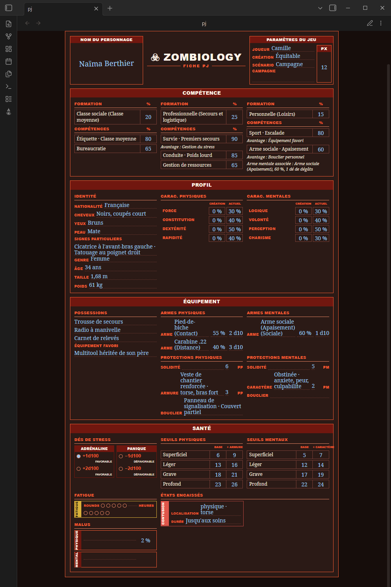
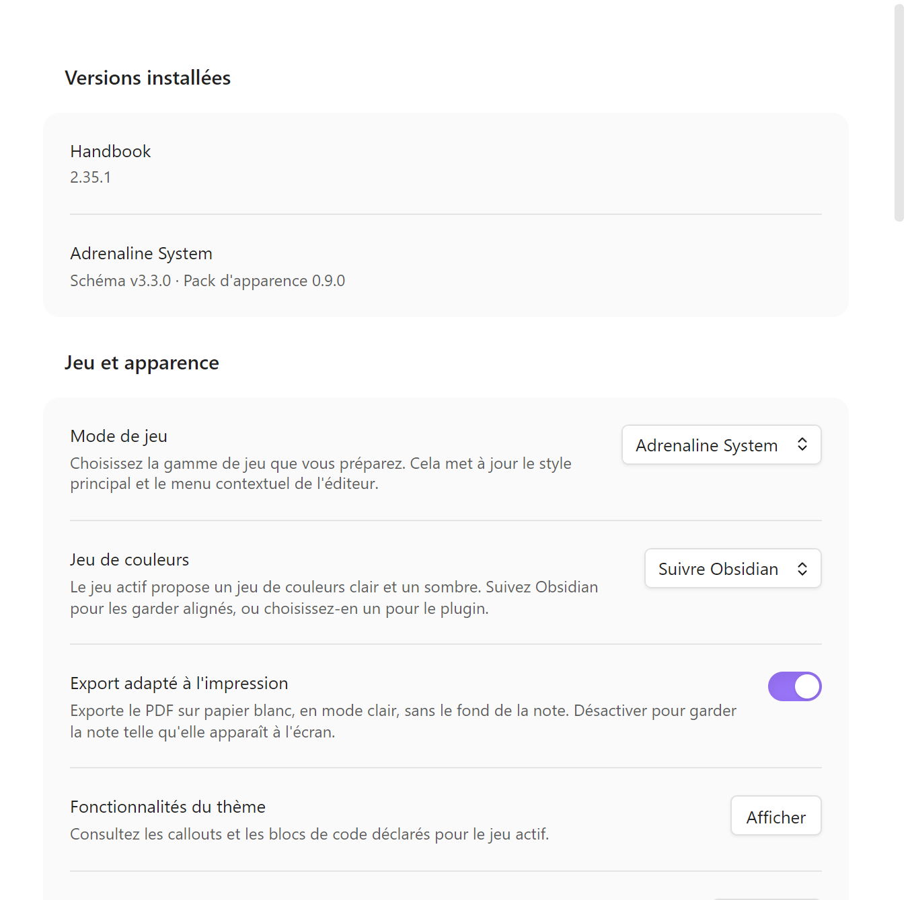
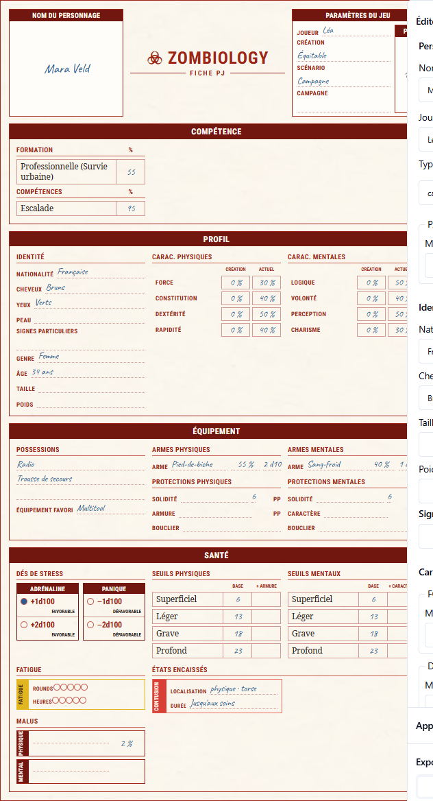

# Schema Adrenaline

_Schémas de données ouverts et versionnés pour l'Adrenaline System, le moteur d100 de Damien Coltice derrière Zombiology : fiches de personnage, PNJ et monstres échangés en JSON ou TOML entre Handbook, Lantern et les autres outils, sans format propriétaire._

## État du projet

Ce dépôt déclare `schema-adrenaline@3.4.0` et la baseline de schéma `3.2.0`
(additive au contrat 3). Les consommateurs épinglent une archive de release
publiée, pas la branche mouvante.

- _Ça marche aujourd'hui :_ trois schémas de personnage (`pj`, `pnj`, `monstre`) avec exemples JSON et TOML, un corpus de conformité partagé, des codecs TypeScript, et le pack Handbook (thèmes, polices, callouts)
- _Pas encore :_ les catalogues de jeu (formations, compétences, armes) ne sont volontairement pas énumérés ; aucun schéma n'existe pour les règles, seulement pour les fiches
- _Prochaine étape :_ l'intégration propre à Lantern vivra sous `lantern/` quand cet outil en aura besoin

## Aperçu

Une fiche de personnage Zombiology rendue dans Obsidian par Handbook, thème sombre :



Le même pack existe en polarité claire. Ces deux captures sont rendues par Playwright à partir des jetons, polices et textures de `handbook/adrenaline/pack.json` : c'est une mise en page de référence construite depuis le pack, pas une capture d'Obsidian.


## Mettre en place Adrenaline chez toi

Il te faut Obsidian et deux plugins. Compte quelques minutes ; aucun fichier à copier à la main.

### 1. Prérequis

- [Obsidian](https://obsidian.md/) 1.12.7 ou plus récent
- Les plugins communautaires activés (**Réglages → Plugins communautaires**)
- Le plugin communautaire [BRAT](https://github.com/TfTHacker/obsidian42-brat), qui installe Handbook
- Facultatif : le plugin communautaire Dice Roller, pour tirer sur les tables aléatoires

### 2. Installer Handbook

Dans BRAT, ajoute le dépôt `RebelliousSmile/obsidian-handbook`, puis active **Handbook** dans la liste des plugins.

### 3. Ajouter la source Adrenaline

Ouvre **Réglages → Handbook → Schema sources**, choisis **Add source**, saisis `RebelliousSmile/schema-adrenaline`, sélectionne la release à suivre (ou une branche), puis **Save and check**. Handbook télécharge ensemble le catalogue, le pack, les polices et les textures.

Pour mettre à jour plus tard, utilise **Check** sur la même source : le remplacement est atomique, sans copie manuelle ni redémarrage.

### 4. Choisir le jeu

Dans **Réglages → Handbook → Jeu et apparence**, règle **Mode de jeu** sur **Adrenaline System**. **Jeu de couleurs** propose le clair, le sombre, ou de suivre Obsidian. Les versions installées s'affichent en haut de la page.



### 5. Écrire et jouer

Tes notes prennent le thème Adrenaline : titres, tableaux et callouts (voir [la liste](handbook/adrenaline/callout-contract.md)). Les fiches `pj`, `pnj` et `monstre` s'affichent comme sur la capture d'en-tête. Le [guide d'écriture](https://github.com/RebelliousSmile/obsidian-handbook/wiki/Writing-Notes-FR) et les [exemples de fiches Adrenaline](https://github.com/RebelliousSmile/obsidian-handbook/wiki/Adrenaline-Sheets-FR) montrent le détail.

Pour créer une fiche sans l'écrire à la main, [Lantern](https://github.com/RebelliousSmile/lantern) propose un éditeur avec aperçu et export TOML ou PNG :



## Ce que les outils apportent

Ce dépôt décrit les données. Ce sont **Handbook** et **Lantern** qui les rendent, les éditent et les rendent jouables. Chaque fonctionnalité ci-dessous vit dans l'outil indiqué, pas ici.

### Handbook (plugin Obsidian)

[Handbook](https://github.com/RebelliousSmile/obsidian-handbook) installe le pack Adrenaline depuis ce dépôt. Il fournit :

- **Thèmes clair et sombre** : couleurs, titres, tableaux, surfaces et textures de page du pack, dans les deux polarités
- **Polices du pack** : Adrenaline Body, Adrenaline Display et une police manuscrite, chargées localement
- **Fiches** : rendu des documents `pj`, `pnj` et `monstre`
- **Callouts visuels** : exemple, description, encart, rôle, formation, action, roller et mention (voir [`callout-contract.md`](handbook/adrenaline/callout-contract.md))
- **Tables aléatoires** : clic droit sur un tableau placé dans un callout `roller` pour tirer un résultat, avec le plugin Dice Roller ; le résultat se copie pour être collé dans un autre document, comme un compte rendu de séance, sans modifier la note source
- **Colonnes** : régions multi-colonnes dans une note, repliées sur une colonne quand le volet de lecture est étroit
- **Sections en mode alterné** : une partie de note affichée dans le mode opposé (sombre dans une note claire, et inversement)
- **Export PDF** : mise en page de la fiche PJ Zombiology telle que la fiche papier la dispose, et option d'export sur papier blanc

La [documentation de Handbook](https://github.com/RebelliousSmile/obsidian-handbook/wiki) détaille chacune de ces fonctions.

### Lantern (application web)

[Lantern](https://github.com/RebelliousSmile/lantern) permet de **créer des fiches** Adrenaline System (personnages joueurs, PNJ, monstres) :

- édition structurée avec aperçu en direct de la fiche imprimée
- import et export TOML, conformes à ces schémas
- export PNG pour le partage et l'impression
- stockage local dans le navigateur, sans compte

## Schémas publiés

Ils vivent sous `adrenaline` plutôt que sous un dossier de jeu : ils décrivent le moteur, que partagent tous les jeux qui l'utilisent. Un dossier de jeu ne contient que ce qui lui est propre.

| Schéma                                   | Couvre                                                                                                                                                                                                                                            |
| ---------------------------------------- | ------------------------------------------------------------------------------------------------------------------------------------------------------------------------------------------------------------------------------------------------- |
| `schemas/adrenaline/pj.schema.json`      | Une fiche de personnage joueur, bloc par bloc comme la fiche imprimée : nom, huit caractéristiques, quatre seuils physiques et quatre mentaux avec leur valeur couverte, protections, formations et compétences, équipement et paramètres de jeu. |
| `schemas/adrenaline/pnj.schema.json`     | Une fiche de personnage non joueur : seul le nom est requis, tout le reste est optionnel, d'un figurant nommé avec un niveau de danger et une ligne en italique jusqu'à un personnage majeur entièrement chiffré.                                 |
| `schemas/adrenaline/monstre.schema.json` | Une fiche de créature : nom et quatre caractéristiques physiques requis, mentales optionnelles, avec un état alternatif, un bloc de contagion générique et un bloc narratif.                                                                      |

## Provenance d'un fichier

Chaque cible porte un bloc optionnel `meta` qui enregistre l'origine de la fiche : `typeDePublication` (`officiel`, `tiers`, `communautaire`, `maison`), `source`, `auteurs`, `page` et `licence`. Il décrit le fichier. Ne le confonds pas avec `parametresDuJeu`, qui décrit la séance d'une table.

## Utiliser le contrat dans ton outil

Installe l'asset immuable de la release GitHub directement. npm enregistre cette URL complète et son intégrité SHA-512 dans le lockfile du consommateur :

```sh
npm install https://github.com/RebelliousSmile/schema-adrenaline/releases/download/v3.3.0/schema-adrenaline-3.3.0.tgz
```

### Types et codecs (applications TypeScript)

Importe le contrat public ; ne copie pas les sources Zod dans un consommateur :

```ts
import {
  ADRENALINE_DOCUMENT_CODECS,
  parsePjJson,
  parsePnjToml,
  type PersonnageJoueurValeur,
} from "schema-adrenaline";

const pj: PersonnageJoueurValeur = parsePjJson(JSON.stringify(userInputJson));
const pnj = parsePnjToml(tomlSource);
const json = ADRENALINE_DOCUMENT_CODECS.monstre.parseJson(jsonSource);
```

Les clés du registre sont `pj`, `pnj` et `monstre`. Chaque codec lit et sérialise JSON et TOML avec le même schéma Zod strict, puis vérifie `minimum ≤ current ≤ maximum` : les clés inconnues et les intervalles jouables inversés sont rejetés, pas supprimés en silence. Les schémas Zod exportés ne valident volontairement que la structure ; utilise un codec ou `validatePlayableRanges` pour le contrat portable complet.

### Valider des données (tout langage)

Utilise les JSON Schemas figés exportés par le paquet installé avec n'importe quel validateur JSON Schema (AJV, Python jsonschema, Rust jsonschema) :

```ts
import fs from "node:fs";
import Ajv from "ajv";
import addFormats from "ajv-formats";

const schemaUrl = import.meta.resolve("schema-adrenaline/schemas/pj.schema.json");
const schema = JSON.parse(fs.readFileSync(new URL(schemaUrl), "utf8"));

const ajv = new Ajv({ allErrors: true, strict: false });
addFormats(ajv);
const validate = ajv.compile(schema);

const data = JSON.parse(fs.readFileSync("path/to/data.json", "utf8"));
if (!validate(data)) console.error(validate.errors);
```

### Rejouer le kit de conformité partagé

`schema-adrenaline/corpus/cases.json` liste chaque cas accepté ou rejeté, en JSON ou en TOML. Chaque `path` se résout depuis le nom du paquet, par exemple :

```ts
const manifestUrl = import.meta.resolve("schema-adrenaline/corpus/cases.json");
const manifest = JSON.parse(fs.readFileSync(new URL(manifestUrl), "utf8"));
const firstCaseUrl = import.meta.resolve(`schema-adrenaline/${manifest.cases[0].path}`);
```

Les chemins qui commencent par `examples/` et `corpus/` sont des exports publics du paquet.

### Compatibilité et versionnement

Le contrat npm et les chemins de schéma figés suivent le versionnement sémantique. Un changement cassant d'API ou de forme de document exige une nouvelle version majeure du contrat ; une forme modifiée reçoit toujours un nouveau dossier `schemas/adrenaline/<version>/`. Les dossiers de version, tags et assets de release publiés sont immuables.

Le catalogue Handbook et le pack de jeu ont leur propre version, qui ne change que lorsque le pack change et reste volontairement indépendante de la version du contrat.

### Autocomplétion dans l'éditeur

Configure le schéma dans les réglages de ton éditeur (`json.schemas` dans VS Code, `evenBetterToml.schema.associations` pour le TOML), associé à un glob de fichiers.

N'ajoute **pas** de clé `"$schema"` dans un fichier de données situé dans `examples/` : les schémas générés portent `"additionalProperties": false` à la racine, donc cette clé fait échouer `npm run validate` sur le fichier.

## Contribuer

Les retours sur les schémas (champ manquant, écart avec la fiche imprimée) et les cas de refus sont les contributions les plus utiles à ce stade. Ouvre d'abord une issue ; la procédure complète est dans [CONTRIBUTING.md](CONTRIBUTING.md).

## Travail dérivé

Ce dépôt dérive de [4rtamis/schema-in-the-mist](https://github.com/4rtamis/schema-in-the-mist), dont il réutilise l'outillage (`tools/`, chaîne de génération et de validation) sous licence MIT. Les schémas ici lui sont propres : rien des schémas du Mist Engine n'a été copié.

## Licence

- **Code et schémas :** MIT (voir [LICENSE](./LICENSE)). La notice porte deux lignes de copyright : l'auteur d'origine de l'outillage de build et l'auteur de ce dépôt.
- **Documentation :** CC BY 4.0 (voir [ici](./LICENSES/DOCS-LICENSE.md))
- **Marques et contenu communautaire :** notice à rédiger. L'Adrenaline System et _Zombiology_ sont l'œuvre de Damien Coltice. À compléter avec les conditions exactes avant publication.
