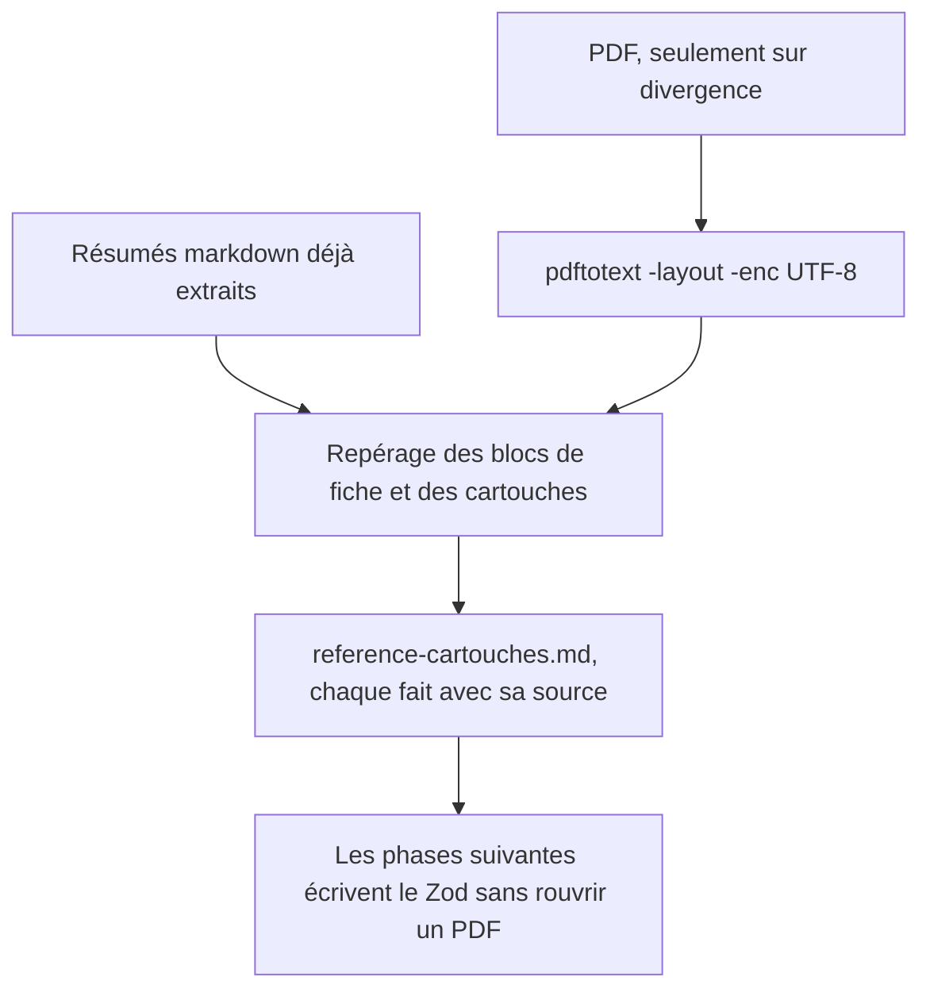

# Instruction: Référence des cartouches

## Architecture projection

> Tree of the final files. ✅ create · ✏️ modify · ❌ delete

```txt
.
└── aidd_docs/tasks/2026_09/2026_09_08_schemas-personnages-adrenaline/
    └── reference-cartouches.md   ✅ faits de structure, chacun sourcé par son fichier markdown ou sa page de PDF
```

## User Journey



## Tasks to do

### `1)` Partir des extractions déjà faites

> Ne pas réextraire 86 Ko de texte qui existent déjà en markdown à côté des PDF.

1. Lire d'abord `_sources/regles/part_01_resume.md` (création de PJ), `part_06_resume.md` (zombiologie), `template_pnj.md` (forme du cartouche PNJ, champ par champ) et `adrenaline-d100.md` (le socle d100 en cheatsheet).
2. Traiter ces fichiers comme des dérivés, non comme l'autorité : ils orientent la lecture, le livre de base tranche.
3. N'extraire un PDF que pour un point que les résumés ne couvrent pas ou contredisent — `zombiology_part_01.pdf`, `zombiology_part_06.pdf`, `Z1L05_Livret PNJ et animaux.pdf`, puis `Z1L01_Zombiology__1_Contamination_Ldb.pdf` en dernier recours. Vérifier le nom par `ls` avant d'extraire : les noms courts ne correspondent à aucun fichier.
4. Extraire avec `pdftotext -layout -enc UTF-8` : l'option `-enc UTF-8` est obligatoire, l'extraction par défaut sort du latin-1 illisible.
5. Extraire tranche par tranche avec `-f <première> -l <dernière>` plutôt que le PDF entier. Les critères exigent un numéro de page par fait ; sans bornage, le texte sort en un bloc où la page n'est plus reconstituable.

### `2)` Figer la structure de la Feuille de PJ

> Savoir quels blocs existent et ce que chacun contient, avant de nommer un seul champ Zod.

1. Relever les blocs de la Feuille de PJ : Paramètres de jeu, Compétence, Caractéristique, Équipement, Santé, Identité.
2. Pour chaque bloc, noter les champs qu'il porte et leur cardinalité observée sur la feuille imprimée.
3. Relever les formules dérivées : Solidité physique et mentale, Seuil superficiel, léger, grave, profond ; noter que grave et profond se calculent depuis le seuil léger.
4. Distinguer explicitement ce qui est une contrainte de place sur la feuille de ce qui est une contrainte de règle — les listes du générateur bornées à 3 relèvent de la première.

### `3)` Figer la structure du cartouche monstre

> Le générateur zombie est un cas particulier ; il faut la forme, pas le bestiaire.

1. Relever les champs du cartouche : corps, état stimulé, type d'infecté, comportement, zone de détection, déplacement, SP, ND.
2. Noter quelles caractéristiques un cartouche zombie porte réellement, et lesquelles il omet.
3. Relever la mécanique de contagion — vecteur, probabilité, délai, évolution — sous une forme dégagée du virus Y, et noter ce qui est propre à Zombiology.
4. Reprendre la forme du cartouche PNJ de `template_pnj.md` — elle est déjà écrite champ par champ — et ne rouvrir le livret PNJ que pour vérifier ce qu'elle omet.

### `4)` Écrire la référence

> Un document que les phases suivantes lisent seul, sans revenir au PDF.

1. Écrire `reference-cartouches.md` dans le dossier de la tâche.
2. Sourcer chaque fait par son fichier — et par sa page quand il vient d'un PDF.
3. Marquer les points restés incertains comme incertains plutôt que de les trancher, et signaler toute divergence entre un résumé markdown et le PDF.
4. Reporter en `.meta({ description })` sur le champ Zod correspondant tout fait qui doit rester lisible depuis le schéma publié : `aidd_docs/` est désormais commité, mais un consommateur du seul `schemas/` ne le lit pas.
5. Tenir la même limite de droit que la table Decisions du plan : `aidd_docs/` est poussé sur un dépôt public, donc `reference-cartouches.md` ne recopie ni table de règles, ni valeur chiffrée d'un catalogue, ni texte du livre de base. Il note quels champs existent, leur cardinalité et leur type — la forme, jamais le contenu. Une citation reste bornée à ce qu'il faut pour lever une ambiguïté de structure.
6. Citer chaque page par sa référence (`part_01, p. 42`) sans en reproduire le texte : la référence permet de rouvrir la source, la reproduction la remplacerait.

## Test acceptance criteria

| Task | Acceptance criteria                                                                                                                          |
| ---- | ---------------------------------------------------------------------------------------------------------------------------------------------- |
| 1    | Les quatre résumés markdown sont lus ; tout texte extrait d'un PDF est lisible, accents français corrects, aucun caractère de remplacement.    |
| 2    | La liste des blocs de la Feuille de PJ et les quatre formules de seuil sont écrites, chacune avec la source qui l'atteste.                     |
| 3    | Les champs du cartouche monstre sont listés, et le document dit lesquelles des huit caractéristiques un cartouche zombie porte effectivement.  |
| 4    | `reference-cartouches.md` existe, chaque affirmation porte sa source — fichier markdown ou page de PDF — et les incertitudes restantes sont nommées comme telles. |
| 4bis | Le document ne contient aucune table de règles recopiée ni valeur chiffrée de catalogue : relu en sachant qu'il part sur un dépôt public. Il décrit des champs, pas du contenu de jeu. |
