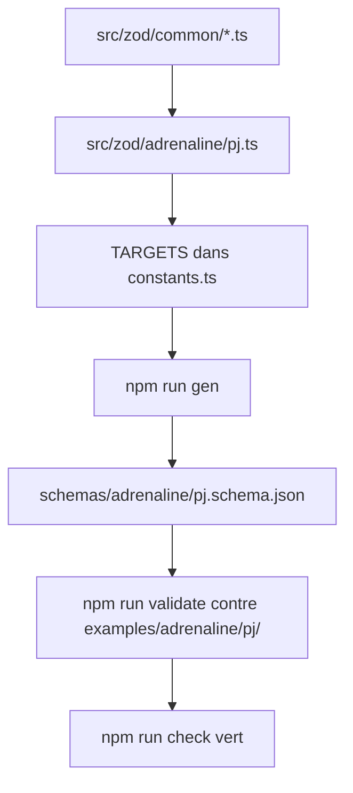

# Instruction: Socle Zod et cible `pj`

## Architecture projection

> Tree of the final files. ✅ create · ✏️ modify · ❌ delete

```txt
.
├── src/zod/
│   ├── constants.ts                    ✏️ entrée GAMES.adrenaline et première entrée TARGETS
│   ├── common/
│   │   ├── caracteristiques.ts         ✅ les 8 clés fermées, valeur en pourcentage
│   │   ├── localisations.ts            ✅ 6 localisations corporelles et 6 émotionnelles, fermées
│   │   ├── sante.ts                    ✅ seuils physiques et mentaux, 4 niveaux fermés
│   │   ├── protections.ts              ✅ PP et PM par localisation, bouclier
│   │   ├── equipement.ts               ✅ armes physiques et mentales, possessions, listes non bornées
│   │   ├── formations.ts               ✅ formation pourcentée et ses compétences, noms en chaînes libres
│   │   └── identite.ts                 ✅ bloc identité, tout optionnel sauf le nom
│   └── adrenaline/
│       └── pj.ts                       ✅ assemblage de la fiche PJ
├── schemas/adrenaline/
│   └── pj.schema.json                  ✅ généré, jamais édité à la main
└── examples/adrenaline/pj/
    ├── survivante-complete.toml        ✅ fiche de campagne, tous les blocs remplis
    └── figurant-minimal.toml           ✅ fiche one-shot, seulement les champs requis
```

## User Journey



## Tasks to do

### `1)` Déclarer le socle comme jeu

> Le système lui-même est le porteur, pas Zombiology.

1. Ajouter dans `GAMES` une entrée `adrenaline` avec `name` « Adrenaline System », `folder` `adrenaline`, `abbr` `adrenaline`.
2. Laisser `zombiology` et `rdt` en place et intactes.
3. Documenter en commentaire que cette entrée porte le socle commun, et que les jeux ne portent que leurs spécificités.

### `2)` Écrire les sous-schémas de forme

> Fermer ce qui est mécanique, laisser ouvert ce qui est catalogue.

1. `caracteristiques.ts` : deux objets fermés, l'un aux 4 clés physiques `for`, `con`, `dex`, `rap`, l'autre aux 4 clés mentales `log`, `vol`, `per`, `cha`, chaque valeur un entier en pourcentage. Exporter les deux objets séparément — la phase 4 compose sa propre variante à partir d'eux — puis exporter aussi leur composition `Physiques.extend(Mentales.shape)` pour le PJ. Jamais d'intersection : `.and()` produit un `allOf` de deux objets portant chacun `additionalProperties: false`, qu'aucun document ne peut satisfaire. Vérifié sur Zod 4.3.6.
2. `localisations.ts` : deux enums fermés, les 6 corporelles (jambe droite, jambe gauche, torse, bras faible, bras fort, tête) et les 6 émotionnelles (anxiété, impuissance, colère, tristesse, peur, culpabilité). La caractéristique associée à chaque localisation est une table de résolution du système, pas une donnée de fiche : la mettre en `.meta({ description })` et non en champ.
3. `sante.ts` : enum fermé des 4 niveaux `superficiel`, `leger`, `grave`, `profond` — libellés attestés par le PDF, pas par le générateur web — et un objet de seuils physiques et un de seuils mentaux.
4. `protections.ts` : une valeur de protection par localisation, plus solidité et bouclier.
5. `equipement.ts` : armes physiques, armes mentales, possessions. Nom en chaîne libre, listes sans `maxItems` — la borne à 3 du générateur vient de la place sur la feuille.
6. `formations.ts` : une formation porte un nom libre, un pourcentage, et une liste de compétences nommées et pourcentées.
7. `identite.ts` : nom requis, le reste optionnel.
8. Sur chaque champ, poser un `.meta({ description })` court, et y reporter les faits de la phase 1 que le schéma publié doit porter — `aidd_docs/` est commité, mais un consommateur du seul `schemas/` ne lit que ces descriptions.
9. N'employer `.default()` nulle part : la génération tourne en vue output, un `.default()` atterrit dans `required` et fait inventer une valeur. Un champ optionnel prend `.optional()`.
10. N'employer `.refine()` nulle part sur un objet destiné à `TARGETS` : la contrainte disparaît du JSON Schema généré, et l'objet devient un `ZodEffects` que le type `SchemaTarget` de `constants.ts` refuse.
11. Accepter que les sous-schémas soient inlinés dans chaque cible plutôt que référencés : Zod 4.3.6 n'émet ni `$ref` ni `$defs` en draft-7. Les trois fichiers générés dupliqueront donc santé et caractéristiques — c'est attendu, pas un défaut à corriger à la main.

### `3)` Assembler la cible `pj`

> La fiche telle qu'on la lit en jeu, pas la recette qui l'a produite.

1. Assembler les blocs : identité, caractéristiques, formations, équipement, protections, santé.
2. Ajouter un bloc `meta` optionnel pour les paramètres de création — type de création, type de scénario, mode d'attribution — sans jamais le rendre requis.
3. Rendre requis ce qu'une fiche jouable porte toujours : nom, les 8 caractéristiques, les seuils de santé.
4. Poser sur l'objet racine un `.meta({ $id, title, description })`, l'`$id` valant `https://raw.githubusercontent.com/RebelliousSmile/schema-adrenaline/main/schemas/adrenaline/pj.schema.json`. Écrire `$id` et non `id` : la seconde forme est du draft-4, Ajv l'ignore en silence.
5. Enregistrer la cible dans `TARGETS` avec `game: GAMES.adrenaline` et `name: "pj"`.

### `4)` Générer et valider

> Prouver que la chaîne produit et accepte quelque chose de réel.

1. Lancer `npm run gen` sous PowerShell, ou `npm.cmd run gen` sous Bash — `npm` nu ne se résout pas dans le Bash de cette machine.
2. Écrire les deux exemples TOML directement dans `examples/adrenaline/pj/` : le validateur liste un seul niveau et ignore les sous-dossiers en silence.
3. Respecter l'ordre TOML : scalaires et tableaux racine d'abord, tables de tableau ensuite, tables nommées en dernier — une clé écrite après un en-tête se rattache à cette table.
4. Ne poser aucune clé `$schema` dans les exemples : le schéma généré porte `additionalProperties: false` à la racine et la rejetterait.
5. Lancer `npm run check` et compter les lignes `✓` : le validateur avertit et poursuit quand un schéma manque ou qu'un dossier d'exemples est vide, donc un code de sortie 0 ne prouve rien à lui seul.

## Test acceptance criteria

| Task | Acceptance criteria                                                                                                                                      |
| ---- | ---------------------------------------------------------------------------------------------------------------------------------------------------------- |
| 1    | `GAMES.adrenaline` existe, `npx.cmd tsc --noEmit` passe, et les entrées `zombiology` et `rdt` n'ont pas bougé. Ne pas s'appuyer sur `npm run check` ici : `TARGETS` est encore vide, la chaîne sort en 0 sans rien prouver. |
| 2    | Une valeur hors des 8 clés de caractéristique, des 12 localisations ou des 4 niveaux de seuil est refusée ; un nom de compétence ou d'arme inédit est accepté. Un personnage portant les 8 caractéristiques valide — ce qui prouve que la composition n'a pas produit un `allOf` insatisfiable. |
| 3    | Une fiche sans bloc `meta` valide ; une fiche sans nom ou sans caractéristiques est refusée. Le schéma généré porte un `$id` en `$id`, pas en `id`.         |
| 4    | `schemas/adrenaline/pj.schema.json` existe et `npm run check` affiche exactement deux lignes `✓`, aucun `⚠️`, aucune ligne `✗`.                            |
