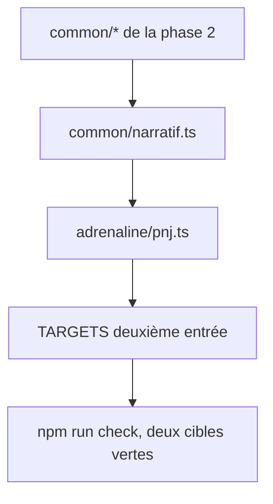

# Instruction: Cible `pnj`

## Architecture projection

> Tree of the final files. ✅ create · ✏️ modify · ❌ delete

```txt
.
├── src/zod/
│   ├── constants.ts                    ✏️ deuxième entrée TARGETS
│   ├── common/
│   │   └── narratif.ts                 ✅ rôle, attitude, personnalité, notes MJ, répliques — bloc optionnel
│   └── adrenaline/
│       └── pnj.ts                      ✅ humain non joué : socle commun, création allégée, narratif
├── schemas/adrenaline/
│   └── pnj.schema.json                 ✅ généré
└── examples/adrenaline/pnj/
    ├── pnj-majeur.toml                 ✅ cartouche chiffré et bloc narratif complet
    └── pnj-secondaire.toml             ✅ quelques stats, aucun narratif
```

## User Journey



## Tasks to do

### `1)` Écrire le bloc narratif

> Ce qui fait vivre un PNJ à la table, sans jamais l'imposer à un figurant.

1. Créer `common/narratif.ts` : rôle dans l'histoire, attitude envers les PJ, traits de personnalité, historique, notes réservées au meneur, répliques types.
2. Garder chaque champ en chaîne ou liste de chaînes libres — une attitude ou un rôle narratif est du contenu de scénario, pas de la mécanique.
3. Rendre le bloc entier optionnel, et chaque champ à l'intérieur optionnel.

### `2)` Assembler la cible `pnj`

> Un humain non joué : même socle qu'un PJ, moins la machinerie de création.

1. Réutiliser identité, caractéristiques, équipement, protections et santé du socle de la phase 2.
2. Rendre les formations optionnelles, et rattacher une liste de compétences directement au PNJ à partir de la compétence exportée par `formations.ts` en phase 2 : un PNJ de scénario porte souvent des compétences sans passer par les trois formations.
3. Ajouter un niveau de danger et le bloc narratif, tous deux optionnels.
4. Ne pas reprendre le bloc `meta` des paramètres de création : il n'a de sens que pour un PJ.
5. Poser un `.meta({ $id, title, description })` sur l'objet racine, l'`$id` pointant `schemas/adrenaline/pnj.schema.json` dans le dépôt, sur le même modèle que la phase 2.
6. Enregistrer la cible dans `TARGETS` avec `game: GAMES.adrenaline` et `name: "pnj"`.

### `3)` Générer et valider

> Deux cibles vertes valent mieux qu'une.

1. Écrire les deux exemples dans `examples/adrenaline/pnj/`, à plat, sans clé `$schema`.
2. L'exemple secondaire ne porte aucun bloc narratif : il prouve que le narratif est bien optionnel.
3. Lancer `npm run check` et corriger jusqu'au vert.
4. Vérifier qu'un `M` sur un schéma régénéré n'est pas une dérive réelle : comparer `git hash-object --path <f> <f>` à `git rev-parse HEAD:<f>` avant de conclure à un changement.

## Test acceptance criteria

| Task | Acceptance criteria                                                                                                              |
| ---- | ---------------------------------------------------------------------------------------------------------------------------------- |
| 1    | Un PNJ sans aucun champ narratif valide ; un champ narratif inconnu est refusé par `additionalProperties: false`.                  |
| 2    | Un PNJ sans formation valide ; un PNJ portant le bloc `meta` de création est refusé.                                              |
| 3    | `schemas/adrenaline/pnj.schema.json` existe, `npm run check` affiche exactement quatre lignes `✓` couvrant les deux cibles, aucun `⚠️`, aucune ligne `✗`. |
