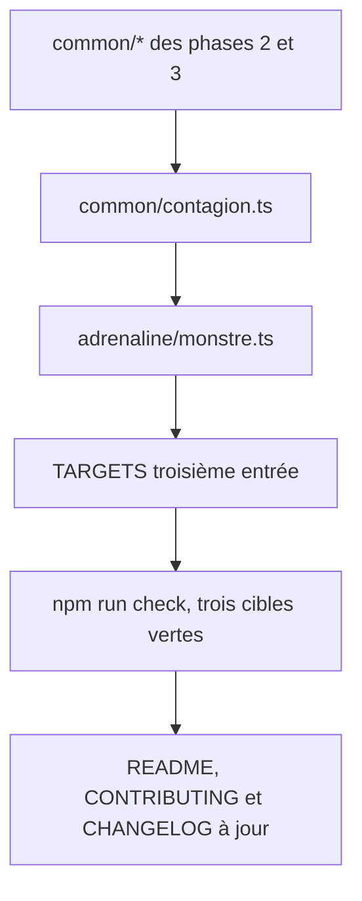

# Instruction: Cible `monstre` et publication

## Architecture projection

> Tree of the final files. ✅ create · ✏️ modify · ❌ delete

```txt
.
├── src/zod/
│   ├── constants.ts                    ✏️ troisième entrée TARGETS
│   ├── common/
│   │   └── contagion.ts                ✅ vecteur, probabilité, délai, évolution — générique, pas le virus Y
│   └── adrenaline/
│       └── monstre.ts                  ✅ nom requis, physiques requises, mentales optionnelles, comportement, contagion, narratif optionnel
├── schemas/adrenaline/
│   └── monstre.schema.json             ✅ généré
├── examples/adrenaline/monstre/
│   ├── infecte-rodeur.toml             ✅ sans caractéristiques mentales, avec contagion
│   └── predateur-pensant.toml          ✅ les 8 caractéristiques, sans contagion
├── README.md                           ✏️ liste des schémas publiés et de leur portée
├── CONTRIBUTING.md                     ✏️ mention du socle adrenaline face aux jeux
└── CHANGELOG.md                        ✏️ entrée sous [Unreleased], section Added déjà en place
```

## User Journey



## Tasks to do

### `1)` Écrire le bloc contagion

> Assez générique pour une malédiction, assez précis pour le virus Y.

1. Créer `common/contagion.ts` : nom de l'agent, vecteurs de transmission avec leur probabilité, délai avant effet, issue de l'infection.
2. Garder les vecteurs en chaînes libres — morsure, respiratoire, ingestion sont du contenu de Zombiology, pas de la mécanique du système.
3. Prévoir une modulation par tranche d'âge ou par profil, en gardant les tranches ouvertes plutôt qu'énumérées.
4. Rendre le bloc entier optionnel : un monstre non contagieux est un monstre valide.

### `2)` Assembler la cible `monstre`

> Un zombie sans conscience et un prédateur pensant doivent tenir dans la même forme.

1. Rendre les quatre caractéristiques physiques requises et les quatre mentales optionnelles — un zé les omet, un monstre pensant les porte et devient cible d'attaques mentales. Composer par `Physiques.extend(Mentales.partial().shape)` : la sonde de la phase 2 confirme que cette forme produit un objet fermé unique, là où `.and()` produirait un `allOf` insatisfiable.
2. Exiger un nom, en champ local et non par le bloc `identite.ts` : un monstre n'a ni âge, ni profession, ni les autres champs de ce bloc. Le générateur zombie impose un « nom du corps », et un bestiaire sans identifiant n'est pas exploitable.
3. Ajouter zone de détection, déplacement, niveau de danger, seuils de santé physiques ; rendre les seuils mentaux optionnels.
4. Ne pas tenter de lier les seuils mentaux à la présence des caractéristiques mentales. Un `.refine()` disparaît du JSON Schema généré et transforme la racine en `ZodEffects` que `SchemaTarget` refuse ; draft-7 n'a pas de `dependentSchemas`. Écrire la contrainte en `.meta({ description })` et l'assumer comme non validable.
5. Ajouter un bloc d'état alternatif optionnel — le stimulé du générateur zombie — qui rejoue les mêmes valeurs modifiées.
6. Ajouter comportement et actions en chaînes libres, plus une liste de traits spéciaux non bornée.
7. Rendre les compétences optionnelles, et n'exiger aucune formation.
8. Rattacher le bloc narratif de la phase 3, optionnel : un monstre nommé et joué mérite le même traitement qu'un PNJ.
9. Poser un `.meta({ $id, title, description })` sur l'objet racine, l'`$id` pointant `schemas/adrenaline/monstre.schema.json`.
10. Enregistrer la cible dans `TARGETS` avec `game: GAMES.adrenaline` et `name: "monstre"`.

### `3)` Générer et valider les deux cas limites

> Les deux exemples existent pour prouver l'écart, pas pour décorer.

1. `infecte-rodeur.toml` : aucune caractéristique mentale, un bloc contagion, un état stimulé.
2. `predateur-pensant.toml` : les huit caractéristiques, aucun bloc contagion, des compétences.
3. Écrire les deux à plat dans `examples/adrenaline/monstre/`, sans clé `$schema`, tables de tableau avant les tables nommées.
4. Lancer `npm run check` et corriger jusqu'au vert.

### `4)` Publier la portée des schémas

> Un lecteur du dépôt doit comprendre pourquoi trois schémas vivent sous `adrenaline` et non sous `zombiology`.

1. Dans le `README.md`, lister les trois schémas publiés et dire en une phrase ce que chacun couvre.
2. Écrire explicitement que ces schémas décrivent la structure d'une fiche et n'énumèrent aucune formation, compétence, arme ni créature.
3. Dans le `CONTRIBUTING.md`, distinguer le socle `adrenaline` des jeux qui tournent dessus, et dire où ajouter un champ selon qu'il est systémique ou propre à un jeu.
4. Ajouter une entrée au `CHANGELOG.md`.

## Test acceptance criteria

| Task | Acceptance criteria                                                                                                                                |
| ---- | ------------------------------------------------------------------------------------------------------------------------------------------------- |
| 1    | Un monstre sans bloc contagion valide ; un vecteur de transmission au nom inédit est accepté.                                                       |
| 2    | Un monstre sans aucune caractéristique mentale valide ; un monstre sans caractéristiques physiques ou sans nom est refusé. Un monstre portant les huit caractéristiques valide, ce qui prouve que la composition n'a pas produit un `allOf` insatisfiable. Le schéma généré porte un `$id`. |
| 3    | `npm run check` affiche exactement six lignes `✓` couvrant les trois cibles, aucun `⚠️`, aucune ligne `✗`.                                          |
| 4    | Le `README.md` nomme les trois schémas et dit qu'ils décrivent une forme, pas un catalogue ; le `CONTRIBUTING.md` dit où poser un champ nouveau.    |
