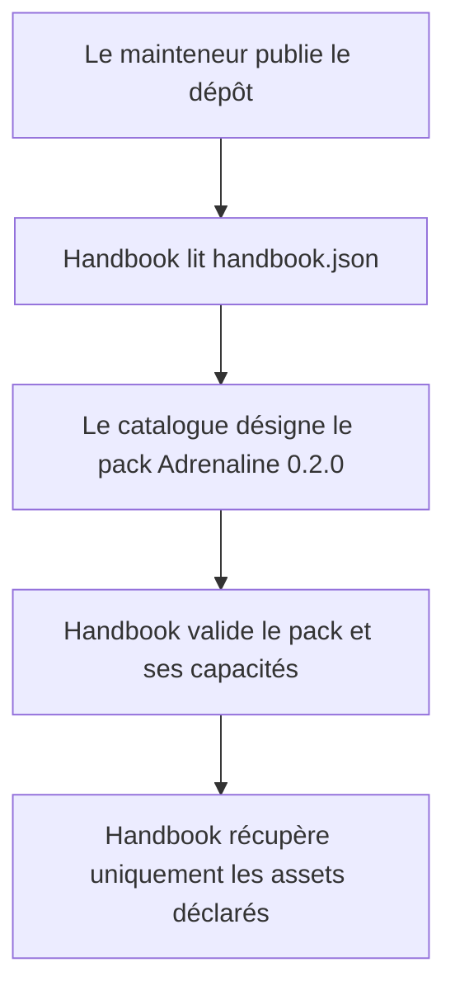
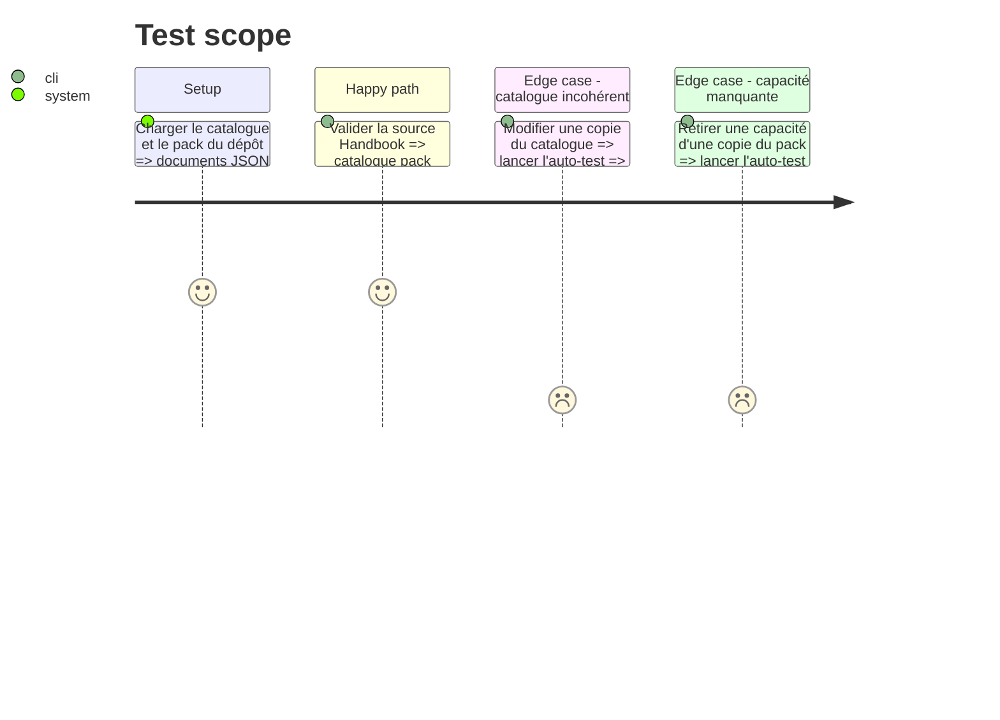

# Instruction: Catalogue et contrat de validation

## Architecture projection

> Tree of the final files. ✅ create · ✏️ modify · ❌ delete

```txt
.
├── ✅ handbook.json
└── tools/
    └── ✏️ validate-handbook-pack.ts
```

## User Journey



## Test Scope



## Tasks to do

### `1)` Publier le catalogue racine

> Déclarer le dépôt et son pack Adrenaline dans le format strict consommé par Handbook 2.7.0.

1. Créer `handbook.json` avec `manifestVersion: 1` et `repository: RebelliousSmile/schema-adrenaline`.
2. Déclarer une unique entrée `adrenaline`, version `0.2.0`, pointant vers `handbook/adrenaline/pack.json`.
3. Utiliser uniquement les champs de catalogue admis par Handbook et des chemins relatifs au dépôt.

### `2)` Valider la source complète

> Faire échouer la porte de qualité dès que le catalogue, le pack ou les fichiers installables divergent.

1. Charger `handbook.json` et chaque `pack.json` déclaré depuis `tools/validate-handbook-pack.ts`.
2. Valider la forme stricte du catalogue, les versions SemVer, les chemins sûrs et l'unicité des ids et chemins.
3. Exiger l'égalité de l'id et de la version entre l'entrée du catalogue et le manifeste de pack.
4. Vérifier que `minimumHandbookVersion` est une SemVer exploitable et que la liste contient exactement les quatre capacités Adrenaline attendues par la release déclarée.
5. Conserver les contrôles de tokens, contrastes, licences et fichiers sous `handbook/adrenaline/assets/`.
6. Ajouter des auto-tests négatifs pour les divergences de catalogue et l'absence d'une capacité requise.

## Test acceptance criteria

| Task | Acceptance criteria |
| ---- | ------------------- |
| 1 | `handbook.json` est accepté par le contrat de catalogue Handbook v1 et référence exactement `handbook/adrenaline/pack.json` en version `0.2.0`. |
| 1 | Le catalogue identifie le dépôt comme `RebelliousSmile/schema-adrenaline` et ne contient ni champ inconnu ni chemin absolu ou remontant. |
| 2 | La validation refuse toute divergence d'id ou de version entre le catalogue et le pack. |
| 2 | La validation refuse un pack qui omet une capacité Adrenaline ou dont la version minimale Handbook n'est pas une SemVer valide. |
| 2 | La validation accepte le pack courant et confirme que ses trois images et deux polices déclarées existent dans sa propre arborescence. |
