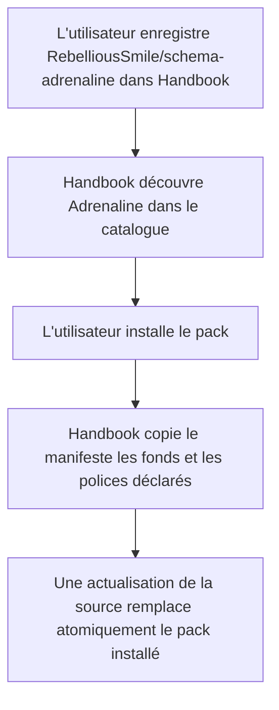
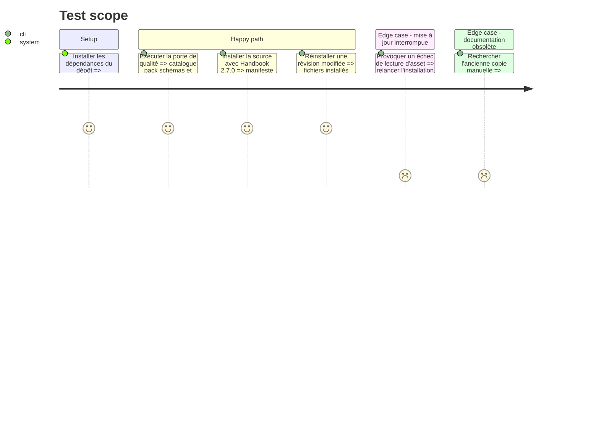

# Instruction: Parcours d'installation et publication

## Architecture projection

> Tree of the final files. ✅ create · ✏️ modify · ❌ delete

```txt
.
├── .github/
│   └── workflows/
│       └── ✏️ ci.yml
├── ✏️ README.md
├── handbook/
│   └── adrenaline/
│       └── ✏️ README.md
└── tools/
    └── ✅ validate-handbook-install.ts
```

## User Journey



## Test Scope



## Tasks to do

### `1)` Documenter l'installation par catalogue

> Décrire le dépôt comme une source Handbook et retirer le parcours principal fondé sur une copie de dossier.

1. Présenter `handbook.json` et le pack publié dans le README racine.
2. Remplacer dans `handbook/adrenaline/README.md` l'installation manuelle par **Settings → Handbook → Schema sources → Add source**, la saisie de `RebelliousSmile/schema-adrenaline`, le choix de la référence et **Save and check**.
3. Expliquer que **Check** actualise atomiquement le manifeste, les trois fonds et les deux polices déclarés.
4. Conserver l'indication de compatibilité avec Handbook 2.7.0 ou plus récent et les informations de provenance/licence.

### `2)` Fermer les portes de publication

> Prouver que le catalogue s'ajoute sans régression aux contrôles existants du dépôt et de l'hôte.

1. Ajouter `tools/validate-handbook-install.ts`, un harness qui charge le véritable catalogue et les fichiers du dépôt dans `installResolvedSchemaSource` depuis le checkout Handbook indiqué par `HANDBOOK_ROOT`.
2. Installer la source dans un adaptateur de stockage isolé et vérifier la matérialisation du `pack.json`, des trois images et des deux polices déclarées.
3. Rejouer l'installation avec une nouvelle révision et des octets d'asset distincts, puis vérifier le remplacement ; provoquer aussi un échec avant promotion et vérifier que la version précédente reste intacte.
4. Étendre `.github/workflows/ci.yml` pour exécuter ce harness après avoir dérivé et installé la release Handbook depuis `minimumHandbookVersion`.
5. Exécuter `npm run format:check` puis `npm run check`, ainsi que le harness croisé contre Handbook 2.7.0.
6. Examiner le diff pour confirmer qu'aucun asset, aucune police et aucun schéma versionné existant n'a été remplacé.

## Test acceptance criteria

| Task | Acceptance criteria |
| ---- | ------------------- |
| 1 | Les deux README décrivent une installation et une mise à jour pilotées par le catalogue, sans copie manuelle comme étape normale. |
| 1 | La documentation annonce Handbook 2.7.0 ou plus récent et identifie `handbook/adrenaline/` comme source des assets et polices. |
| 2 | La porte de qualité complète termine sans erreur et inclut la validation du catalogue Handbook. |
| 2 | Le véritable installateur de Handbook 2.7.0 accepte le catalogue, l'id, la version, les quatre capacités et les polarités du pack Adrenaline. |
| 2 | Une installation isolée contient le manifeste, les trois fonds et les deux polices ; une nouvelle révision les remplace, tandis qu'un échec conserve la version antérieure entière. |
| 2 | Le diff final ne modifie ni les cinq fichiers binaires du pack ni les schémas figés déjà publiés. |
