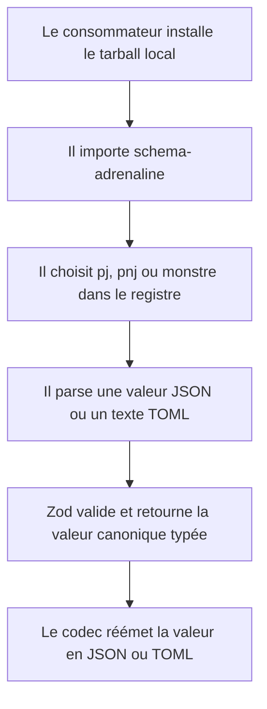
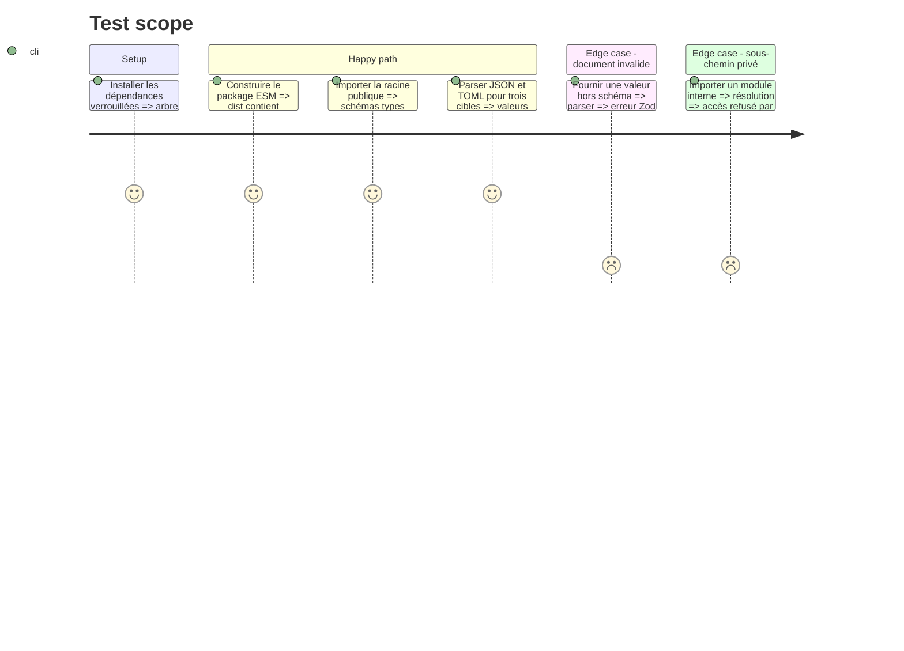

# Instruction: Surface publique et codecs canoniques

## Architecture projection

> Tree of the final files. ✅ create · ✏️ modify · ❌ delete

```txt
.
├── ✏️ package.json
├── ✏️ package-lock.json
├── ✅ tsconfig.build.json
├── src/
│   ├── ✅ index.ts
│   ├── ✅ contract-version.ts
│   ├── codecs/
│   │   └── ✅ documents.ts
│   └── zod/
│       ├── ✏️ constants.ts
│       ├── adrenaline/
│       │   ├── ✏️ pj.ts
│       │   ├── ✏️ pnj.ts
│       │   └── ✏️ monstre.ts
│       └── common/
│           ├── ✏️ caracteristiques.ts
│           ├── ✏️ danger.ts
│           ├── ✏️ equipement.ts
│           ├── ✏️ formations.ts
│           ├── ✏️ protections.ts
│           └── ✏️ sante.ts
└── schemas/adrenaline/1.0.0/
    ├── ✅ pj.schema.json
    ├── ✅ pnj.schema.json
    └── ✅ monstre.schema.json
```

## User Journey



## Test Scope



## Tasks to do

### `1)` Construire une distribution ESM consommable

> Produire du JavaScript NodeNext et ses déclarations sans exposer les modules internes.

1. Ajouter une configuration de build dédiée à `dist/` avec déclarations et imports relatifs `.js` compatibles ESM.
2. Mettre à jour les imports relatifs de `src/zod/` nécessaires au build NodeNext.
3. Déclarer `main`, `types`, `build` et `prepack`, limiter `files` à `dist`, au gel `1.0.0`, au corpus, aux exemples, au README et à la licence, puis exposer uniquement `.`, `./schemas/*`, `./corpus/*` et `./examples/*`.
4. Déplacer Zod dans les dépendances d'exécution, ajouter le sérialiseur TOML retenu et régénérer le lockfile.

### `2)` Exposer le contrat Adrenaline

> Fournir une API racine stable pour les trois formes documentaires.

1. Déclarer les constantes de version du contrat et de la syntaxe TOML.
2. Créer un registre typé `pj`, `pnj`, `monstre` reliant chaque cible à son schéma et à son type inféré.
3. Implémenter les parseurs et sérialiseurs JSON/TOML qui valident systématiquement par Zod avant de retourner ou d'émettre une valeur.
4. Réexporter depuis `src/index.ts` les constantes, schémas, types, fonctions nommées et registre, sans exporter les chemins internes.

### `3)` Établir la ligne de base du contrat 1.0.0

> Versionner ensemble l'API et ses schémas sans coupler la version du pack visuel.

1. Passer uniquement la version du package à `1.0.0` puis générer le gel correspondant sans toucher aux gels `0.1.0` et `0.2.0`.
2. Vérifier que chaque nouveau `$id` contient `/schemas/adrenaline/1.0.0/` et que les schémas courants conservent leur `$id` sous `main`.
3. Laisser le catalogue et le pack Handbook en `0.2.0`, conserver `minimumHandbookVersion` à `2.7.0` et exactement les quatre capacités déjà déclarées.
4. Faire passer le build et les validations existantes, y compris le catalogue Handbook contre son hôte minimal.

## Test acceptance criteria

| Task | Acceptance criteria |
| ---- | ------------------- |
| 1 | `npm run build` produit une distribution ESM importable sous Node avec ses déclarations TypeScript, et le tarball ne prévoit que les fichiers publics. |
| 2 | La racine publique donne accès aux trois schémas, à leurs types et aux codecs JSON/TOML ; un document invalide est rejeté par le même schéma quel que soit son format. |
| 3 | Les trois gels `1.0.0` portent des `$id` versionnés, les gels antérieurs restent inchangés, et le pack Adrenaline reste indépendamment en `0.2.0` avec Handbook `2.7.0` et ses quatre capacités. |
