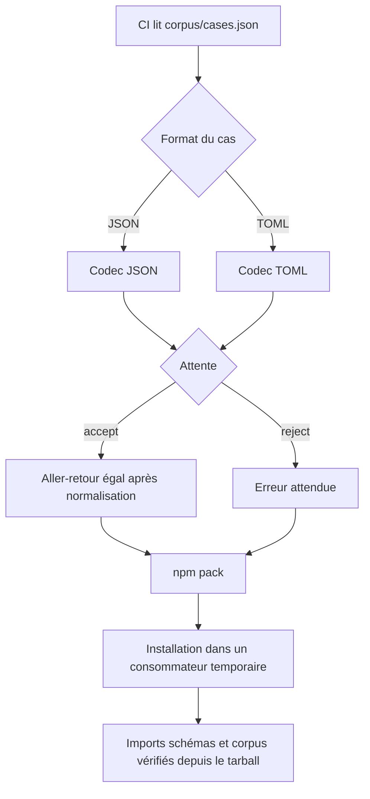
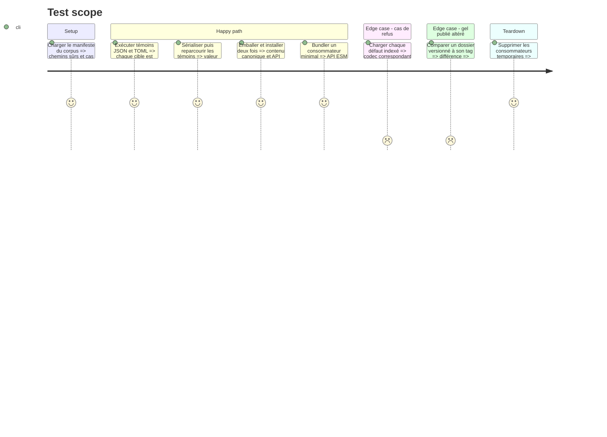

# Instruction: Kit de conformité et preuve du tarball

## Architecture projection

> Tree of the final files. ✅ create · ✏️ modify · ❌ delete

```txt
.
├── ✏️ package.json
├── ✏️ package-lock.json
├── corpus/
│   ├── ✏️ README.md
│   ├── ✅ cases.json
│   └── contract/
│       ├── valid/
│       │   └── ✅ pnj-syntax-edge-values.toml
│       └── invalid/
│           └── ✅ pnj-unknown-field.toml
└── tools/
    ├── ✅ validate-contract.ts
    ├── ✅ validate-bundle.ts
    ├── ✅ validate-package.ts
    ├── ✅ validate-versioning.ts
    └── ✅ prepare-release.ts
```

## User Journey



## Test Scope



## Tasks to do

### `1)` Transformer le corpus en contrat public

> Donner aux deux consommateurs une liste déterministe des mêmes témoins et refus.

1. Ajouter `corpus/cases.json` avec version de manifeste, version TOML, format, cible, chemin relatif à la racine du package et attente de chaque cas.
2. Indexer tous les témoins et refus JSON ainsi que les six exemples TOML existants sans dupliquer leurs fichiers.
3. Ajouter seulement un témoin PNj minimal couvrant `0`, une liste vide et une clé canonique citée, ainsi qu'un refus PNj à clé inconnue ; ne pas inventer de valeur booléenne absente des schémas Adrenaline.
4. Documenter la résolution des chemins et la règle de couverture du kit dans `corpus/README.md`.

### `2)` Prouver la sémantique des codecs

> Vérifier chaque cas avec l'API publique qui sera réellement consommée.

1. Valider la structure du manifeste, l'unicité et la sûreté des chemins ainsi que la couverture accept/refuse par cible et la présence d'au moins un témoin TOML par cible.
2. Pour JSON, prouver parseur puis sérialiseur puis parseur sur la valeur normalisée.
3. Pour TOML, comparer le parseur d'exécution à `@iarna/toml`, puis prouver que sérialiser et reparcourir conserve récursivement objets, tableaux et scalaires.
4. Ajouter les refus attendus et intégrer le validateur au `npm run check` existant.

### `3)` Vérifier la distribution et les versions

> Tester le contenu installé, l'immuabilité des gels et la reproductibilité avant toute publication.

1. Emballer avec `npm pack`, installer le tarball dans un projet temporaire et tester la racine, les sous-chemins de schémas et le manifeste du corpus.
2. Refuser un import interne non déclaré et confirmer que chaque fichier référencé par `cases.json` est présent dans le tarball via `./corpus/*` ou `./examples/*`.
3. Installer esbuild comme dépendance de développement directe et bundler un consommateur minimal qui importe le registre, un schéma et un codec depuis la racine publique.
4. Comparer chaque gel dont le tag existe à la copie de ce tag, vérifier séparément package/gel courant et catalogue/pack, puis traiter `1.0.0` comme candidat tant que son tag n'existe pas.
5. Générer deux tarballs et comparer leurs contenus canoniques, puis fournir une commande de préparation qui produit le `.tgz`, son `.sha256` et un résumé machine-lisible.
6. Ajouter toutes ces preuves à `npm run check` sans retirer les validations de schémas, d'exemples, d'audit ou de pack Handbook.

## Test acceptance criteria

| Task | Acceptance criteria |
| ---- | ------------------- |
| 1 | Le manifeste distribué référence tous les cas JSON et exemples TOML existants, couvre chaque cible, et son cas syntaxique ciblé conserve `0`, liste vide et clé citée. |
| 2 | Tous les témoins survivent à un aller-retour dans leur format après normalisation Zod, tous les refus échouent, et les deux parseurs TOML donnent la même valeur sur les témoins. |
| 3 | Des consommateurs Node et esbuild importent uniquement les entrées publiques depuis le `.tgz`, retrouvent tous les fichiers indexés, les gels tagués sont inchangés et deux préparations donnent le même contenu canonique. |
