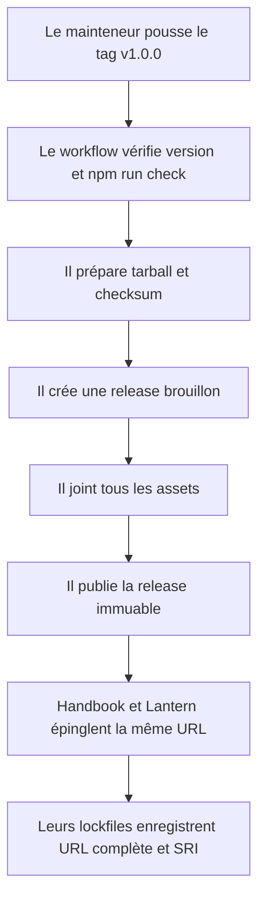
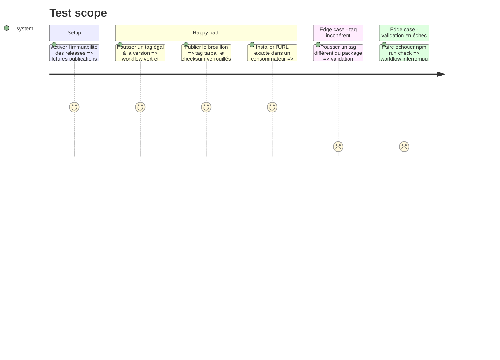

# Instruction: Publication immuable et documentation des consommateurs

## Architecture projection

> Tree of the final files. ✅ create · ✏️ modify · ❌ delete

```txt
.
├── ✅ .github/workflows/release.yml
├── ✏️ README.md
├── ✏️ CONTRIBUTING.md
└── ✏️ CHANGELOG.md
```

## User Journey



## Test Scope



## Tasks to do

### `1)` Automatiser une publication atomique

> Ne rendre publique qu'une release dont le code, le contrat et tous les assets ont été vérifiés.

1. Déclencher le workflow sur un tag SemVer et donner seulement la permission `contents: write` nécessaire à la release.
2. Vérifier que le tag égale `v` suivi de la version du package et exécuter `npm ci` puis `npm run check`.
3. Préparer le tarball et son checksum, créer la release en brouillon, joindre les deux fichiers puis publier le brouillon.
4. Rendre le workflow rejouable tant que la release reste en brouillon et ne jamais remplacer un asset après publication.

### `2)` Documenter le contrat et sa maintenance

> Remplacer la copie des sources par les imports stables et expliciter les règles de compatibilité.

1. Documenter les imports des schémas, types, codecs, JSON Schemas et cas de conformité depuis le package.
2. Donner l'URL exacte attendue `https://github.com/RebelliousSmile/schema-adrenaline/releases/download/v1.0.0/schema-adrenaline-1.0.0.tgz` et préciser que npm inscrit son intégrité SRI dans le lockfile consommateur.
3. Décrire les règles de version : rupture de l'API ou de forme, nouveau gel, immutabilité des dossiers publiés et indépendance entre version du contrat et version du pack Handbook.
4. Ajouter au guide de contribution la préparation et la vérification d'une release, puis consigner la surface 1.0.0 dans le changelog.

### `3)` Publier et remettre le point d'intégration

> Produire l'asset final que Handbook et Lantern peuvent épingler sans registre npm.

1. Activer l'immuabilité des releases du dépôt avant la création de `v1.0.0`.
2. Publier le tag et vérifier que la release est marquée immuable, que le `.tgz` et le `.sha256` sont présents et que l'asset local passe la vérification d'intégrité GitHub.
3. Installer l'URL de release dans un consommateur temporaire et constater que le lockfile contient cette URL complète et une intégrité SHA-512.
4. Communiquer l'URL et le SHA-256 publiés dans `obsidian-handbook#27` et `lantern#2`, sans modifier leurs dépôts dans cette phase.

## Test acceptance criteria

| Task | Acceptance criteria |
| ---- | ------------------- |
| 1 | Un tag cohérent et une suite verte produisent une release complète via brouillon ; un tag incohérent ou une validation rouge ne publie aucun asset. |
| 2 | La documentation ne recommande plus la copie de Zod, montre toutes les entrées publiques et explique l'épinglage de l'asset, du lockfile et des versions. |
| 3 | La release `v1.0.0` est signalée immuable, sert `schema-adrenaline-1.0.0.tgz` et son checksum, et une installation HTTP enregistre la même URL avec son intégrité SRI. |
