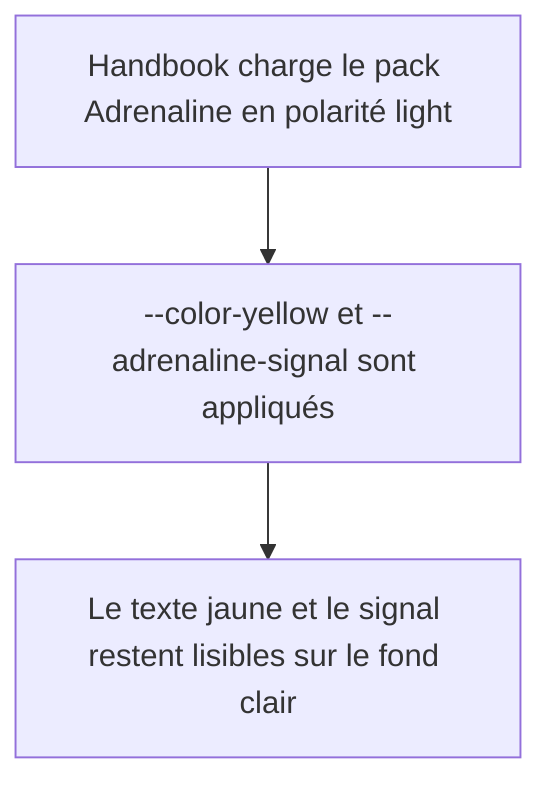

<!-- Fill or omit these sections; never add, rename, or reorder one. -->

# Instruction: Corriger les valeurs du pack en polarité light

## Architecture projection

> Tree of the final files. ✅ create · ✏️ modify · ❌ delete

```txt
.
└── handbook/
    └── adrenaline/
        └── ✏️ pack.json
```

## User Journey



## Tasks to do

### `1)` Remonter les trois valeurs light concernées

> Corriger uniquement `light.note`, sans toucher à `dark` ni à aucune autre clé.

1. `--color-yellow` : `#A66C16` → `#956114`.
2. `--color-yellow-rgb` : `166, 108, 22` → `149, 97, 20`.
3. `--adrenaline-signal` : `#B98522` → `#A6781F`.
4. Lancer `npm run format` (PowerShell) pour réaligner l'indentation JSON si Prettier la modifie.

## Test acceptance criteria

<!-- Each criterion is an observable behavior, not a command. -->

| Task | Acceptance criteria |
| ---- | -------------------------------- |
| 1 | `--color-yellow` contre `--background-primary` (`#F4F0E8`) mesure ≥4.5:1 (calcul attendu : 4.62:1). |
| 1 | `--adrenaline-signal` contre `--background-primary` mesure ≥3:1 (calcul attendu : 3.47:1). |
| 1 | `--adrenaline-signal-ink` contre `--adrenaline-signal` reste ≥4.5:1 (calcul attendu : 4.74:1, donc ne régresse pas sous le seuil déjà exigé). |
| 1 | Les valeurs `dark` et tout autre jeton `light` restent strictement inchangés. |
