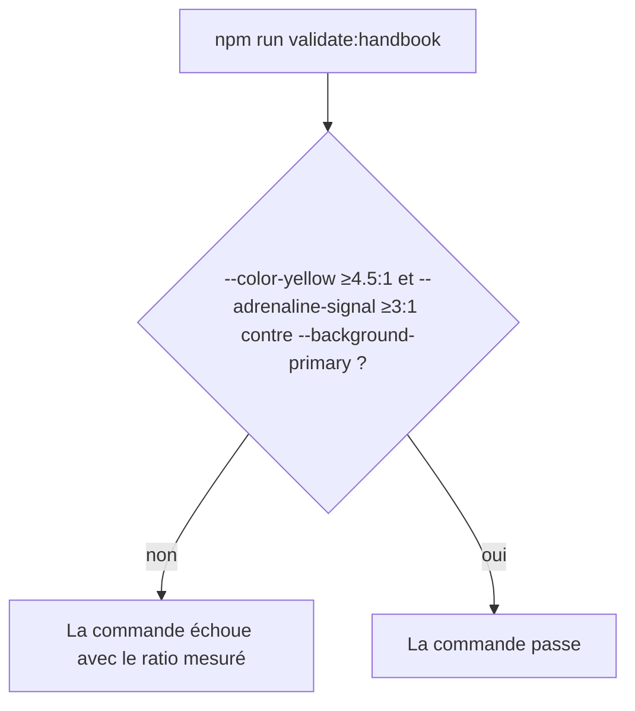

<!-- Fill or omit these sections; never add, rename, or reorder one. -->

# Instruction: Durcir le validateur contre la régression

## Architecture projection

> Tree of the final files. ✅ create · ✏️ modify · ❌ delete

```txt
.
└── tools/
    └── ✏️ validate-handbook-pack.ts
```

## User Journey



## Tasks to do

### `1)` Ajouter les contrôles de contraste manquants

> `--color-yellow` et `--adrenaline-signal` n'ont aujourd'hui aucun `requireContrast` associé contre `--background-primary` : c'est le trou qui a laissé les deux régressions de l'issue #5 passer inaperçues.

1. Dans la boucle par polarité de `validateHandbookPack`, ajouter `requireContrast(note, "--color-yellow", "--background-primary");` au même niveau que les autres contrôles `note` (seuil 4.5:1, usage texte).
2. Ajouter aussi `requireContrast(note, "--adrenaline-signal", "--background-primary", 3);` (seuil 3:1, usage liseré/UI) : le contrôle encre/signal existant protège une paire différente (encre sur signal) et ne couvre pas signal contre fond — sans cet ajout, la deuxième valeur que l'issue #5 signale comme sous le seuil resterait sans garde-fou automatisé.
3. Documenter en commentaire, à côté des deux ajouts, pourquoi `--color-yellow` est jugé au seuil texte (4.5) et `--adrenaline-signal` au seuil UI (3) : ce dépôt ne voit pas le CSS Handbook réel, la distinction reprend celle déjà actée dans `CLAUDE.md` (jaune consommé comme texte, signal comme liseré de callout).

### `2)` Vérifier sur le pack réel

1. Exécuter `npm run validate:handbook` (PowerShell) après la phase 1 : doit passer en light et en dark.
2. Vérifier que `npm run check` (PowerShell) reste vert de bout en bout.

## Test acceptance criteria

<!-- Each criterion is an observable behavior, not a command. -->

| Task | Acceptance criteria |
| ---- | -------------------------------- |
| 1 | Remettre manuellement `--color-yellow` à `#A66C16` fait échouer `npm run validate:handbook` avec un message citant `--color-yellow`/`--background-primary` et le ratio 3.87. |
| 1 | Remettre manuellement `--adrenaline-signal` à `#B98522` fait échouer `npm run validate:handbook` avec un message citant `--adrenaline-signal`/`--background-primary` et le ratio 2.87. |
| 2 | `npm run validate:handbook` et `npm run check` passent tous deux sur le pack corrigé, polarités light et dark confondues. |
