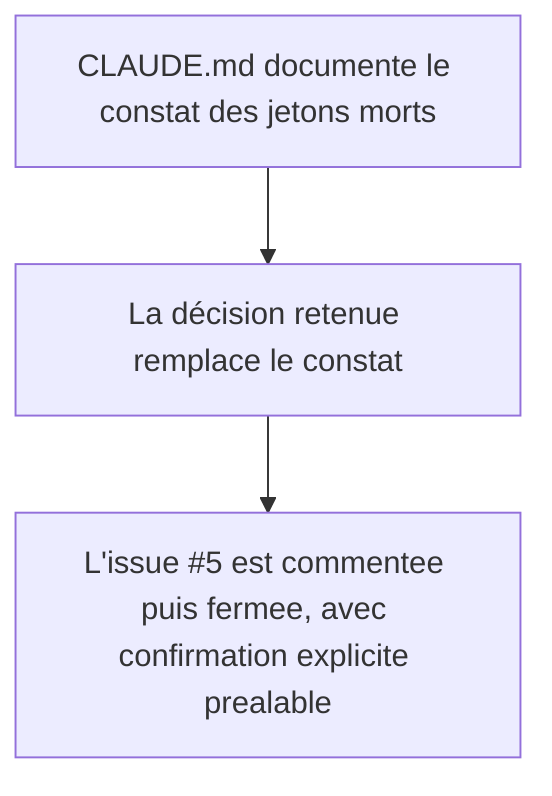

<!-- Fill or omit these sections; never add, rename, or reorder one. -->

# Instruction: Trancher le sort des jetons morts et clore l'issue

## Architecture projection

> Tree of the final files. ✅ create · ✏️ modify · ❌ delete

```txt
.
└── CLAUDE.md
```

## User Journey



## Tasks to do

### `1)` Décider du sort de `--adrenaline-page-texture-opacity` et `--adrenaline-signal-ink`

> Les deux jetons sont déclarés dans le pack mais n'ont aucun consommateur connu côté Handbook (constat du 2026-09-12 dans `CLAUDE.md`). Ce dépôt ne peut pas modifier Handbook ; la décision porte donc sur le pack seul.

1. Retenir : garder les deux jetons tels quels. `--adrenaline-signal-ink` a un contrat de contraste actif dans le validateur (protégé par la phase 1) même sans sélecteur SCSS qui l'applique aujourd'hui — le retirer romprait ce contrat sans bénéfice mesurable. `--adrenaline-page-texture-opacity` documente une intention (moduler l'opacité de texture par polarité) que Handbook peut choisir de consommer plus tard sans nouvelle version de pack.
2. Mettre à jour la section `CLAUDE.md` concernée pour remplacer le constat ouvert par la décision retenue et sa justification.

### `2)` Clore l'issue #5 (nécessite confirmation explicite avant toute action visible)

> Poster un commentaire puis fermer l'issue sont des actions visibles sur un dépôt public : à ne déclencher qu'après accord explicite de l'utilisateur, hors de ce plan.

1. Rédiger le commentaire de clôture : valeurs retenues (`#956114`, `#A6781F`), écart assumé avec la proposition `#8B6419` de l'auteur et sa raison (contrainte géométrique + contrat encre/signal existant), référence aux maquettes Zombiology comme évidence du rôle réel du signal (aplat, pas texte fin).
2. Ne poster et ne fermer qu'après confirmation explicite ; jusque-là, laisser l'issue ouverte.

## Test acceptance criteria

<!-- Each criterion is an observable behavior, not a command. -->

| Task | Acceptance criteria |
| ---- | -------------------------------- |
| 1 | `CLAUDE.md` ne présente plus le sort des deux jetons comme une question ouverte ; la décision et sa justification y figurent. |
| 2 | Le commentaire et la fermeture de l'issue #5 ne sont exécutés qu'après une confirmation explicite distincte de l'approbation de ce plan. |
