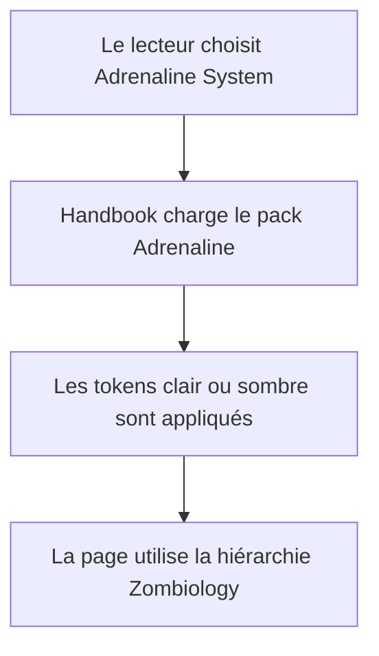
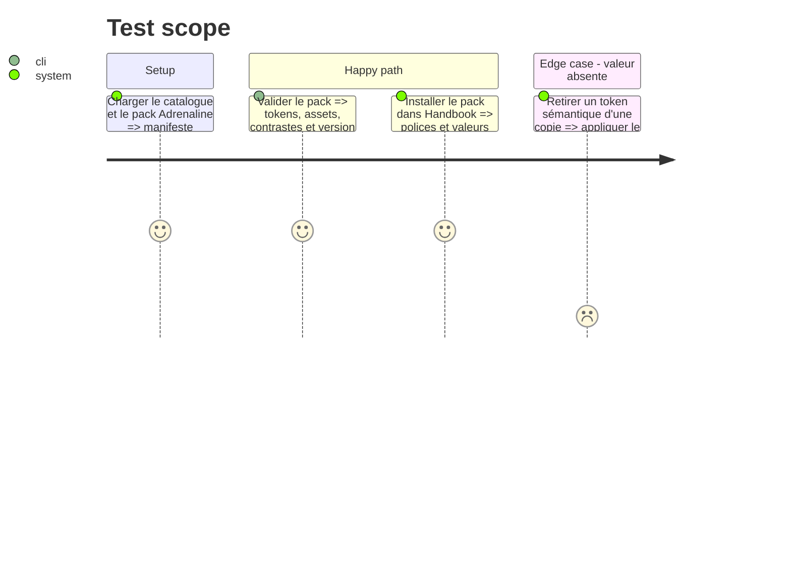

# Instruction: Contrat visuel déclaratif du pack

## Architecture projection

> Tree of the final files. ✅ create · ✏️ modify · ❌ delete

```txt
.
├── handbook/
│   └── adrenaline/
│       ├── ✏️ pack.json
│       └── ✏️ README.md
└── ✏️ handbook.json
```

## User Journey



## Test Scope



## Tasks to do

### `1)` Définir les tokens éditoriaux et de composants

> Déclarer dans le pack toutes les valeurs qui distinguent Zombiology du rendu Adrenaline générique.

1. Ajouter, pour clair et sombre, les tokens sémantiques de texte italique rouge, titres `h3` en cartouche sombre, titres `h4` rouges soulignés, listes à marqueur triangulaire, statuts jaune et rouge, tableaux, notes et cartouches de callout.
2. Conserver les polices locales existantes et calibrer tailles, graisses, capitales, espacements et contrastes contre les captures, sans ajouter de police ou d'illustration sous copyright.
3. Versionner simultanément `handbook/adrenaline/pack.json` et son entrée dans `handbook.json`.
4. Documenter la séparation entre tokens du pack et sélecteurs structurels du host.

## Test acceptance criteria

| Task | Acceptance criteria |
| ---- | ------------------- |
| 1 | Chaque polarité déclare les valeurs nécessaires aux titres, italiques, listes, statuts, tableaux, notes et callouts sans valeur Zombiology codée dans Handbook. |
| 1 | Le validateur du pack accepte la nouvelle version, ses assets et les contrastes de chaque surface texte/fond. |
| 1 | La documentation identifie le pack comme source de vérité des valeurs visuelles et décrit les repli attendus. |
