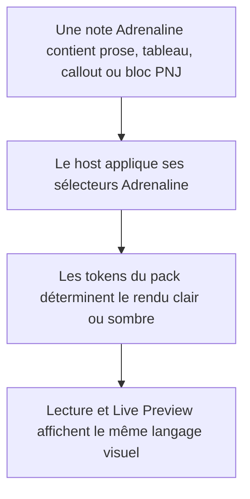
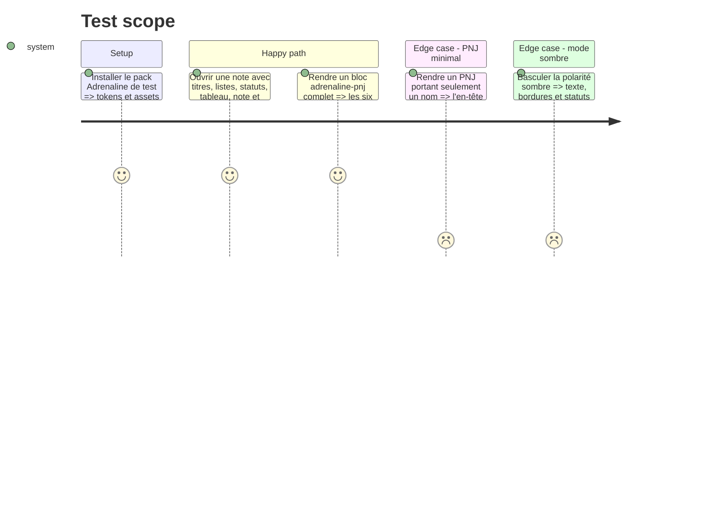

# Instruction: Rendu générique Handbook et fiche PNJ

## Architecture projection

> Tree of the final files. ✅ create · ✏️ modify · ❌ delete

```txt
../handbook/
├── src/
│   ├── features/
│   │   └── adrenalinePnj/
│   │       └── ✏️ renderer.ts
│   └── styles/
│       └── adrenaline/
│           ├── ✏️ _page.scss
│           ├── ✏️ _callouts.scss
│           ├── ✏️ _pnj.scss
│           └── ✅ _content.scss
└── tools/
    └── ✅ assert-adrenaline-zombiology-style.mjs
```

## User Journey



## Test Scope



## Tasks to do

### `1)` Ajouter les sélecteurs structurels neutres

> Faire consommer les tokens du pack par tous les contenus Markdown sans fixer de couleur, police ou mesure Zombiology dans le host.

1. Créer le partial de contenu Adrenaline et l'inclure dans son index.
2. Appliquer les variables sémantiques aux italiques, `h3`, `h4`, listes, tableaux et statuts dans les vues lecture et Live Preview.
3. Reprendre les callouts `note`, `example`, `warning` et `interroger` avec une anatomie distincte : note épinglée/papier, exemple encadré pointillé, cartouche à bandeau et panneau de règle.
4. Préserver les repli Obsidian si un ancien pack ne déclare pas les nouveaux tokens.

### `2)` Rapprocher la fiche PNJ de la feuille Zombiology

> Réordonner et différencier typographiquement les zones déjà fournies par le schéma, sans changer le contrat de données.

1. Vérifier et ajuster le marquage du renderer pour distinguer rôle, niveau de danger, présentation, caractéristiques, santé/protections, formations/compétences et équipement.
2. Recomposer la fiche avec bandeau brun, intertitres gris, grille de caractéristiques, deux colonnes de seuils, lignes de compétences et équipement final.
3. Garder le comportement compact d'un PNJ minimal et l'adaptation mobile.

## Test acceptance criteria

| Task | Acceptance criteria |
| ---- | ------------------- |
| 1 | En lecture et en Live Preview, les italiques sont rouges, les `h3` sont des cartouches sombres et les `h4` sont rouges avec un filet inférieur. |
| 1 | Les listes emploient des triangles rouges, les statuts négatifs jaune ou rouge sont distincts, et les tableaux reprennent l'encadrement et le bandeau de la référence. |
| 1 | Les callouts note, exemple et règle/cartouche restent lisibles, contrastés et utilisables sans image décorative. |
| 2 | Un PNJ complet rend les six zones de la fiche dans l'ordre de la référence ; un PNJ minimal ne montre aucun panneau ni libellé vide. |
| 2 | Le host ne contient aucune couleur, police ou dimension propre à Zombiology : il ne lit que des variables déclarées par le pack. |
