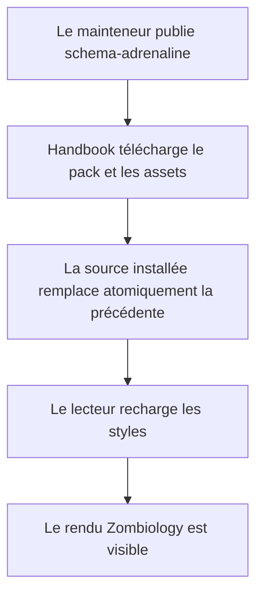
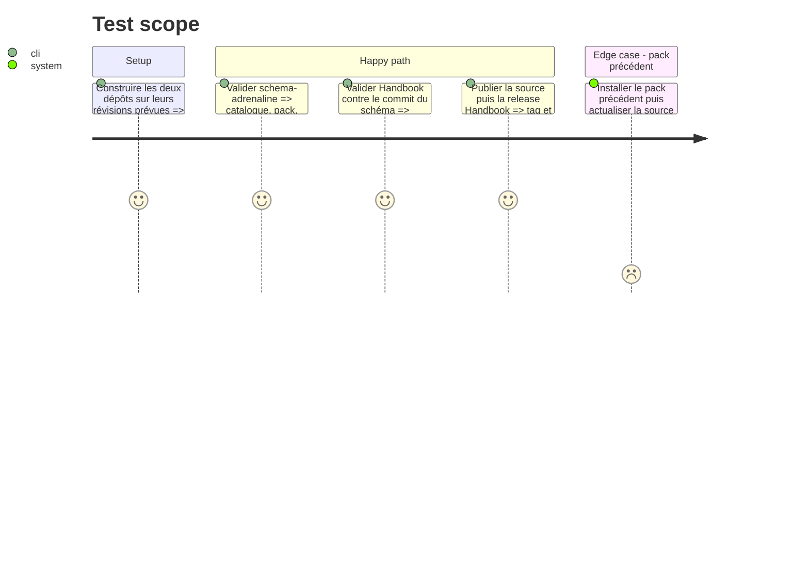

# Instruction: Validation, synchronisation et publication

## Architecture projection

> Tree of the final files. ✅ create · ✏️ modify · ❌ delete

```txt
../handbook/
├── compat/
│   └── ✏️ schema-adrenaline.ref
├── package.json
└── tools/
    └── ✏️ check.mjs
schema-adrenaline/
├── handbook/
│   └── adrenaline/
│       └── ✏️ pack.json
└── handbook.json
```

## User Journey



## Test Scope



## Tasks to do

### `1)` Prouver le contrat entre les deux dépôts

> Vérifier que le pack publié est consommé par le véritable host et que les nouveaux tokens ne rompent aucun pack existant.

1. Étendre les assertions Handbook pour contrôler les sélecteurs Adrenaline, leurs repli et la présence des tokens nécessaires dans le pack de test.
2. Exécuter la validation complète de `schema-adrenaline`, puis la validation complète de `handbook` avec la révision exacte du schéma.
3. Vérifier manuellement une note de référence claire et sombre, en lecture et Live Preview, avant publication.

### `2)` Publier dans l'ordre de compatibilité

> Synchroniser le pack source et le host sans exposer une version que l'autre ne saurait consommer.

1. Publier la release `schema-adrenaline` contenant le pack versionné et ses assets.
2. Mettre à jour dans Handbook la référence de compatibilité vers ce commit, puis publier la release patch du host avec les sélecteurs génériques.
3. Confirmer que l'installation et l'actualisation de la source dans Obsidian récupèrent le manifeste et les assets publiés.

## Test acceptance criteria

| Task | Acceptance criteria |
| ---- | ------------------- |
| 1 | Les contrôles des deux dépôts passent et prouvent que le pack Adrenaline réel est accepté et installé par Handbook. |
| 1 | Les régressions de contraste, de token absent, de lecture/Live Preview et de PNJ minimal sont couvertes par des assertions ou une vérification manuelle explicitement consignée. |
| 2 | La release du schéma précède la référence de compatibilité et la release patch de Handbook. |
| 2 | Une actualisation de source remplace atomiquement le pack installé et rend le nouveau style disponible sans copie manuelle. |
