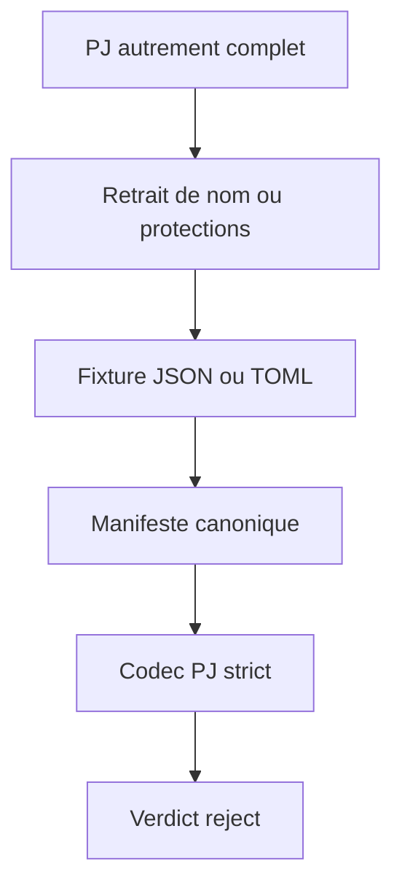
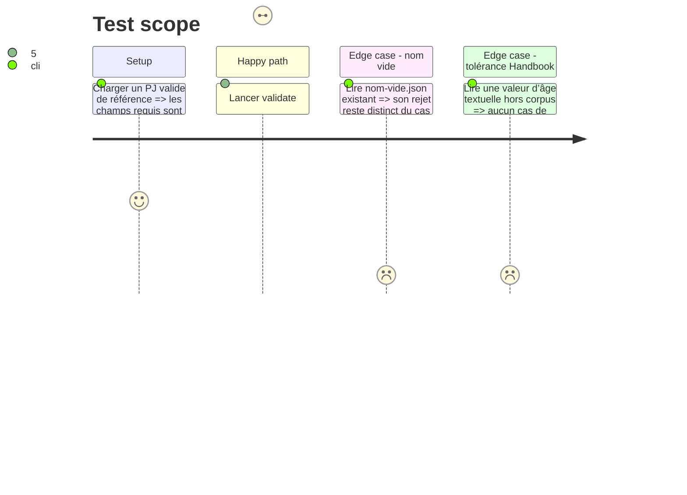

# Instruction: Fixtures de refus PJ et manifeste canonique

## Architecture projection

> Tree of the final files. ✅ create · ✏️ modify · ❌ delete

```txt
schema-adrenaline/
├── corpus/
│   ├── cases.json                              ✏️ indexe les quatre nouveaux refus
│   ├── refus/pj/nom-absent.json                ✅ PJ JSON complet sauf clé nom
│   ├── refus/pj/protections-absentes.json      ✅ PJ JSON complet sauf protections
│   └── contract/invalid/
│       ├── pj-nom-absent.toml                  ✅ PJ TOML complet sauf clé nom
│       └── pj-protections-absentes.toml        ✅ PJ TOML complet sauf protections
└── aidd_docs/tasks/2026_09/2026_09_15_refus-pj-nom-protections/
    ├── plan.md                                 ✅ trace la décision et le périmètre
    ├── phase-1.md                              ✅ borne la livraison
    └── backlog-link.json                       ✅ relie l’issue #7
```

## User Journey



## Test Scope



## Tasks to do

### `1)` Écrire les refus minimalement isolés

> Produire un document PJ par défaut métier et par format public, sans mélanger d’autres erreurs.

1. Créer les fixtures JSON `nom-absent` et `protections-absentes` à partir d’un PJ valide, en gardant respectivement toutes les autres valeurs requises.
2. Créer leurs homologues TOML sous `corpus/contract/invalid/`, avec la même cible PJ et une omission unique du champ concerné.
3. Vérifier que le cas `nom-vide` reste intact, puisqu’une chaîne vide et une clé absente sont deux défauts différents.

### `2)` Publier et prouver la couverture du manifeste

> Faire distribuer les quatre sources à tous les consommateurs du contrat.

1. Ajouter les quatre chemins à `corpus/cases.json` avec `target: pj`, leur format réel et `expect: reject`, sans duplicat ni chemin non indexé.
2. Exécuter `npm run validate:contract` pour prouver que les quatre codecs PJ correspondants refusent les documents et que le manifeste couvre exactement les fichiers corpus/exemples.
3. Exécuter `npm run validate:package` et `npm run validate:bundle` pour confirmer que le corpus enrichi reste inclus et accessible depuis l’archive consommée.

## Test acceptance criteria

| Task | Acceptance criteria |
| --- | --- |
| 1 | Chaque fixture contient un PJ valide à l’exception du seul champ obligatoire annoncé ; JSON et TOML refusent séparément l’absence de `nom` et de `protections`. |
| 2 | Le manifeste compte 39 entrées, dont 29 `reject`, indexe les quatre nouveaux chemins une fois, et les validations contrat/package/bundle passent. |
