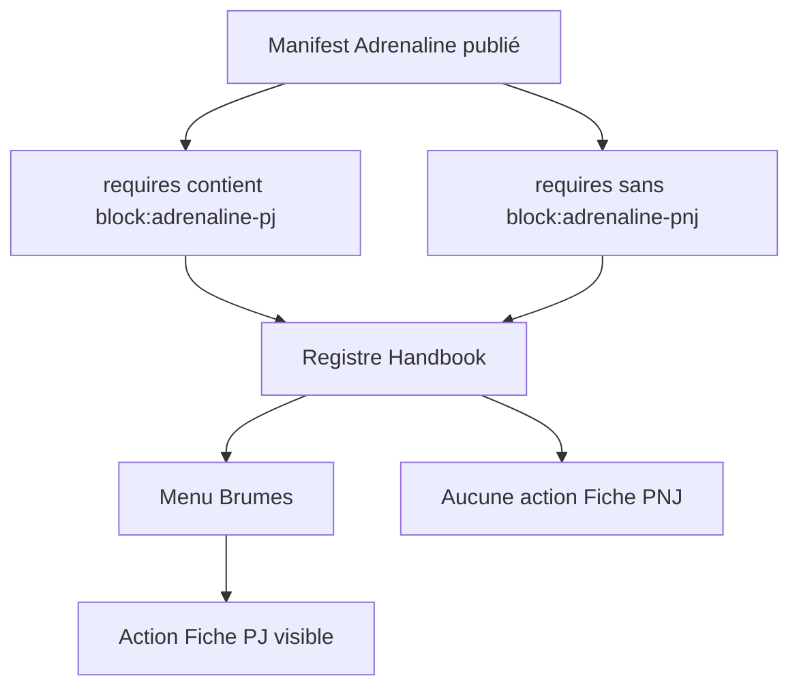
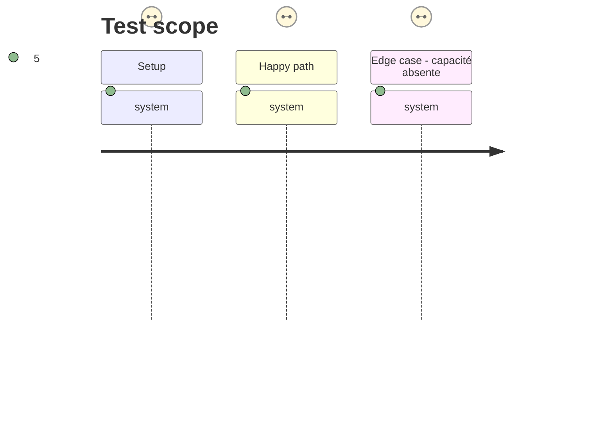

# Instruction: Activation Adrenaline par capacité publiée

## Architecture projection

> Tree of the final files. ✅ create · ✏️ modify · ❌ delete

```txt
handbook/
├── src/features/
│   ├── adrenalinePj/block.ts                 ✏️ déclarer block:adrenaline-pj
│   ├── adrenalinePnj/block.ts                ✏️ déclarer block:adrenaline-pnj
│   └── adrenalineMonstre/block.ts            ✏️ déclarer block:adrenaline-monstre
├── tools/
│   ├── customPacks.harness.mts                ✏️ sélectionner Adrenaline par capacité publiée
│   ├── contextualPackBlocks.harness.mts      ✅ vérifier Menu et Editor avec capacités partielles
│   └── assert-contextual-pack-blocks.mjs     ✅ bundler le harness avec un stub Obsidian
└── package.json                              ✏️ exposer l’assertion dans les scripts
```

## User Journey



## Test Scope



## Tasks to do

### `1)` Déclarer les capacités des blocs Adrenaline

> Faire porter à chaque bloc son identifiant de capacité publié, sans changer son rendu, son libellé ou son gabarit.

1. Remplacer `mode: "adrenaline"` par la capacité exacte dans les trois définitions de bloc.
2. Vérifier la compatibilité avec le registre de capacités Handbook et le manifeste Adrenaline 0.3.0.
3. Ne modifier ni les codecs ni les gabarits dépendants du contrat 2.0.0.

### `2)` Prouver la sélection dans le menu

> Vérifier que `requires` pilote réellement les insertions et exports contextuels Adrenaline.

1. Initialiser `GAME_REGISTRATIONS` par `initGameRegistry` avec un manifeste Adrenaline simulé, puis créer un faux `Menu` et `Editor` sur le modèle de l’assertion TOML contextuelle existante.
2. Vérifier les trois actions quand les capacités sont présentes, puis la disparition ciblée d’une action lorsque sa capacité manque.
3. Vérifier que l’export TOML ne peut être proposé que pour un bloc actif sous le curseur.

### `3)` Intégrer la vérification

> Rendre le harness disponible dans les scripts Handbook et la suite de contrôles.

1. Migrer le scénario Adrenaline de `customPacks.harness.mts` vers les capacités `block:adrenaline-*`.
2. Ajouter le lanceur esbuild avec stub Obsidian et déclarer `assert:contextual-pack-blocks` dans `package.json`.
3. Exécuter l’assertion avec les contrôles contextuels, de packs et contractuels Adrenaline existants.

## Test acceptance criteria

| Task | Acceptance criteria |
| ---- | ------------------- |
| 1 | Chaque bloc Adrenaline dépend uniquement de sa capacité `block:adrenaline-*` publiée. |
| 2 | Les insertions et exports visibles correspondent exactement aux capacités de blocs présentes dans le manifeste simulé. |
| 3 | Les scripts d’assertion échouent si une action apparaît sans capacité publiée ou disparaît malgré sa capacité. |
