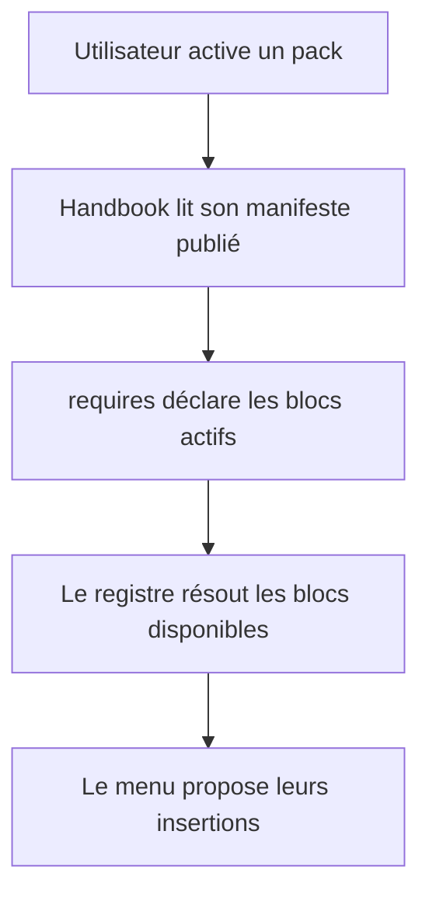

# Instruction: Projection des blocs publiés dans Handbook

## Architecture projection

> Tree of the final files. ✅ create · ✏️ modify · ❌ delete

```txt
handbook/
├── src/
│   ├── features/sources/                     ✏️ résoudre le manifeste publié du pack actif
│   ├── features/blocks/registry.ts            ✏️ sélectionner les blocs déclarés par requires
│   └── contextMenu/index.ts                   ✏️ composer les insertions du pack actif
└── tests/
    └── …                                     ✏️ couvrir la projection manifeste → menu
```

## User Journey



## Test Scope


## Tasks to do

### `1)` Établir la matrice des capacités existantes

> Prouver les blocs et opérations réellement communs avant toute généralisation.

1. Relever pour Adrenaline, schema-in-the-mist et schema-pbta les blocs publiés par leurs manifests.
2. Distinguer insertion de bloc, export TOML et collage TOML selon les exécuteurs Handbook existants.
3. Consigner les opérations qui ne sont pas représentables par `requires` comme candidats futurs, sans leur inventer de contrat.

### `2)` Dériver le registre actif du manifeste

> Utiliser `requires` comme autorité de disponibilité des insertions du menu.

1. Résoudre le manifeste du pack sélectionné depuis son catalogue publié.
2. Croiser ses exigences `block:*` avec le registre local de blocs rendables.
3. Conserver le comportement actuel pour un pack sans bloc ou pour une référence inconnue.

## Test acceptance criteria

| Task | Acceptance criteria |
| ---- | ------------------- |
| 1 | La matrice ne déclare aucune nouvelle métadonnée sans opération Handbook réelle qui la requiert. |
| 2 | Les insertions visibles correspondent exactement aux blocs `requires` du pack actif et aux blocs enregistrés. |

