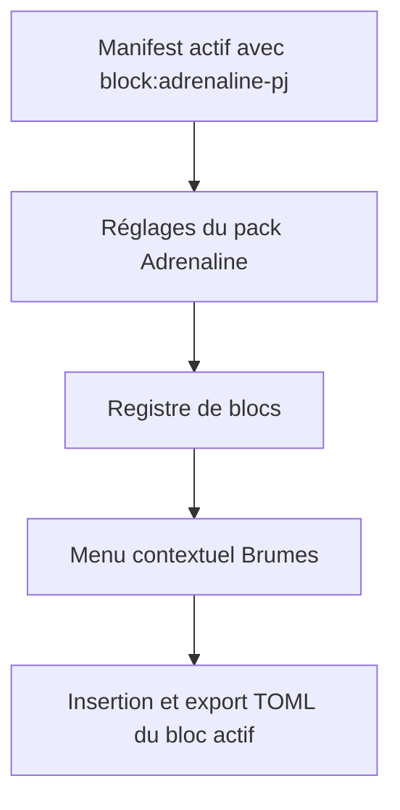
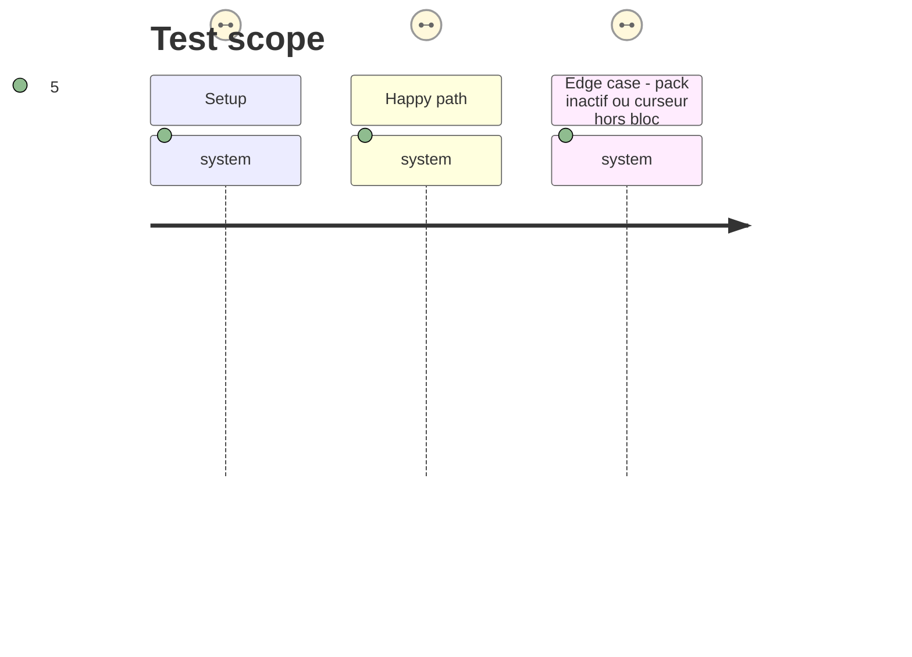

# Instruction: Harness des capacités de blocs contextuelles

## Architecture projection

> Tree of the final files. ✅ create · ✏️ modify · ❌ delete

```txt
handbook/
├── package.json                              ✏️ exposer le harness dans les scripts d’assertion
├── tools/
│   ├── contextualPackBlocks.harness.mts       ✅ simuler Menu et Editor pour les blocs publiés
│   └── assert-contextual-pack-blocks.mjs      ✅ bundler le harness avec un stub Obsidian
└── src/
    └── features/blocks/                       ✏️ aucune modification attendue ; surface sous test
```

## User Journey



## Test Scope



## Tasks to do

### `1)` Écrire le harness de menu

> Couvrir la chaîne de disponibilité commune sans ajouter de comportement productif.

1. Réutiliser le stub Obsidian et les faux `Menu`/`Editor` du harness d’export contextuel existant.
2. Construire les réglages qui activent puis désactivent les capacités `block:adrenaline-*` publiées.
3. Vérifier les titres, icônes, contenu inséré et export TOML pour PJ, PNJ et monstre.

### `2)` Intégrer l’assertion au contrôle Handbook

> Rendre la preuve exécutable localement et dans la suite de contrôles.

1. Ajouter le lanceur qui bundle le harness avec le stub Obsidian.
2. Exposer un script `assert:contextual-pack-blocks` dans `package.json`.
3. Exécuter ce script avec les assertions contextuelles et contractuelles Adrenaline existantes.

## Test acceptance criteria

| Task | Acceptance criteria |
| ---- | ------------------- |
| 1 | Chaque bloc Adrenaline requis produit une insertion contextuelle avec son libellé, son icône et son gabarit attendus, et son export TOML n’est offert qu’au curseur dans ce bloc. |
| 2 | Un pack inactif ou un curseur hors bloc ne produit aucune action Adrenaline, et le nouveau script échoue si cette sélection régresse. |

