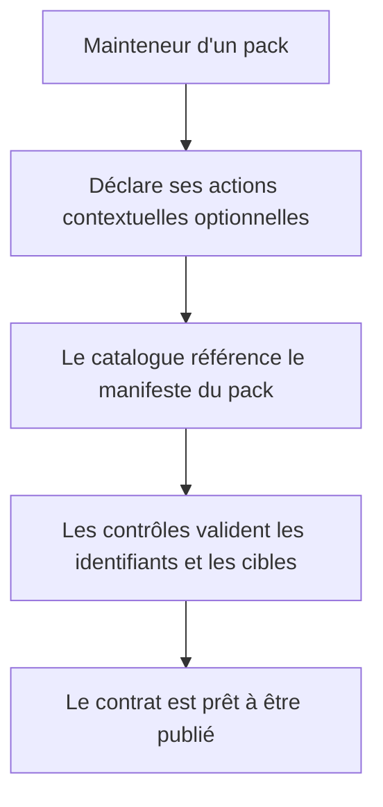

# Instruction: Contrat déclaratif optionnel des actions

## Architecture projection

> Tree of the final files. ✅ create · ✏️ modify · ❌ delete

```txt
schema-adrenaline/
├── handbook/
│   └── adrenaline/
│       └── pack.json                         ✏️ publier les actions contextuelles du pack
├── src/
│   └── …                                    ✏️ exposer et valider les métadonnées de contrat si nécessaire
├── schemas/adrenaline/2.0.0/
│   └── …                                    ✏️ régénérer les artefacts contractuels concernés
└── tools/
    └── …                                    ✏️ vérifier catalogue, manifeste et métadonnées d’actions
```

## User Journey



## Test Scope


## Tasks to do

### `1)` Modéliser les métadonnées publiées

> Définir une capacité optionnelle, indépendante de tout pack particulier, qui identifie l’action, le bloc cible, son libellé, son icône et son opération générique.

1. Relever les opérations déjà rendues pour schema-in-the-mist dans Handbook.
2. Ajouter au manifeste Adrenaline les déclarations compatibles sans encoder d’adaptateur Obsidian.
3. Documenter les invariants d’identifiant, de bloc cible et d’absence d’action.

### `2)` Verrouiller le contrat et ses artefacts

> Garantir que la capacité publiée est découverte depuis le catalogue et le manifeste référencé.

1. Étendre les contrôles de source pour lire les métadonnées via le manifeste du pack.
2. Régénérer les artefacts gelés seulement lorsqu’ils sont concernés par le contrat.
3. Couvrir les déclarations Adrenaline et l’absence de déclaration d’un autre pack.

## Test acceptance criteria

| Task | Acceptance criteria |
| ---- | ------------------- |
| 1 | Un pack peut publier zéro ou plusieurs actions contextuelles sans dépendre de schema-in-the-mist. |
| 2 | Les contrôles rejettent une action dont l’identifiant, l’opération ou le bloc cible ne correspond pas au manifeste publié. |

