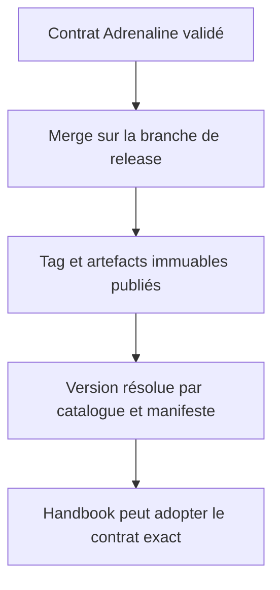
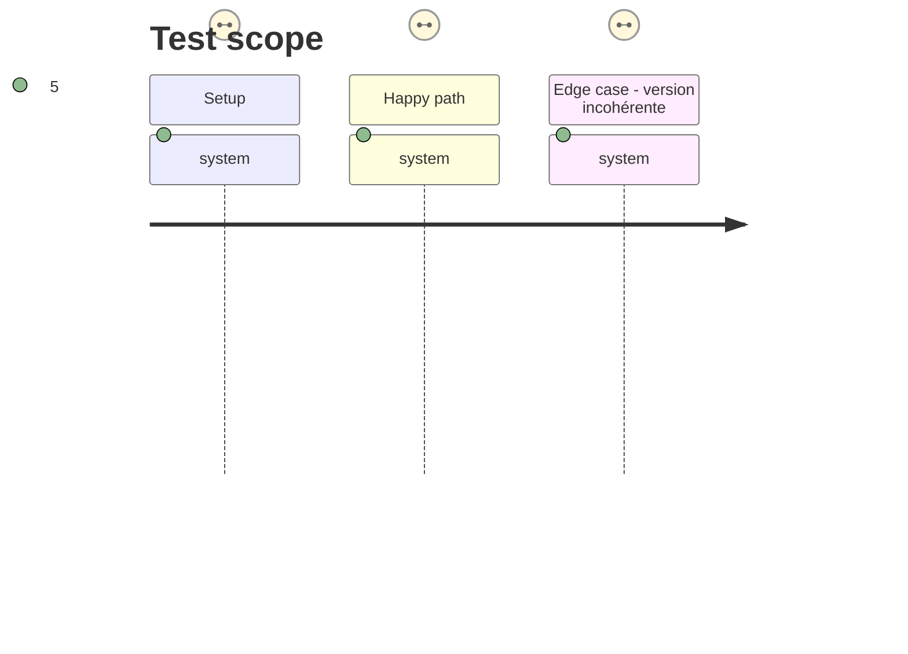

# Instruction: Release immuable du contrat Adrenaline

## Architecture projection

> Tree of the final files. ✅ create · ✏️ modify · ❌ delete

```txt
schema-adrenaline/
├── package.json                              ✏️ version et scripts de release
├── handbook/
│   ├── handbook.json                         ✏️ catalogue de la version publiée
│   └── adrenaline/pack.json                  ✏️ manifeste immuable avec actions
├── schemas/adrenaline/2.0.0/                 ✏️ archive de contrat vérifiée
└── aidd_docs/tasks/2026_09/
    └── 2026_09_18_valeurs-jouables-bornees/  ✏️ lever le blocage de release existant
```

## User Journey



## Test Scope



## Tasks to do

### `1)` Publier la révision contractuelle

> Livrer la révision incluant les valeurs bornées et les actions déclarées sous une référence immuable.

1. Terminer les validations et la revue de la branche Adrenaline.
2. Merger, taguer et publier les archives, manifests et artefacts gelés correspondants.
3. Mettre à jour le statut du plan des valeurs jouables bornées selon le résultat réel de la release.

### `2)` Prouver la résolution consommateur

> Vérifier qu’un consommateur ne connaît aucune version Adrenaline littérale.

1. Résoudre le pack par son entrée de catalogue puis son manifeste.
2. Vérifier la cohérence des versions, des chemins et des actions publiées.
3. Archiver la référence de release à utiliser par Handbook.

## Test acceptance criteria

| Task | Acceptance criteria |
| ---- | ------------------- |
| 1 | Une release Adrenaline immuable contient le manifeste qui déclare les actions contextuelles. |
| 2 | Une assertion consommateur dérive la version du catalogue et du manifeste, sans constante de version producteur. |

