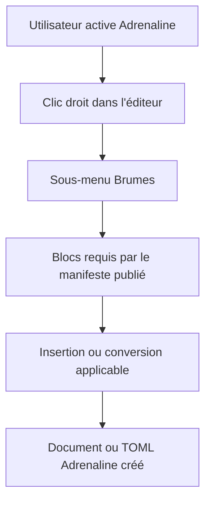

# Instruction: Rendu du menu depuis la release publiée

## Architecture projection

> Tree of the final files. ✅ create · ✏️ modify · ❌ delete

```txt
handbook/
├── src/
│   ├── contextMenu/index.ts                  ✏️ composer les actions des blocs résolus dans le sous-menu Brumes
│   ├── features/blocks/registry.ts            ✏️ sélectionner et insérer les blocs du pack actif
│   └── contracts/                            ✏️ résoudre le manifeste Adrenaline 0.3.0 publié
└── tests/
    └── …                                    ✏️ tester découverte, visibilité et insertion
```

## User Journey



## Test Scope


## Wireframe

```txt
┌──────────────────────────────────────────────┐
│ Menu contextuel de l'éditeur                  │
├──────────────────────────────────────────────┤
│ (1) Commandes natives                         │
├──────────────────────────────────────────────┤
│ (2) Brumes  ›                                 │
│      ┌──────────────────────────────────────┐│
│      │ (3) Actions des blocs actifs          ││
│      │     Fiche PJ / PNJ / monstre          ││
│      ├──────────────────────────────────────┤│
│      │ (4) Conversion TOML du bloc au curseur││
│      └──────────────────────────────────────┘│
└──────────────────────────────────────────────┘
```

1. Commandes natives : actions propres à Obsidian hors de portée du contrat.
2. Sous-menu Brumes : point d’entrée des capacités actives.
3. Blocs actifs : insertions résolues depuis `requires` et le registre Handbook.
4. Conversion TOML : action existante proposée seulement pour un bloc actif au curseur.

## Tasks to do

### `1)` Résoudre le pack actif

> Lire catalogue et manifeste publiés afin de sélectionner les blocs du pack sans liste Adrenaline locale.

1. Résoudre le pack actif par son entrée de catalogue et son manifeste référencé.
2. Croiser `requires` avec le registre de blocs Handbook et préserver l’ordre publié.
3. Émettre un diagnostic pour une dépendance de bloc inconnue sans ajouter d’entrée de menu.

### `2)` Rendre les insertions contextuelles

> Alimenter le sous-menu Brumes avec les blocs résolus et les contrôles existants d’activation.

1. Réutiliser labels, icônes et gabarits du registre de blocs.
2. Afficher seulement les insertions dont le pack et le bloc sont actifs.
3. Appliquer la même sélection aux exports et collages TOML déjà enregistrés pour le bloc au curseur.

### `3)` Prouver l’expérience utilisateur

> Vérifier que les trois blocs Adrenaline publiés sont accessibles comme les blocs schema-in-the-mist.

1. Ajouter des tests de résolution du manifeste, de bloc inconnu et de pack inactif.
2. Ajouter le parcours du clic droit jusqu’à l’insertion et à l’export TOML de PJ, PNJ et monstre.
3. Vérifier que les assertions de source dérivent toujours la version du catalogue et du manifeste.

## Test acceptance criteria

| Task | Acceptance criteria |
| ---- | ------------------- |
| 1 | Handbook sélectionne les blocs Adrenaline depuis la release publiée sans liste ou version Adrenaline codée en dur. |
| 2 | Le sous-menu Brumes affiche les insertions et conversions applicables à PJ, PNJ et monstre lorsque leurs blocs publiés sont actifs. |
| 3 | Un bloc est inséré ou exporté à l’emplacement du curseur, et un pack inactif ou une dépendance inconnue ne produit aucune entrée invalide. |
