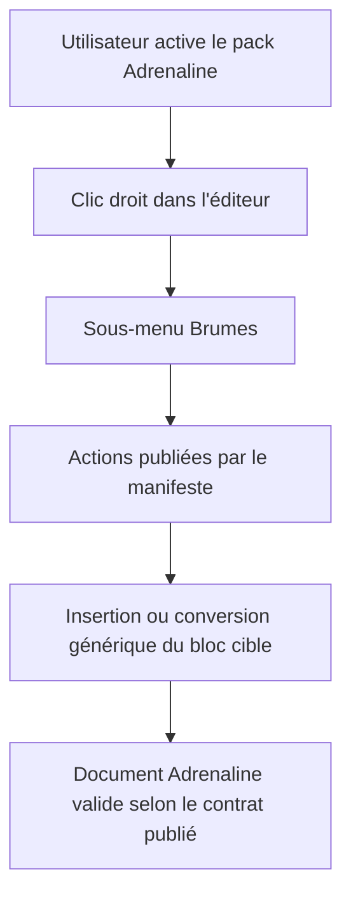
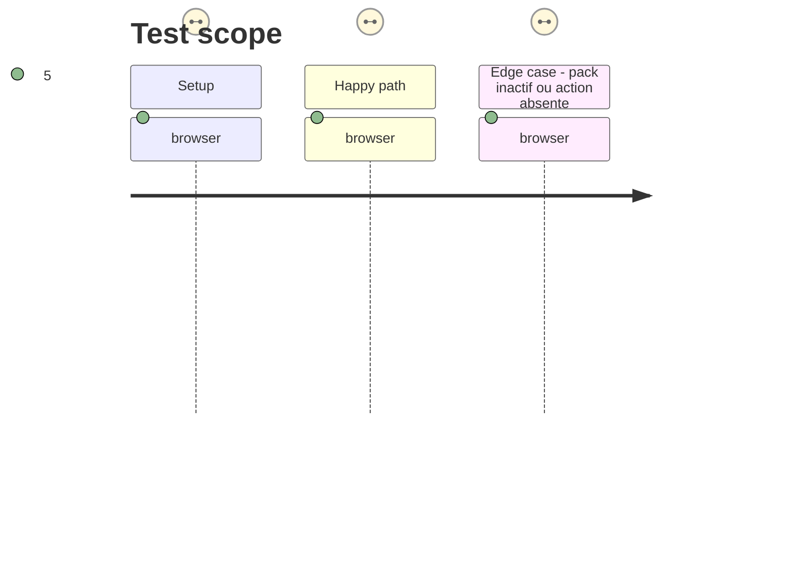

# Instruction: Découverte et rendu génériques dans Handbook

## Architecture projection

> Tree of the final files. ✅ create · ✏️ modify · ❌ delete

```txt
handbook/
├── src/
│   ├── contextMenu/index.ts                  ✏️ composer les actions publiées dans le sous-menu Brumes
│   ├── features/blocks/                      ✏️ résoudre et exécuter les opérations génériques déclarées
│   └── contracts/                            ✏️ charger le contrat Adrenaline publié exact
├── tests/
│   └── …                                    ✏️ tester découverte, visibilité et exécution des actions
└── package.json                              ✏️ dépendance sur la release Adrenaline publiée
```

## User Journey



## Test Scope



## Wireframe

```txt
┌──────────────────────────────────────────────┐
│ Menu contextuel de l'éditeur                  │
├──────────────────────────────────────────────┤
│ (1) Commandes natives                         │
├──────────────────────────────────────────────┤
│ (2) Brumes  ›                                 │
│      ┌──────────────────────────────────────┐│
│      │ (3) Actions génériques déjà disponibles││
│      ├──────────────────────────────────────┤│
│      │ (4) Actions déclarées par Adrenaline  ││
│      ├──────────────────────────────────────┤│
│      │ (5) Actions de conversion du bloc     ││
│      └──────────────────────────────────────┘│
└──────────────────────────────────────────────┘
```

1. Commandes natives : actions propres à Obsidian hors de portée du contrat.
2. Sous-menu Brumes : point d’entrée existant pour les capacités actives.
3. Actions génériques : insertions, collages ou exports déjà applicables.
4. Actions Adrenaline : entrées découvertes dans le manifeste du pack actif.
5. Conversions : entrées proposées seulement quand le curseur cible le bloc déclaré.

## Tasks to do

### `1)` Charger la capacité publiée

> Résoudre les actions depuis le pack Adrenaline publié, avec le même chemin de découverte que les autres contrats.

1. Remplacer les listes Adrenaline locales par la lecture du catalogue puis du manifeste de la release exacte.
2. Mapper uniquement les opérations déclaratives sur les exécuteurs génériques déjà possédés par Handbook.
3. Conserver les réglages de disponibilité et l’absence d’entrée lorsqu’une capacité est absente.

### `2)` Afficher les actions dans le menu contextuel

> Ajouter les entrées du pack actif au sous-menu Brumes avec les séparateurs et les conditions existantes.

1. Insérer les actions découvertes dans l’ordre déclaré, avec leurs libellés et icônes publiés.
2. Mettre à jour les gabarits Adrenaline pour produire les valeurs bornées du contrat 2.0.0.
3. Utiliser les codecs du contrat pour toute conversion TOML plutôt qu’un fallback sémantique local.

### `3)` Vérifier la parité et les régressions

> Prouver l’expérience de menu pour Adrenaline et préserver les packs qui expérimentent leurs propres capacités.

1. Ajouter des tests unitaires de résolution, opérations inconnues et absence d’action.
2. Adapter les assertions de source afin que la version vienne du catalogue et du manifeste.
3. Exécuter un parcours Obsidian du menu contextuel et les tests de conversion des blocs.

## Test acceptance criteria

| Task | Acceptance criteria |
| ---- | ------------------- |
| 1 | Handbook résout les actions Adrenaline depuis la release publiée sans liste ou version Adrenaline codée en dur. |
| 2 | Le sous-menu Brumes montre les mêmes catégories d’actions applicables que schema-in-the-mist pour les blocs Adrenaline actifs. |
| 3 | Les blocs créés ou convertis sont valides pour Adrenaline 2.0.0, et l’absence d’une capacité ne casse aucun autre pack. |

