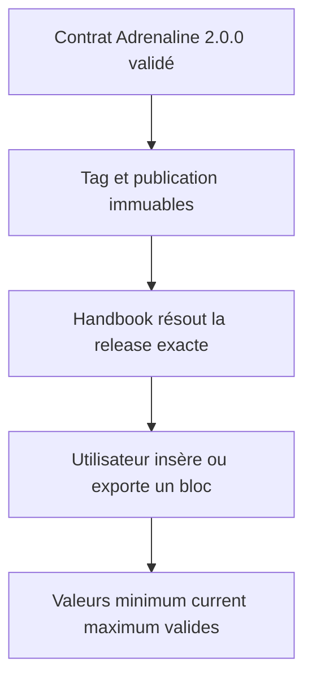

# Instruction: Adoption des valeurs bornées après release

## Architecture projection

> Tree of the final files. ✅ create · ✏️ modify · ❌ delete

```txt
schema-adrenaline/
├── handbook/
│   ├── handbook.json                         ✏️ catalogue de la release 2.0.0
│   └── adrenaline/pack.json                  ✏️ manifeste immuable avec les blocs requis
└── schemas/adrenaline/2.0.0/                 ✏️ archive de contrat vérifiée
handbook/
├── src/features/adrenalinePj/block.ts         ✏️ gabarit de valeur jouable bornée
├── src/features/adrenalinePnj/block.ts        ✏️ gabarit de valeur jouable bornée
├── src/features/adrenalineMonstre/block.ts    ✏️ gabarit de valeur jouable bornée
└── src/features/blocks/tomlExports.ts         ✏️ conversions par les codecs 2.0.0
```

## User Journey



## Test Scope


## Tasks to do

### `1)` Publier le contrat Adrenaline 2.0.0

> Lever le prérequis de release sans retarder les insertions déjà disponibles en 0.3.0.

1. Terminer les validations et la revue du contrat de valeurs bornées.
2. Merger, taguer et publier l’archive, le catalogue et le manifeste immuables.
3. Mettre à jour le statut du plan des valeurs jouables bornées selon le résultat réel de la release.

### `2)` Adopter la nouvelle forme dans Handbook

> Mettre à niveau seulement les gabarits et conversions affectés par les valeurs jouables bornées.

1. Résoudre la release 2.0.0 depuis catalogue puis manifeste.
2. Mettre à jour les gabarits PJ, PNJ et monstre vers `minimum`, `current`, `maximum`.
3. Utiliser les codecs publiés pour les exports TOML et supprimer toute supposition scalaire locale.

### `3)` Vérifier la migration

> Prouver les parcours d’insertion et de conversion du contrat immuable.

1. Vérifier la cohérence catalogue/manifeste sans version producteur codée en dur.
2. Tester les intervalles valides et incohérents par les codecs publics.
3. Exécuter le parcours Obsidian d’insertion puis d’export des trois blocs.

## Test acceptance criteria

| Task | Acceptance criteria |
| ---- | ------------------- |
| 1 | La release 2.0.0 contient les schémas, le catalogue et le manifeste immuables nécessaires à Handbook. |
| 2 | Les nouveaux gabarits et exports produisent uniquement des valeurs jouables bornées valides. |
| 3 | Les assertions ne contiennent aucune version Adrenaline littérale et les intervalles incohérents sont refusés. |

