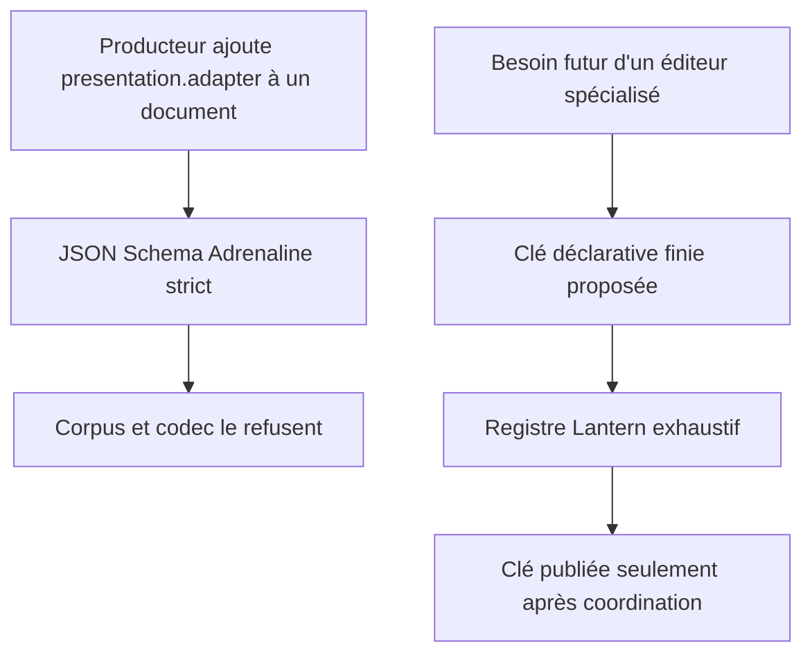
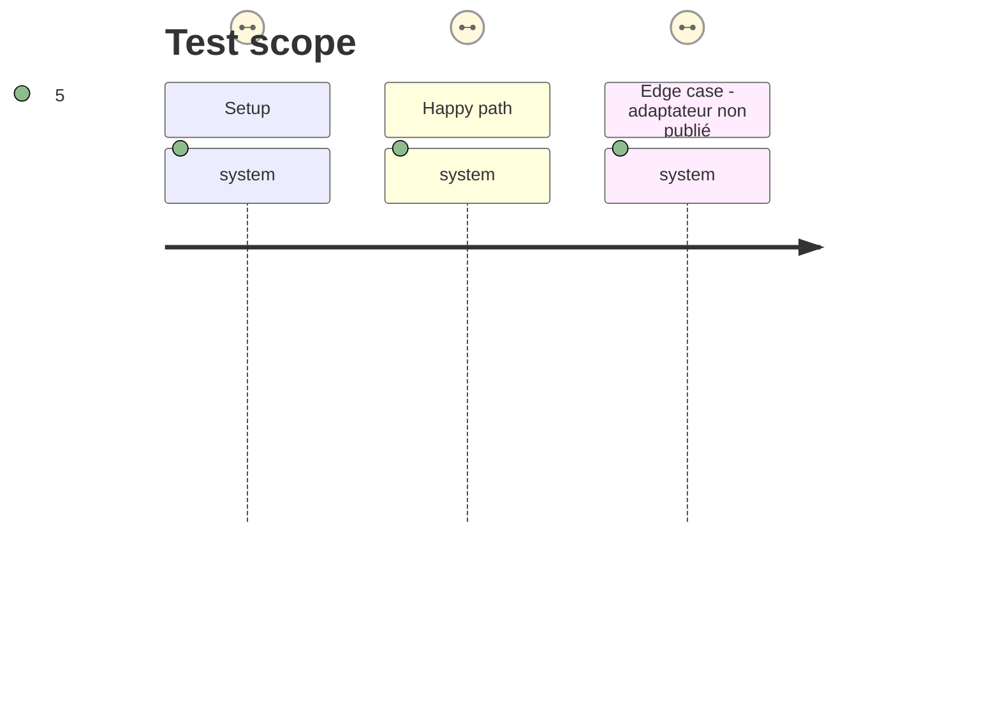

# Instruction: Absence de métadonnées et frontière Lantern

## Architecture projection

> Tree of the final files. ✅ create · ✏️ modify · ❌ delete

```txt
.
├── README.md                                             ✏️ déclarer l'absence actuelle de présentation et le protocole d'extension
├── aidd_docs/memory/internal/decisions/
│   └── cles-adaptateur-lantern-registre-ferme.md         ✅ consigner la frontière de responsabilité inter-dépôts
├── corpus/
│   ├── cases.json                                        ✏️ indexer les contre-exemples de présentation
│   └── refus/
│       ├── pj/presentation-adapter-inconnu.json           ✅ refuser une métadonnée d'adaptateur non publiée
│       ├── pnj/presentation-adapter-inconnu.json          ✅ refuser une métadonnée d'adaptateur non publiée
│       └── monstre/presentation-adapter-inconnu.json      ✅ refuser une métadonnée d'adaptateur non publiée
└── tools/
    └── validate-contract.ts                              ✏️ exiger que ces contre-exemples soient refusés par le schéma et les codecs
```

## User Journey



## Test Scope



## Tasks to do

### `1)` Déclarer le vocabulaire actuellement vide

> Dire dans la documentation publique et dans une décision durable qu'Adrenaline ne publie actuellement aucun descripteur de présentation ni clé d'adaptateur.

1. Documenter dans `README.md` que les schémas ne portent que les données interchangeables et qu'aucun champ de présentation, d'adaptateur ou de composant n'est accepté aujourd'hui.
2. Créer la décision qui fixe le protocole futur : clé stable et finie dans le contrat, aucune référence React, chemin, classe CSS ou configuration exécutable, registre exhaustif et erreur explicite côté Lantern.
3. Exiger qu'une future clé soit convenue avec Lantern et son registre fermé avant la release qui la publie ; ne créer ni clé fictive ni modification Lantern dans ce lot.

### `2)` Rendre le refus exécutable

> Couvrir les trois documents Adrenaline contre l'introduction silencieuse de métadonnées de présentation.

1. Ajouter une fixture invalide par cible, avec un bloc `presentation` qui contient une clé `adapter` non publiée, sans masquer une autre erreur métier.
2. Indexer ces fixtures dans `corpus/cases.json` comme refus JSON afin qu'elles soient distribuées avec le kit de conformité.
3. Étendre `tools/validate-contract.ts` pour vérifier explicitement que ces cas échouent autant au JSON Schema draft-7 qu'au codec ; conserver la vérification existante des intervalles, qui est la seule exception structurellement valide.
4. Exécuter `npm run validate:contract`, `npm run audit` et `npm run check` pour confirmer que l'absence de surface de présentation ne modifie ni les témoins ni le tarball.

## Test acceptance criteria

| Task | Acceptance criteria |
| ---- | ------------------- |
| 1 | La documentation déclare sans ambiguïté qu'aucune clé d'adaptateur ni métadonnée de présentation n'est publiée, et attribue à Lantern le registre fermé ainsi que l'échec des clés inconnues. |
| 2 | Pour PJ, PNJ et monstre, une fixture `presentation.adapter` est rejetée par le schéma généré et par le codec ; les documents légitimes restent acceptés et les vérifications de distribution passent. |
