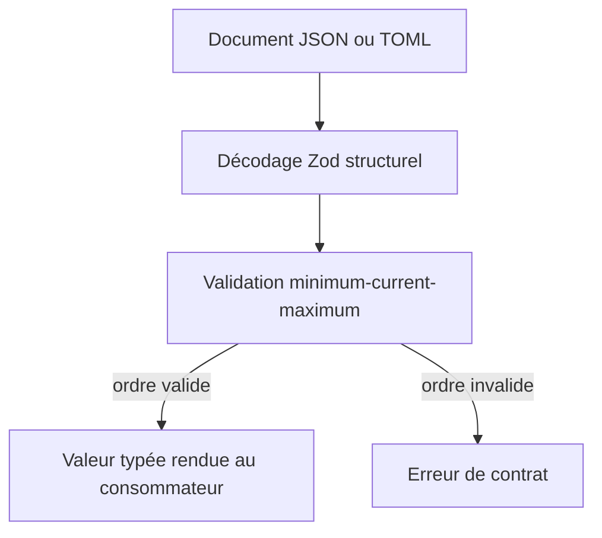
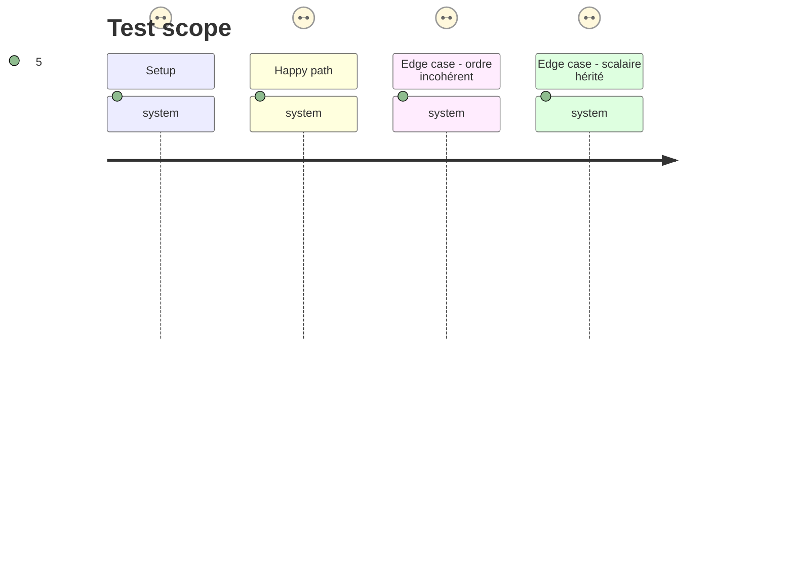

# Instruction: Contrat v2 et validation d'intervalle

## Architecture projection

> Tree of the final files. ✅ create · ✏️ modify · ❌ delete

```txt
.
├── src/
│   ├── contract-version.ts                 ✏️ annonce le contrat majeur et sa baseline 2.0.0
│   ├── index.ts                            ✏️ publie le type, le schéma et le validateur d'intervalle
│   ├── codecs/documents.ts                 ✏️ applique le validateur après le décodage Zod JSON ou TOML
│   ├── validation/playable-ranges.ts       ✅ vérifie récursivement minimum ≤ current ≤ maximum sans modifier le schéma draft-7
│   └── zod/common/
│       ├── primitives.ts                   ✏️ définit et exporte ValeurJouable et ses variantes bornées
│       ├── caracteristiques.ts             ✏️ remplace les caractéristiques scalaires
│       ├── formations.ts                   ✏️ remplace les pourcentages jouables des formations et compétences
│       ├── protections.ts                  ✏️ remplace les valeurs de protection jouables
│       ├── sante.ts                        ✏️ remplace les seuils et valeurs de santé jouables
│       ├── equipement.ts                   ✏️ remplace les pourcentages jouables d'équipement
│       └── contagion.ts                    ✏️ remplace les probabilités jouables, si elles sont modifiables en jeu
└── aidd_docs/tasks/2026_09/2026_09_18_valeurs-jouables-bornees/
    └── phase-1.md                          ✏️ décrit la phase
```

## User Journey



## Test Scope



## Tasks to do

### `1)` Délimiter précisément les nombres jouables

> Appliquer l'objet borné aux états de jeu, sans étendre la rupture aux nombres structurels ou éditoriaux.

1. Recenser chaque emploi de `Pourcentage`, `Points`, `Cumul` et de toute probabilité modifiable dans les trois cibles.
2. Remplacer les scores, ressources, seuils, caractéristiques, pourcentages modifiables, protections, santé et jauges par la même forme exportée `{ minimum, current, maximum }` avec les bornes métier existantes sur chacune de ses composantes.
3. Conserver scalaires les pages, quantités, dés, indices, comptes d'actions, niveaux de danger, versions et identifiants numériques ; documenter cette frontière dans les descriptions publiées.
4. Mettre à jour les types exportés pour que TypeScript ne permette plus d'écrire un scalaire aux emplacements jouables.

### `2)` Ajouter la validation de cohérence hors du schéma généré

> Rejeter tout intervalle inversé sur les points d'entrée de contrat, sans dissimuler une contrainte dans Zod.

1. Créer un validateur explicite, réutilisable et exporté, qui visite les valeurs jouables décodées et rapporte leur chemin lorsque `minimum > current` ou `current > maximum`.
2. L'appeler dans les parseurs JSON et TOML des codecs après la validation Zod structurelle, et conserver une erreur exploitable par les consommateurs.
3. Désigner et documenter les codecs et le validateur exporté comme les seules API de validation de contrat complète ; les schémas Zod exportés restent volontairement des validateurs de forme et ne doivent pas être présentés comme vérifiant l'ordre.
4. Ne pas ajouter `.refine()` aux schémas Zod et ne pas injecter de mécanisme non draft-7 dans les JSON Schemas : Ajv doit continuer à compiler leur forme structurelle.

### `3)` Préparer la rupture de contrat majeure

> Aligner identité, baseline immuable et documentation publique sur la nouvelle forme.

1. Passer package, constantes de contrat, chemins figés et exports de package à `2.0.0`.
2. Mettre à jour README, descriptions Zod et commentaires de codecs pour expliquer la distinction entre validation structurelle draft-7 et ordre validé par les codecs.
3. Écrire la note de migration : un scalaire historique `n` devient `{ minimum: 0, current: n, maximum: n }`, sans prétendre connaître une capacité absente des données.

## Test acceptance criteria

| Task | Acceptance criteria |
| ---- | ------------------- |
| 1 | Chaque emplacement numérique jouable des trois documents exige les trois clés de l'objet ; les nombres explicitement structurels ou éditoriaux restent des scalaires. |
| 2 | Les codecs publics JSON et TOML, ainsi que le validateur exporté, acceptent un intervalle ordonné et refusent chaque ordre impossible avec le chemin de la valeur fautive ; les schémas Zod et JSON publiés sont explicitement structurels et restent compilables par Ajv en draft-7. |
| 3 | Les exports et chemins de package identifient 2.0.0, et le guide de migration ne crée aucune capacité fictive. |
