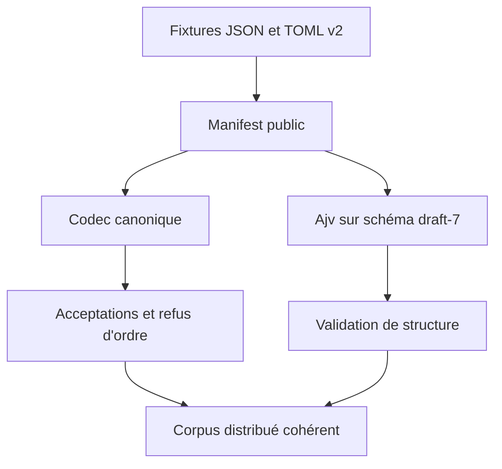
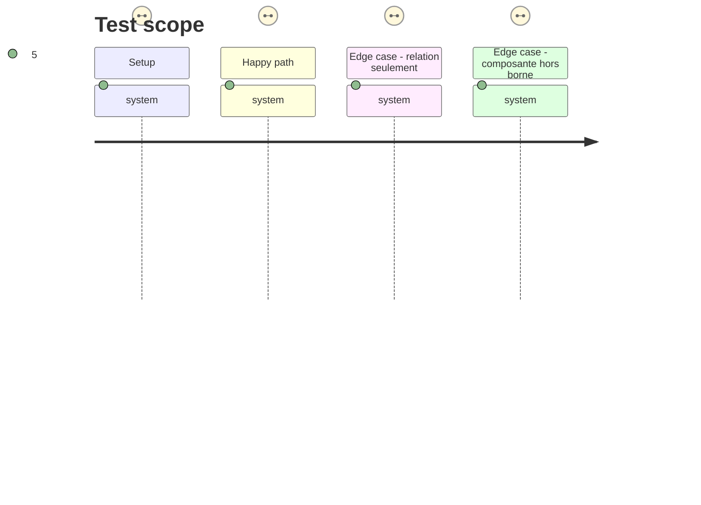

# Instruction: Corpus, génération et contrôles du contrat

## Architecture projection

> Tree of the final files. ✅ create · ✏️ modify · ❌ delete

```txt
.
├── examples/adrenaline/                   ✏️ convertit tous les exemples TOML à la forme bornée
├── corpus/
│   ├── temoins/                            ✏️ convertit les témoins JSON complets à la forme bornée
│   ├── refus/                              ✏️ adapte les refus existants et ajoute les intervalles incohérents
│   ├── contract/                           ✏️ ajoute les cas TOML d'ordre invalide et adapte les cas existants
│   ├── cases.json                          ✏️ indexe exactement tous les documents modifiés ou créés
│   └── README.md                           ✏️ explique la preuve structurelle et inter-champs
├── schemas/adrenaline/
│   ├── pj.schema.json                      ✏️ schéma courant régénéré
│   ├── pnj.schema.json                     ✏️ schéma courant régénéré
│   ├── monstre.schema.json                 ✏️ schéma courant régénéré
│   └── 2.0.0/                              ✅ gel généré des trois schémas v2
├── tools/
│   ├── validate-contract.ts                ✏️ prouve codec, migration de formes et refus inter-champs
│   └── audit-schemas.ts                    ✏️ distingue les refus Ajv structurels des refus des codecs si nécessaire
└── CHANGELOG.md                            ✏️ consigne la rupture majeure et le chemin de migration
```

## User Journey



## Test Scope



## Tasks to do

### `1)` Migrer les preuves publiques vers v2

> Faire du corpus la référence exécutable de la nouvelle forme et de sa migration.

1. Convertir exemples et témoins sans altérer leurs faits éditoriaux ; la valeur existante devient `current` et chaque migration historique applique `minimum: 0`, `maximum: n`.
2. Adapter les refus de type et de borne pour viser la composante pertinente d'un objet borné.
3. Ajouter au minimum des refus JSON et TOML pour `minimum > current` et `current > maximum`, ainsi qu'un cas de scalaire hérité refusé par v2.
4. Mettre `corpus/cases.json` à jour pour que chaque fichier public soit indexé une fois, avec sa cible, son format et son attente.

### `2)` Vérifier les deux niveaux de validité

> Empêcher une confusion entre forme JSON Schema et sémantique de l'intervalle.

1. Étendre `validate-contract.ts` afin que les cas de relation passent par les codecs publics JSON et TOML, et que leurs aller-retours restent stables.
2. Conserver les contrôles Ajv sur les schémas et prouver explicitement qu'un objet bien formé mais désordonné est hors du champ draft-7 tout en étant refusé par le contrat exécutable.
3. Garder l'audit des descriptions, identifiants, bornes réelles, témoins et refus ; ajuster uniquement ses attentes devenues obsolètes par les objets imbriqués.

### `3)` Régénérer et contrôler le livrable majeur

> Produire les artefacts distribuables depuis les sources, jamais à la main.

1. Régénérer les schémas courants et le répertoire figé `schemas/adrenaline/2.0.0/`.
2. Mettre à jour CHANGELOG et le guide de corpus avec la rupture et le comportement de migration.
3. Exécuter la chaîne `npm run check` complète et corriger les incohérences de génération, manifest, package ou bundle qu'elle révèle.

## Test acceptance criteria

| Task | Acceptance criteria |
| ---- | ------------------- |
| 1 | Chaque fixture distribuée est v2 et indexée une seule fois ; le corpus contient des preuves JSON et TOML pour chaque relation d'intervalle invalide et pour un scalaire hérité. |
| 2 | La suite sépare clairement le refus structurel Ajv du refus inter-champs des codecs, sans affirmer qu'Ajv sait comparer les trois champs. |
| 3 | Les trois schémas courants et leurs gels 2.0.0 sont générés depuis les sources et `npm run check` réussit intégralement. |
