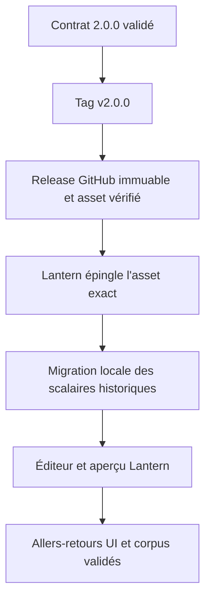
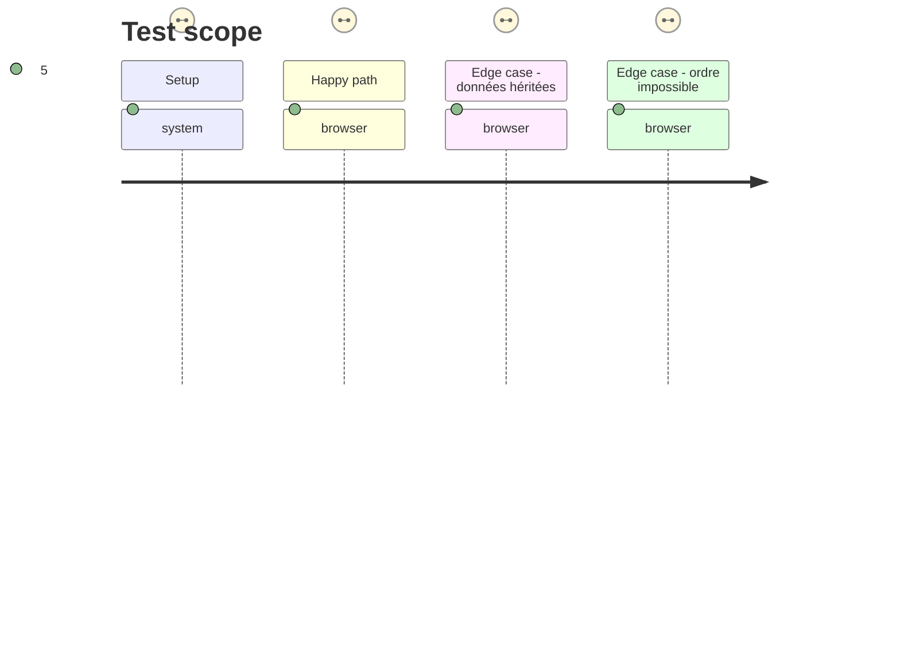

# Instruction: Release immuable et relais Lantern

## Architecture projection

> Tree of the final files. ✅ create · ✏️ modify · ❌ delete

```txt
schema-adrenaline/
├── package.json                            ✏️ archive uniquement les artefacts 2.0.0 et exports correspondants
├── .github/workflows/release.yml           ✏️ vérifie et publie l'asset v2.0.0 immuable
├── README.md                               ✏️ donne l'URL de release et le guide d'adoption 2.0.0
└── CHANGELOG.md                            ✏️ annonce les incompatibilités et la migration

Lantern (dépôt consommateur, après release)
├── dépendance lockfile                     ✏️ épingle l'URL et l'intégrité de l'archive schema-adrenaline-2.0.0.tgz
├── adaptateur de migration                 ✏️ transforme localement les anciens scalaires sans inventer de maximum
├── éditeurs de valeurs jouables            ✏️ saisissent minimum, current et maximum
├── aperçus de fiches                       ✏️ affichent les trois valeurs selon la sémantique publiée
└── assertions et parcours UI               ✏️ couvrent import, édition, aperçu et aller-retour JSON/TOML
```

## User Journey



## Test Scope



## Wireframe

```txt
┌──────────────────────────────────────────────────────┐
│ (1) En-tête de fiche                                  │
├───────────────────┬──────────────────────────────────┤
│ (2) Navigation    │ (3) Bloc de valeur jouable        │
│     des sections  │ ┌────────┬────────┬─────────────┐ │
│                   │ │ (4) min│(5) curr│ (6) max     │ │
│                   │ └────────┴────────┴─────────────┘ │
│                   │ (7) Aperçu de la valeur           │
├───────────────────┴──────────────────────────────────┤
│ (8) Actions d'enregistrement et d'export              │
└──────────────────────────────────────────────────────┘
```

1. En-tête : identité de la fiche et contexte du document.
2. Navigation : accès aux groupes de valeurs de la fiche.
3. Bloc : conteneur d'une valeur jouable publiée par le contrat.
4. Minimum : première composante de l'intervalle.
5. Current : composante actuellement jouée.
6. Maximum : dernière composante de l'intervalle.
7. Aperçu : représentation de la valeur dans la fiche.
8. Actions : enregistrement et formats d'échange de la fiche.

## Tasks to do

### `1)` Publier le contrat majeur immuable

> Faire de 2.0.0 une dépendance consommable avant toute adoption Lantern.

1. Vérifier que le tag `v2.0.0`, la version package, les schémas figés, les exports et l'archive ne portent qu'une même version.
2. Lancer les contrôles de release, publier l'asset et son checksum, puis vérifier l'état immuable et le digest exposés par GitHub.
3. Documenter l'URL installable et l'intégrité de l'archive exacte ; ne pas demander à Lantern de suivre `main` ni un tag mutable.

### `2)` Transmettre le contrat au dépôt Lantern

> Créer un handoff exécutable sans importer d'adaptateur consommateur dans ce dépôt.

1. Ouvrir ou relier le travail Lantern seulement après la release, en indiquant l'URL, la version, le checksum et les cas de corpus v2 à réutiliser.
2. Exiger une dépendance exacte dans son lockfile et une migration consumer-owned de chaque scalaire `n` vers `{ minimum: 0, current: n, maximum: n }`.
3. Ne pas fournir de fallback sémantique local : les menus, formulaires et aperçus Lantern doivent dériver des métadonnées et types 2.0.0 publiés.

### `3)` Vérifier l'adoption de bout en bout dans Lantern

> Prouver l'expérience consommateur sans déplacer son code ni ses tests dans le package de schéma.

1. Mettre à jour les éditeurs et aperçus pour les trois composants de chaque valeur jouable, selon le wireframe validé.
2. Ajouter assertions d'import/migration, de validation d'ordre, d'export JSON/TOML et d'affichage, en réutilisant le corpus distribué.
3. Exécuter les parcours navigateur sur une fiche héritée, une fiche v2 valide et une saisie invalide, puis joindre les résultats au travail Lantern.

## Test acceptance criteria

| Task | Acceptance criteria |
| ---- | ------------------- |
| 1 | GitHub publie une release `v2.0.0` immuable, avec exactement l'archive et son checksum correspondant aux artefacts validés. |
| 2 | Lantern dépend de l'archive 2.0.0 exacte et possède son adaptation locale documentée, sans fallback qui réinterprète les scalaires dans le consommateur. |
| 3 | Dans Lantern, une fiche héritée migre sans capacité inventée, une fiche v2 effectue un aller-retour intact, et une valeur désordonnée ne peut ni être enregistrée ni exportée. |
