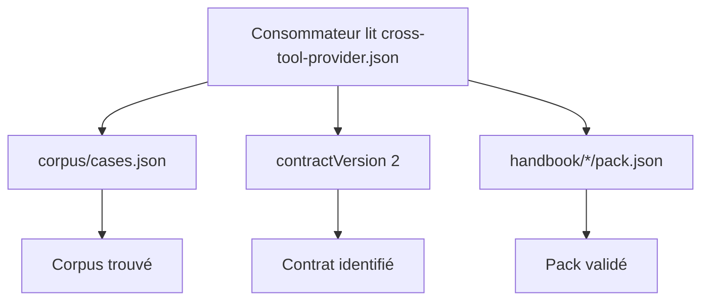
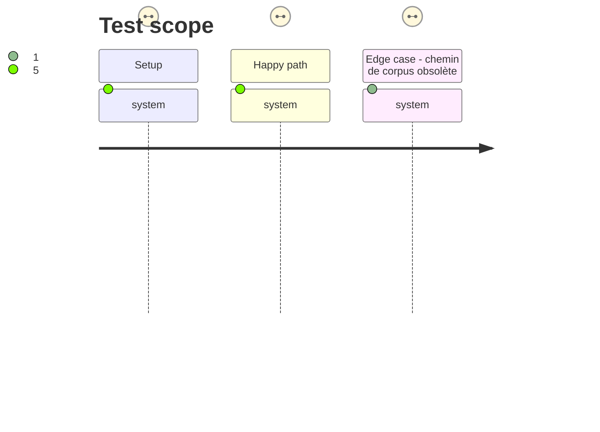

# Instruction: Contrat du descripteur et validation locale

## Architecture projection

> Tree of the final files. ✅ create · ✏️ modify · ❌ delete

```txt
.
├── cross-tool-provider.json       ✏️ annoncer le manifeste de corpus réel et contractVersion 2
└── tools/
    └── validate-packs.ts          ✏️ vérifier les champs consommés du descripteur et leurs chemins publiés
```

## User Journey



## Test Scope



## Tasks to do

### `1)` Corriger les métadonnées publiées

> Faire correspondre le descripteur aux fichiers et à la version du contrat qu'il annonce.

1. Remplacer le chemin de corpus inexistant par `corpus/cases.json`.
2. Ajouter `contractVersion` avec la valeur du contrat Adrenaline actuel.
3. Conserver les capacités, le motif de manifeste Handbook et la commande de validation existants.

### `2)` Refuser les dérives du descripteur

> Étendre le validateur piloté par le descripteur afin que les champs consommés par les outils croisés ne soient plus décoratifs.

1. Lire et typer `corpus` et `contractVersion` avec les champs déjà consommés.
2. Vérifier que la version est celle de `ADRENALINE_CONTRACT_VERSION`, que le corpus est un chemin relatif sûr vers un fichier, et qu'il peut être lu comme manifeste de corpus.
3. Conserver la découverte des packs depuis `packManifest`, et ajouter une auto-vérification qui refuse le chemin de corpus historique.

## Test acceptance criteria

| Task | Acceptance criteria |
| ---- | ------------------- |
| 1 | `cross-tool-provider.json` annonce `corpus/cases.json` et la version majeure du contrat effectivement publiée. |
| 1 | Les capacités Handbook et Lantern, le motif de pack et la commande de validation restent inchangés. |
| 2 | `npm run validate:packs` échoue si le corpus est absent, sort du dépôt, n'est pas un manifeste lisible ou si `contractVersion` diverge du contrat exporté. |
| 2 | La validation locale refuse explicitement le chemin historique `corpus/contract/cases.json`. |
