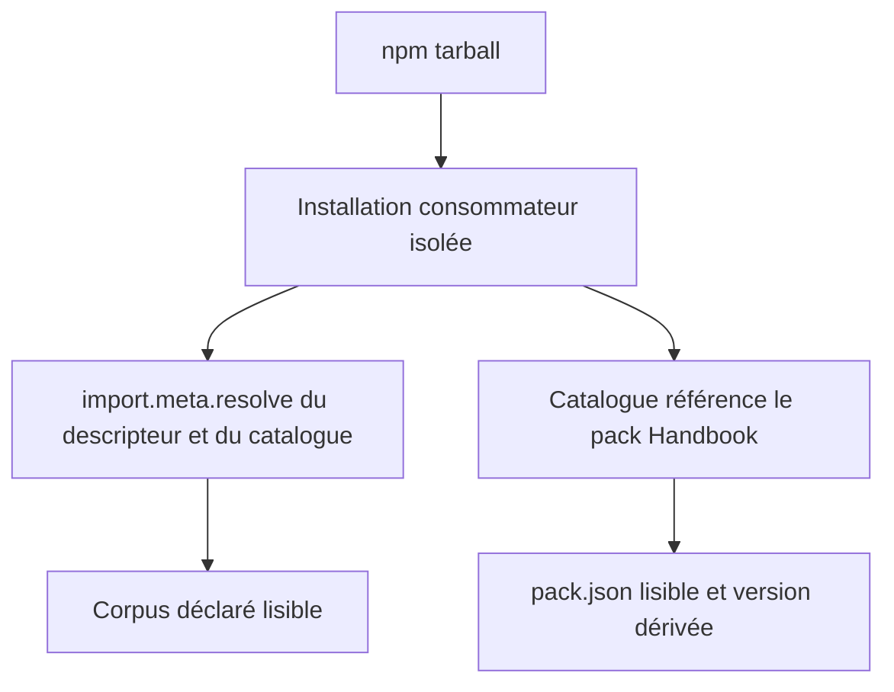
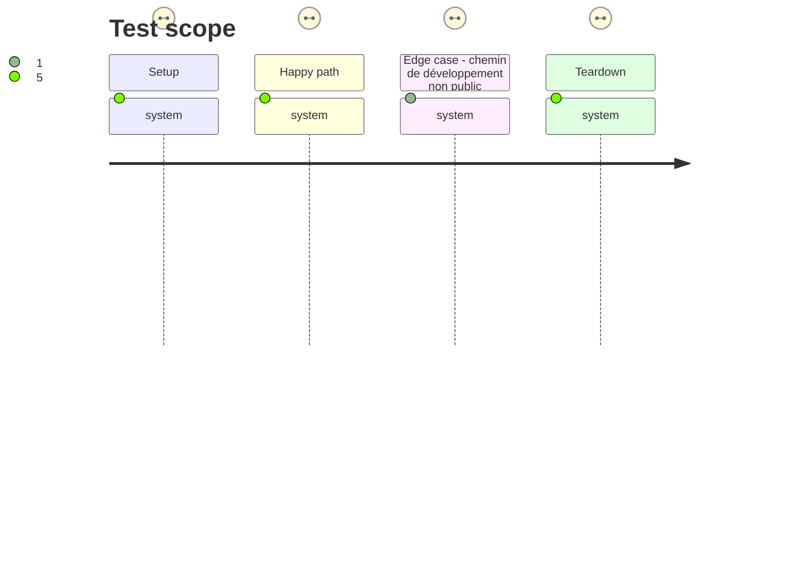

# Instruction: Surface tarball consommable

## Architecture projection

> Tree of the final files. ✅ create · ✏️ modify · ❌ delete

```txt
.
├── package.json                   ✏️ inclure et exporter le descripteur, handbook.json et handbook/
└── tools/
    └── validate-package.ts        ✏️ prouver la résolution depuis un package installé isolé
```

## User Journey



## Test Scope



## Tasks to do

### `1)` Déclarer la surface de release

> Mettre les métadonnées que le consommateur doit découvrir dans l'archive npm et dans la carte des exports ESM.

1. Ajouter `cross-tool-provider.json`, `handbook.json` et `handbook/` à `files`.
2. Ajouter les exports exacts `./cross-tool-provider.json` et `./handbook.json`, ainsi que le motif `./handbook/*` pour le manifeste et ses assets.
3. Préserver les exports actuels des schémas, corpus et exemples ainsi que l'entrée ESM racine.

### `2)` Prouver le parcours consommateur

> Faire de l'installation d'un tarball la preuve de la surface réellement publiée, plutôt qu'une inspection du checkout.

1. Étendre la liste blanche de `validate-package.ts` au descripteur, au catalogue et aux assets Handbook attendus.
2. Dans le consommateur temporaire, résoudre le descripteur et le catalogue par leurs specifiers publics, lire le corpus, puis résoudre et lire le manifeste référencé par l'entrée du catalogue.
3. Vérifier que la version de contrat du descripteur concorde avec l'API installée et dériver la version du pack de l'entrée de catalogue avant de la comparer au manifeste référencé.
4. Exécuter les validations de packs et de package, puis la porte de release afin de confirmer que le tarball reste reproductible.

## Test acceptance criteria

| Task | Acceptance criteria |
| ---- | ------------------- |
| 1 | Le tarball contient `cross-tool-provider.json`, `handbook.json`, `handbook/adrenaline/pack.json` et les assets référencés, sans élargir la surface à des fichiers de développement. |
| 1 | Un consommateur ESM peut résoudre `schema-adrenaline/cross-tool-provider.json`, `schema-adrenaline/handbook.json` et le manifeste référencé, sans rendre accessibles des sous-chemins non exportés. |
| 2 | Le descripteur installé mène à un corpus existant ; le catalogue installé mène au manifeste Handbook effectivement publié. |
| 2 | La version du pack est dérivée de son entrée dans le catalogue publié puis égale à celle du manifeste référencé ; aucune version de producteur n'est codée en dur dans l'assertion consommateur. |
| 2 | La validation de package échoue si un chemin déclaré ne peut pas être résolu après installation, et le contrôle consommateur confirme le refus d'un sous-chemin non exporté. |
| 2 | `npm run validate:packs`, `npm run validate:package` et `npm run validate:release` terminent avec succès. |
