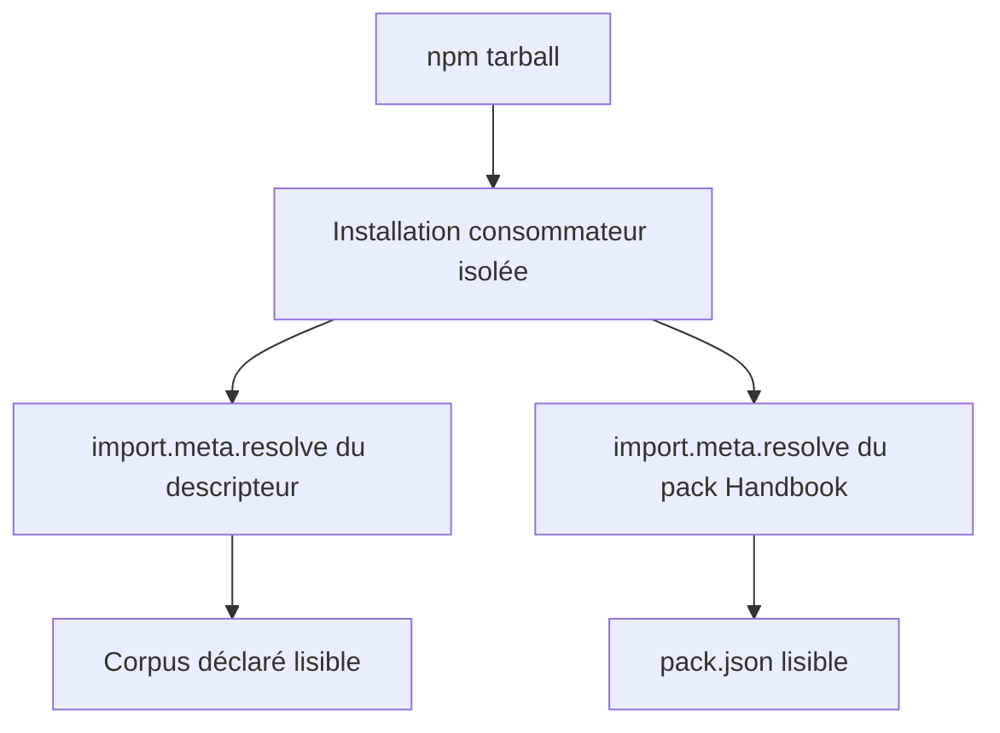
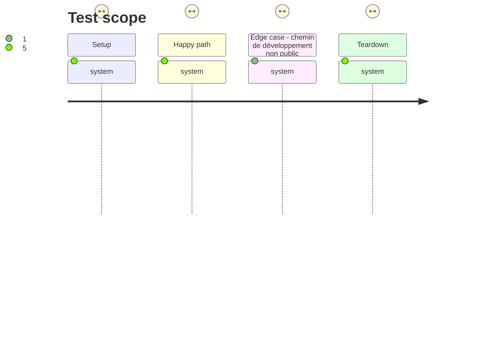

# Instruction: Surface tarball consommable

## Architecture projection

> Tree of the final files. ✅ create · ✏️ modify · ❌ delete

```txt
.
├── package.json                   ✏️ inclure et exporter le descripteur et handbook/
└── tools/
    └── validate-package.ts        ✏️ prouver la résolution depuis un package installé isolé
```

## User Journey



## Test Scope



## Tasks to do

### `1)` Déclarer la surface de release

> Mettre les métadonnées que le consommateur doit découvrir dans l'archive npm et dans la carte des exports ESM.

1. Ajouter `cross-tool-provider.json` et `handbook/` à `files`.
2. Ajouter l'export exact `./cross-tool-provider.json` et le motif `./handbook/*` pour le manifeste et ses assets.
3. Préserver les exports actuels des schémas, corpus et exemples ainsi que l'entrée ESM racine.

### `2)` Prouver le parcours consommateur

> Faire de l'installation d'un tarball la preuve de la surface réellement publiée, plutôt qu'une inspection du checkout.

1. Étendre la liste blanche de `validate-package.ts` aux métadonnées et assets Handbook attendus.
2. Dans le consommateur temporaire, résoudre le descripteur par son specifier public, lire son corpus et son motif de pack, puis résoudre et lire le manifeste Adrenaline.
3. Vérifier que la version de contrat du descripteur concorde avec l'API installée, et que l'identité/version du pack concordent avec le catalogue installé.
4. Exécuter les validations de packs et de package, puis la porte de release afin de confirmer que le tarball reste reproductible.

## Test acceptance criteria

| Task | Acceptance criteria |
| ---- | ------------------- |
| 1 | Le tarball contient `cross-tool-provider.json`, `handbook/adrenaline/pack.json` et les assets référencés, sans élargir la surface à des fichiers de développement. |
| 1 | Un consommateur ESM peut résoudre `schema-adrenaline/cross-tool-provider.json` et `schema-adrenaline/handbook/adrenaline/pack.json`, sans rendre accessibles des sous-chemins non exportés. |
| 2 | Le descripteur installé mène à un corpus existant et au manifeste Handbook effectivement publié. |
| 2 | La validation de package échoue si un chemin déclaré ne peut pas être résolu après installation, et le contrôle consommateur confirme le refus d'un sous-chemin non exporté. |
| 2 | `npm run validate:packs`, `npm run validate:package` et `npm run validate:release` terminent avec succès. |
