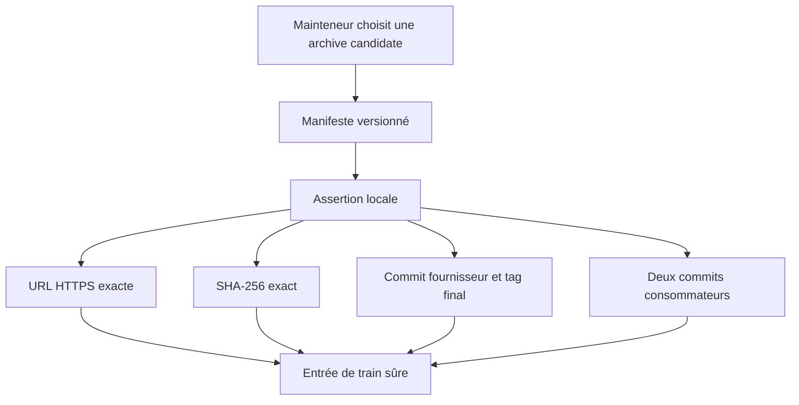
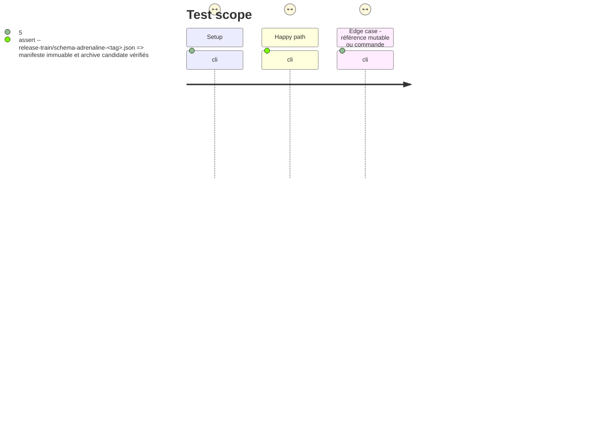

# Instruction: Contrat de train immuable et assertion locale

## Architecture projection

> Tree of the final files. ✅ create · ✏️ modify · ❌ delete

```txt
.
├── package.json                         ✏️ exposer l'assertion de train et une porte de release strictement locale au fournisseur
├── release-train/
│   ├── README.md                         ✅ documenter le manifeste commité par candidate
│   └── schema-adrenaline-<tag>.json      ✅ enregistrer, pour chaque train, archive candidate, SHA-256 et pins immuables
└── tools/
    └── assert-release-train.ts           ✅ valider strictement le manifeste et sa preuve d'archive
```

## User Journey



## Test Scope



## Tasks to do

> État de reprise : le fournisseur possède une première assertion propriétaire, mais son format n'est pas encore le contrat commun. Les worktrees isolés `lantern-adrenaline-release-train` et `handbook-adrenaline-release-train` sont prêts; aucune preuve consommateur Adrenaline n'est encore validée.

### `1)` Définir l'entrée de train committée

> Rendre l'identité de la candidate et des deux consommateurs lisible par machine et non ambiguë.

1. Ajouter le format documenté d'un manifeste par tag final sous `release-train/`.
2. Exiger `protocol: 1`, puis une candidate fournisseur-neutre avec `provider`, `releaseUrl`, `sha256`, `integrity`, `version`, `stagingTag`, `finalTag` et `providerCommit`.
3. Exiger une liste de consommateurs, chacun avec `role`, `repository` et `ref` complet; conserver Handbook et Lantern comme les deux entrées requises du train Adrenaline.
4. Interdire clés inconnues, références mutables, URLs non attendues, chemins locaux, commandes et toute divergence entre candidate, tags, version et archive.

### `2)` Outiller la validation avant orchestration

> Exposer une seule commande déterministe qui valide le format puis les octets candidats.

1. Créer `tools/assert-release-train.ts` et le script `release-train:assert` dans `package.json`.
2. Vérifier téléchargement, SHA-256 et cohérence de la version package contenue dans l'archive sans dépendre du checkout courant.
3. Extraire de `check` une porte de release fournisseur qui couvre typecheck, build, génération, corpus, package et reproductibilité sans lancer de checkout ou de script consommateur.
4. Ajouter des fixtures ou auto-tests couvrant manifeste valide, digest incorrect, ref mutable, champ inconnu et tentative de commande arbitraire.

## Test acceptance criteria

| Task | Acceptance criteria |
| ---- | ------------------- |
| 1 | Un manifeste commité porte `protocol: 1`, décrit une candidate avec son fournisseur, URL, SHA-256, SRI, version, tags et commit, puis exactement les consommateurs Lantern et Handbook avec leurs refs complètes. |
| 1 | L'assertion refuse une branche, un tag, un SHA abrégé, une URL non HTTPS, un chemin local, une clé inconnue ou une commande déclarée. |
| 2 | `npm run release-train:assert -- <manifest>` vérifie que les octets téléchargés correspondent au SHA déclaré et que leur package version correspond au tag final. |
| 2 | Les cas négatifs échouent avant tout checkout de consommateur ou lancement de sous-processus externe. |
| 2 | La porte de release fournisseur ne résout aucune référence Lantern ou Handbook; la CI quotidienne conserve séparément son contrôle inter-outils de baseline. |
