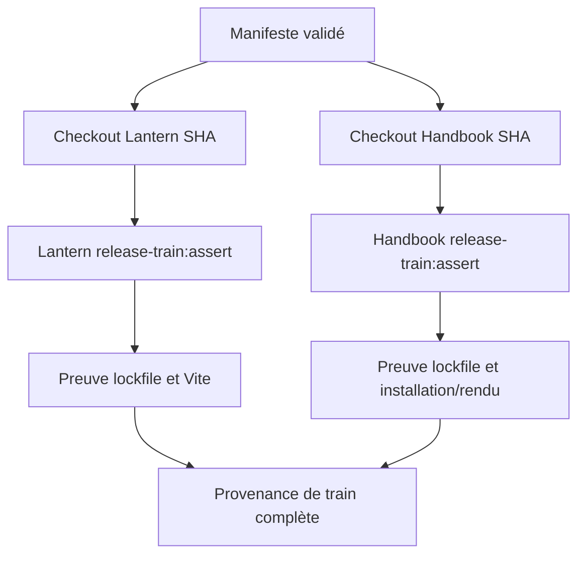
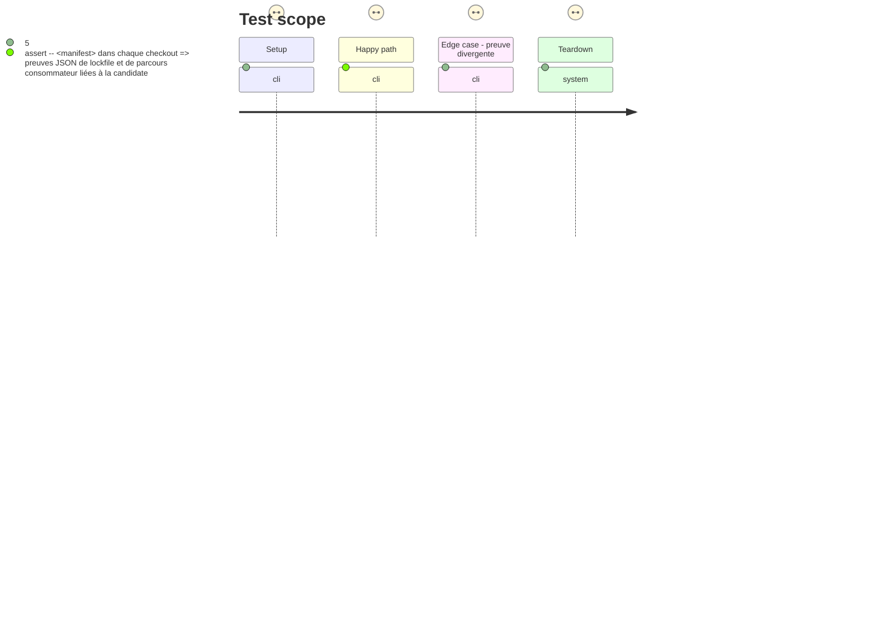

# Instruction: Orchestration des preuves consommateurs

## Architecture projection

> Tree of the final files. ✅ create · ✏️ modify · ❌ delete

```txt
.
├── .github/workflows/
│   └── release-train.yml                 ✅ matérialiser les pins et collecter les preuves candidates
├── package.json                          ✏️ conserver l'entrée unique release-train:assert
├── release-train/
│   └── schema-adrenaline-<tag>.json      ✏️ référencer les commits Lantern et Handbook approuvés
└── tools/
    └── assert-release-train.ts           ✏️ préparer les entrées consommateur et valider leurs résultats machine-readable
```

## User Journey



## Test Scope



## Tasks to do

### `1)` Exécuter uniquement les consommations déclarées

> Coordonner les deux dépôts à leurs commits exacts sans déplacer leurs adaptateurs dans le fournisseur.

1. Ajouter un workflow déclenché manuellement ou par candidate, avec le chemin du manifeste comme entrée contrôlée.
2. Après validation locale, checkout Lantern et Handbook uniquement sur les SHAs complets du manifeste, installer depuis leurs lockfiles et fournir l'archive candidate au format attendu par leurs commandes.
3. Invoquer chaque consommateur exclusivement avec `npm run release-train:assert -- <manifest>`; ne lire ni champ `command` ni matrice quotidienne comme substitut.

### `2)` Relier les preuves à la même archive

> N'accepter une candidate que si les deux preuves consommateur parlent exactement de ses octets et de leurs parcours propriétaires.

1. Définir le résultat JSON minimal: statut, version résolue, URL d'archive, intégrité, commit consommateur et identifiant du parcours exécuté.
2. Vérifier que Lantern atteste son lockfile actif et son build/adoption Vite, et que Handbook atteste son lockfile actif et son parcours d'installation/rendu de catalogue, pack, tokens et assets.
3. Échouer si une preuve manque, est mal formée ou diverge du manifeste; publier les résultats et leur provenance comme artefacts du workflow.

### `3)` Préserver la porte quotidienne

> Garder le contrat fournisseur partagé comme signal indépendant de la promotion d'une candidate.

1. Ne pas remplacer ni relâcher les validations actuelles `npm run check`, descriptor, pack ou installation Handbook de la CI quotidienne.
2. Documenter que le workflow de train choisit ses propres SHAs de consommateurs et ne réutilise pas les pins de baseline.

## Test acceptance criteria

| Task | Acceptance criteria |
| ---- | ------------------- |
| 1 | Le workflow ne checkout Lantern et Handbook qu'aux SHAs complets déclarés et n'exécute dans chacun que `npm run release-train:assert -- <manifest>`. |
| 1 | Aucun manifeste ne peut fournir une commande shell, une branche, un tag ou un SHA court à l'orchestrateur. |
| 2 | Les deux résultats machine-readable confirment la même URL, intégrité et version que l'archive candidate; Lantern couvre son build Vite et Handbook son installation/rendu. |
| 2 | Une preuve absente ou divergente empêche la création d'un état de train promouvable. |
| 3 | La CI quotidienne continue d'exécuter ses contrôles de contrat existants indépendamment du workflow release train. |

