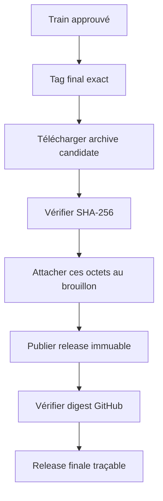
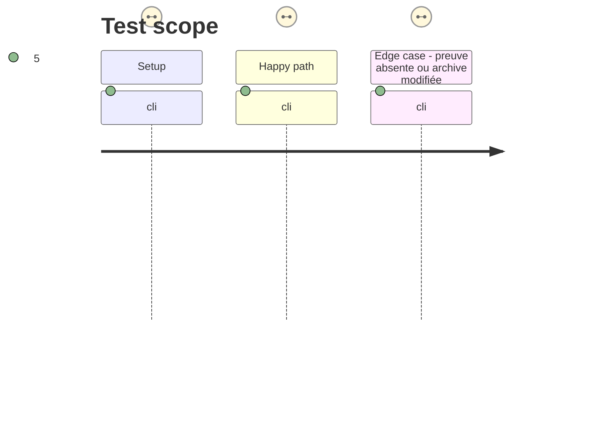

# Instruction: Promotion sans reconstruction

## Architecture projection

> Tree of the final files. ✅ create · ✏️ modify · ❌ delete

```txt
.
├── .github/workflows/
│   ├── release-train.yml                 ✏️ conserver le statut et la provenance de train approuvé
│   └── release.yml                       ✏️ exiger le train approuvé, lancer les contrôles fournisseur locaux et attacher l'archive candidate vérifiée
├── package.json                          ✏️ séparer la porte fournisseur de release de la CI inter-outils quotidienne
├── release-train/
│   └── schema-adrenaline-<tag>.json      ✏️ devenir le lien auditable entre candidate et tag final
└── tools/
    └── assert-release-train.ts           ✏️ exposer les contrôles de réemploi des octets au workflow final
```

## User Journey



## Test Scope



## Tasks to do

### `1)` Bloquer la release finale sur le train approuvé

> Faire du manifeste et des deux résultats consommateur une précondition vérifiable du tag final.

1. Modifier `release.yml` pour résoudre le manifeste du tag reçu, vérifier son commit fournisseur et attendre le statut de train correspondant.
2. Refuser tag absent du manifeste, commit divergent, preuves consommateurs incomplètes ou état de train non approuvé avant de créer ou modifier une release.
3. Conserver les contrôles fournisseur de version, contrat, contenu de package et immuabilité, mais remplacer `npm run check` dans ce workflow par la porte locale définie en phase 1 afin qu'aucun tag ou checkout consommateur mutable n'entre dans la promotion.

### `2)` Promouvoir les mêmes octets

> Attacher le fichier attesté par les consommateurs, jamais un tarball reconstruit après leurs preuves.

1. Télécharger l'archive candidate déclarée, vérifier son SHA-256 et joindre ce fichier ainsi que son checksum au brouillon du tag final.
2. Vérifier le digest d'asset retourné par GitHub contre le SHA du manifeste avant de rendre la release immuable.
3. Enregistrer dans le run la référence du manifeste et les résultats Lantern/Handbook afin que la provenance de la promotion soit consultable.

## Test acceptance criteria

| Task | Acceptance criteria |
| ---- | ------------------- |
| 1 | Une release taguée est refusée sans manifeste correspondant, commit fournisseur identique et statuts approuvés des deux consommateurs. |
| 1 | La promotion lance les validations fournisseur locales; la porte quotidienne inter-outils reste un contrôle supplémentaire, hors du workflow de promotion, et ne remplace pas les preuves de train. |
| 2 | Le workflow final ne lance pas `release:prepare` et n'attache aucun tarball construit pendant le run; il publie exclusivement l'archive candidate téléchargée dont le SHA-256 a été vérifié. |
| 2 | Le digest de l'asset GitHub, le checksum attaché et le SHA du manifeste sont identiques, et la release finale devient immuable seulement après cette égalité. |
