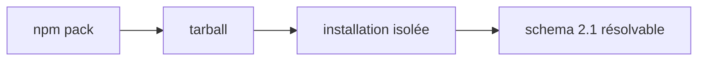
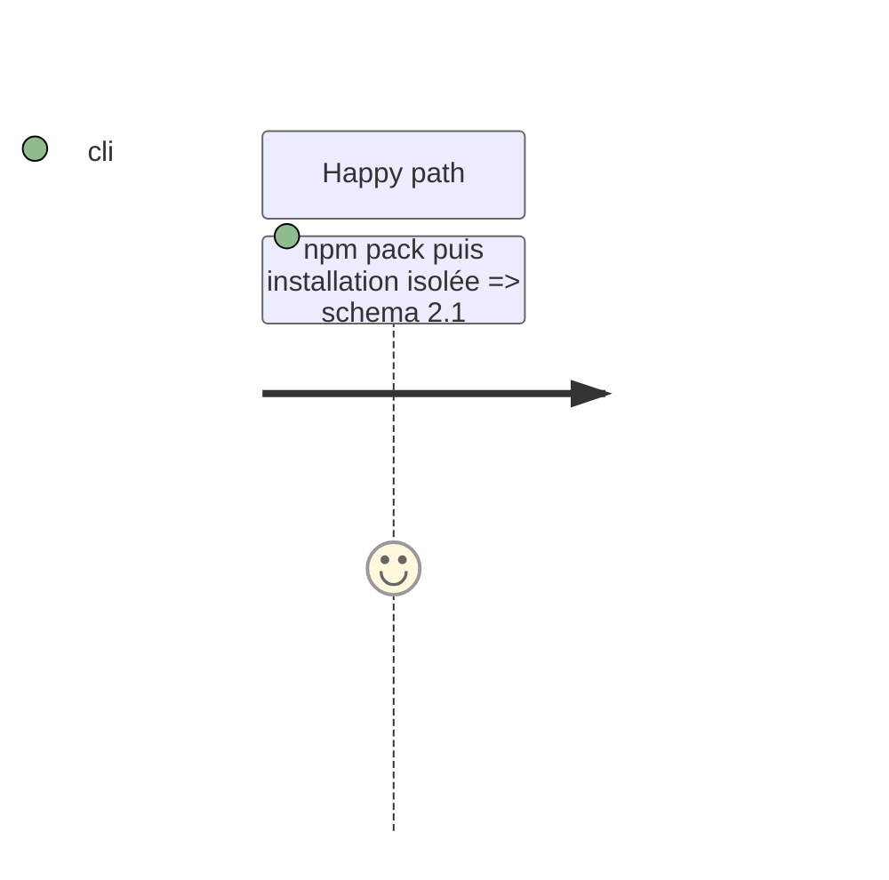

# Instruction: Rendre la baseline 2.1 publiable

## Architecture projection

```txt
package.json                 ✏️ exporte et empaquette schemas/adrenaline/2.1.0
tools/validate-package.ts    ✏️ prouve la baseline exportée depuis un tarball installé
```

## User Journey



## Tasks to do

### `1)` Publier la baseline déclarée

> Faire correspondre la version exportée et les fichiers réellement empaquetés.

1. Remplacer les chemins `2.0.0` des `exports`, de `files` et de `validate-package.ts` par la baseline déclarée `2.1.0`.
2. Faire échouer `validate:package` si un tarball installé résout une autre baseline.
3. Vérifier que le package ne contient aucun schéma historique inutile.

## Test Scope



## Test acceptance criteria

| Task | Acceptance criteria |
| --- | --- |
| 1 | Le tarball installé exporte la même baseline que `ADRENALINE_SCHEMA_VERSION`. |
