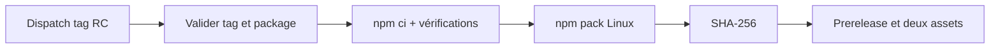
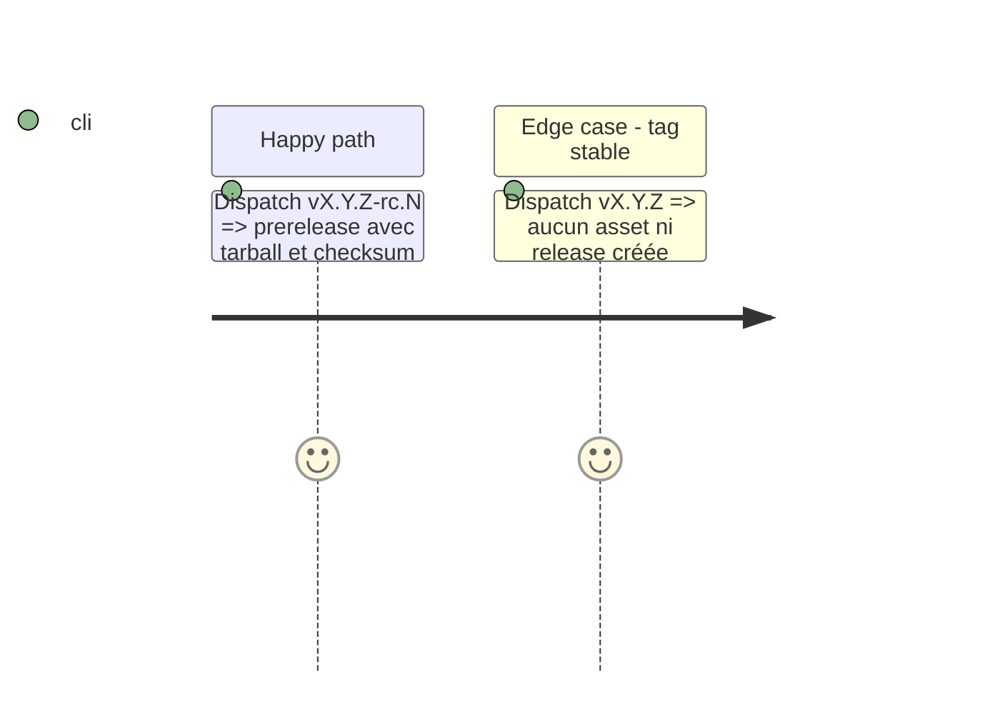

# Instruction: Ajouter le workflow candidate manuel

## Architecture projection

```txt
.github/workflows/publish-candidate.yml  ✅ workflow_dispatch Ubuntu/Node 20
```

## User Journey



## Tasks to do

### `1)` Isoler la candidate de la promotion

> N'autoriser que `vX.Y.Z-rc.N`, et ne jamais appeler le workflow stable.

1. Déclarer `workflow_dispatch`, `contents: write`, Node 20 et Ubuntu ; refuser un dispatch hors de `main` ou dont le SHA n'est pas ancêtre de `origin/main`.
2. Rejeter les tags stables, versions divergentes, tag RC déjà pointé ailleurs, release existante non-prerelease et toute ref non déterministe.
3. Lancer `release:verify-provider`, produire l'archive avec `release:prepare`, puis calculer SHA-256 et checksum depuis ce même fichier.
4. Créer ou reprendre seulement une prerelease liée au SHA dispatché, uploader exactement ces deux fichiers, puis vérifier via l'API le tag, les deux assets, le digest et l'immuabilité.

## Test Scope



## Test acceptance criteria

| Task | Acceptance criteria |
| --- | --- |
| 1 | Une candidate publiée porte exactement deux assets dont le SHA-256 annoncé, et aucun chemin ne publie une stable. |
