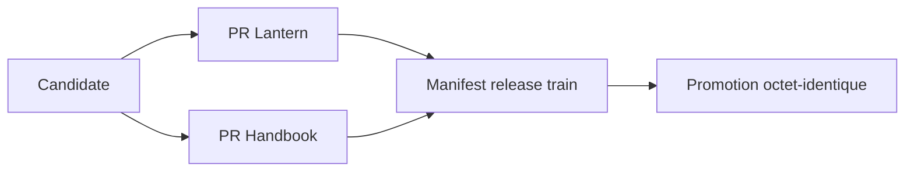
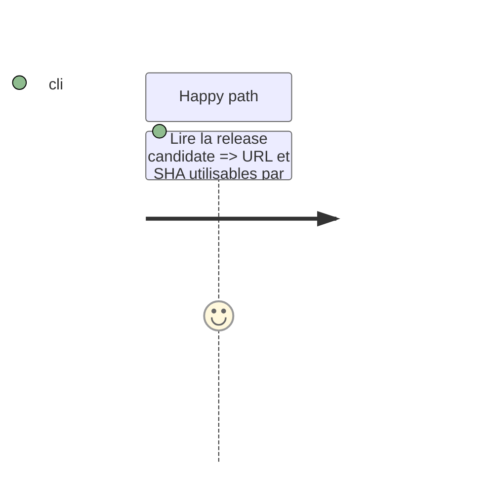

# Instruction: Prouver le parcours et documenter le train

## Architecture projection

```txt
README.md                       ✏️ documente candidate → preuves consommateurs → promotion
tools/validate-package.ts       ✏️ couvre le package installé
.github/workflows/publish-candidate.yml  ✏️ auto-vérifie la prerelease
```

## User Journey



## Tasks to do

### `1)` Rendre le handoff auditable

> Donner aux consommateurs une URL et un SHA uniques, sans les faire construire.

1. Documenter les commandes et l'ordre de train.
2. Vérifier localement le workflow par assertions de structure, de ref `main`, de tag RC, de non-écrasement et de contrôle API après upload.
3. Exécuter une seule candidate de test après merge, puis vérifier ses assets et SHA avant les PRs consommateurs.

## Test Scope



## Test acceptance criteria

| Task | Acceptance criteria |
| --- | --- |
| 1 | Le train peut référencer une candidate Linux vérifiée sans ambiguïté et sans déclenchement automatique. |
