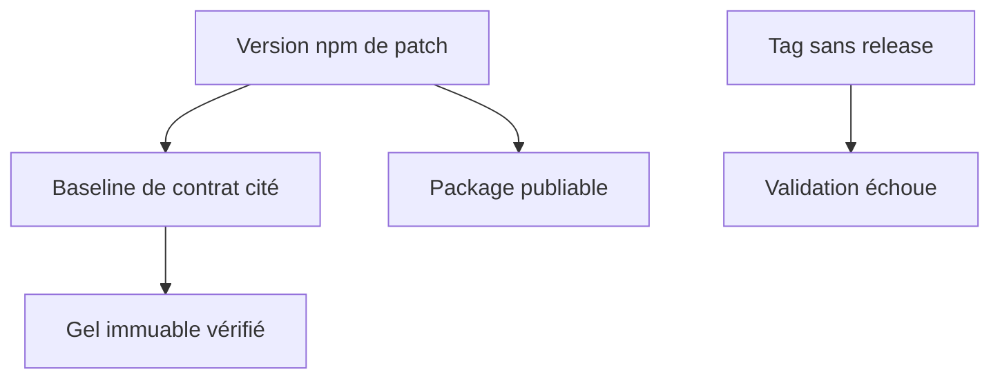
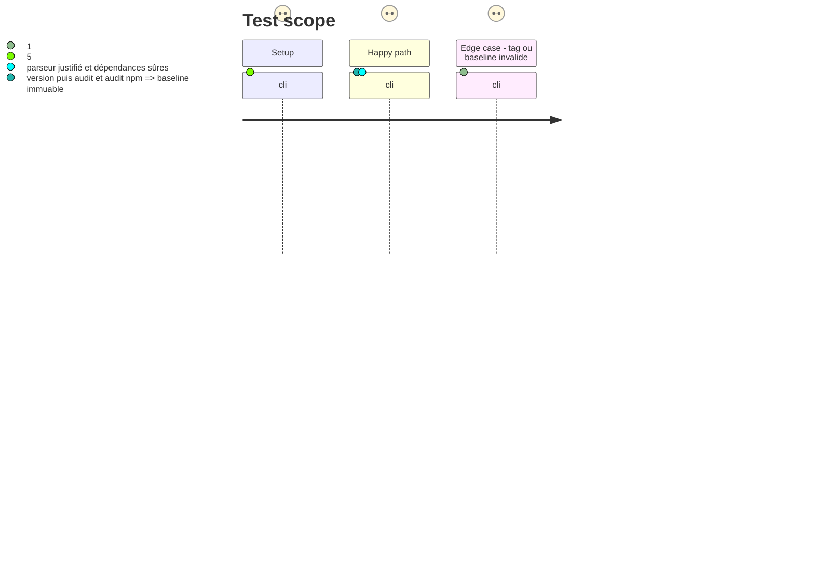

# Instruction: Rétablir le contrat local de version et de dépendances

## Architecture projection

> Tree of the final files. ✅ create · ✏️ modify · ❌ delete

```txt
.
├── package.json                 ✏️ conserver un seul parseur TOML justifié et des scripts cohérents
├── package-lock.json            ✏️ verrouiller les remédiations de sécurité
├── tools/audit-schemas.ts       ✏️ vérifier le gel d'après la version de contrat, pas npm
├── tools/validate-contract.ts   ✏️ conserver ou ajouter la preuve de concordance des parseurs
└── tools/validate-versioning.ts ✏️ contrôler l'immuabilité du baseline cité et les releases associées aux tags
```

## User Journey



## Test Scope



## Tasks to do

### `1)` Découpler complètement le baseline du package

> Réparer les contrôles qui utilisent encore la version npm comme chemin de schéma.

1. Rechercher toutes les assertions de gel et les faire dériver de la constante de contrat.
2. Ajouter les cas négatifs pour baseline absent ou modifié après publication.

### `2)` Corriger les dépendances et la validation des releases

> Éliminer la vulnérabilité et faire apparaître localement chaque tag sans release complète.

1. Appliquer la mise à jour non majeure qui résout `fast-uri` et la vulnérabilité transitive restante.
2. Retirer le parseur TOML réellement mort, ou rendre explicite et testé le cross-check des deux parseurs conservés.
3. Interroger l'API GitHub de façon injectable afin que la validation refuse les tags sans release complète.

## Test acceptance criteria

| Task | Acceptance criteria |
| ---- | ------------------- |
| 1 | Une version npm différente du baseline passe si le dossier de baseline est immuable; un baseline absent ou altéré échoue. |
| 2 | `npm audit` ne signale plus de vulnérabilité et la raison de chaque parseur TOML conservé est vérifiée. |
| 2 | Un tag sans release complète est signalé par `validate:version` sans dépendre d'un run CI. |
