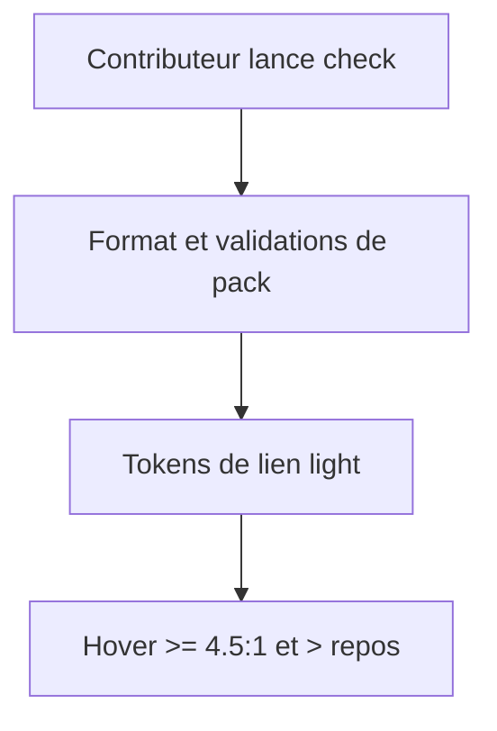
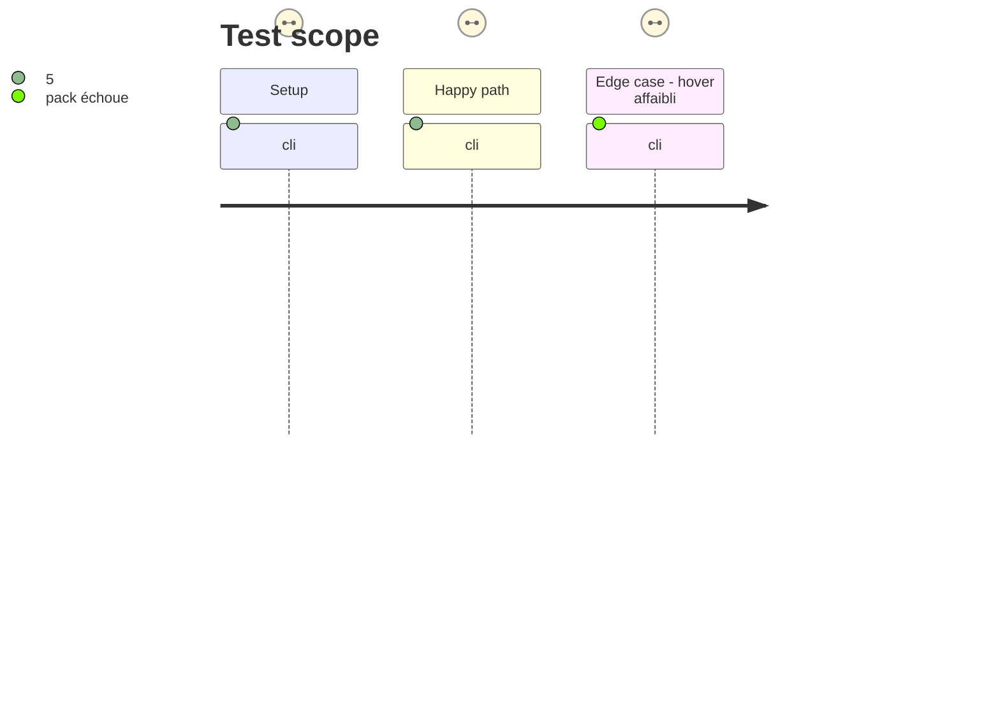

# Instruction: Étendre la porte de qualité et protéger le contraste des liens

## Architecture projection

> Tree of the final files. ✅ create · ✏️ modify · ❌ delete

```txt
.
├── package.json                       ✏️ intégrer format et validations de packs dans check
├── handbook/adrenaline/pack.json      ✏️ rendre le hover de lien light plus contrasté que son repos
└── tools/validate-handbook-pack.ts    ✏️ vérifier tous les hover requis et leur progression de contraste
```

## User Journey



## Test Scope



## Wireframe

```txt
┌──────────────────────────────────────────┐
│ (1) Note Handbook                         │
│                                          │
│   (2) Lien de contenu ── lien survolé    │
│                                          │
└──────────────────────────────────────────┘
```

1. Note: surface light existante, sans changement de structure.
2. Lien: seul son token de couleur au survol change; la place et le libellé restent inchangés.

## Tasks to do

### `1)` Rendre check représentatif de la CI

> Relier les scripts déjà définis à la porte unique locale et CI.

1. Ajouter `format:check`, `validate:packs` et `validate:pack` à `check` dans un ordre déterministe.
2. Vérifier que chaque échec remonte par la porte agrégée.

### `2)` Couvrir la famille de tokens de lien

> Corriger le contraste hover light et empêcher une régression relative.

1. Choisir une couleur hover light à au moins 4.5:1 sur le fond déclaré et strictement supérieure au repos.
2. Ajouter une assertion de contraste absolu et relatif pour les tokens hover, avec auto-test négatif.

## Test acceptance criteria

| Task | Acceptance criteria |
| ---- | ------------------- |
| 1 | `check` exécute format, `validate:packs` et `validate:pack`; chacun peut faire échouer l'agrégat. |
| 2 | Le hover light est à au moins 4.5:1 contre le fond et plus contrasté que le lien au repos. |
| 2 | Le validateur refuse un hover absent, non hexadécimal, sous le seuil ou plus faible que son repos. |
