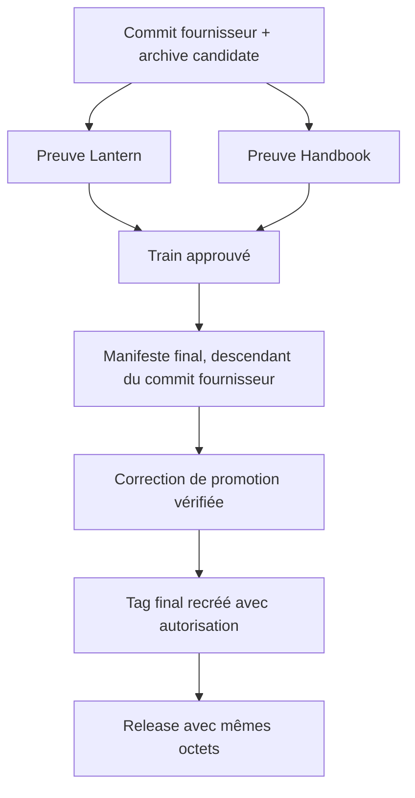

# Instruction: Rendre les publications et le release-train vérifiables

## Architecture projection

> Tree of the final files. ✅ create · ✏️ modify · ❌ delete

```txt
.
├── .github/workflows/ci.yml       ✏️ ne redevient verte qu'avec les assertions locales réparées
├── release-train/                 ✏️ contient le manifeste de la candidate finale
├── .github/workflows/release.yml  ✏️ lit le manifeste du tag sans résolution Node ambiguë
├── .github/workflows/release-train.yml ✏️ installe et isole les consommateurs avant leurs preuves
└── aidd_docs/tasks/.../plan.md    ✏️ consigne les preuves observées et la clôture des tickets
```

## User Journey



## Test Scope


## Tasks to do

### `1)` Corriger la reprise sûre de promotion

> Rendre lisible depuis le workflow le manifeste déjà validé, sans modifier l'archive candidate ni créer un asset supplémentaire.

1. Remplacer la résolution Node du manifeste par un chemin relatif explicite (`./release-train/...`).
2. Valider la PR et confirmer que le workflow échoué n'a créé ni draft ni asset `v2.4.0`.

### `2)` Reprendre le tag final sous contrôle

> Après autorisation explicite, faire pointer `v2.4.0` vers le commit de correction, puis laisser le workflow promouvoir l'archive RC inchangée.

1. Supprimer localement et à distance le tag sans release, puis le recréer au commit approuvé et le pousser.
2. Observer le workflow `release.yml` : train vert au même SHA, SHA-256 de l'asset candidat, tarball local équivalent, deux assets et release immuable.

### `3)` Auditer la clôture des issues


1. Vérifier le catalogue final : chaque tag conservé possède une release complète, et `v2.4.0` expose `cross-tool-provider.json`.
2. Recueillir les preuves Lantern et Handbook de l'exécution de train, puis contrôler les trois CI `main` consécutives demandées.
3. Vérifier issue par issue les critères #11, #13 à #19 et #21 ; fermer uniquement celles dont la preuve est complète.

## Test acceptance criteria

| Task | Acceptance criteria |
| ---- | ------------------- |
| 1 | Le workflow de release peut lire le manifeste sur le tag et aucun asset n'est créé par le chemin de reprise. |
| 2 | `v2.4.0` est immuable, comporte exactement le tarball candidat et son checksum, et leurs SHA-256 correspondent au manifeste. |
| 3 | Toutes les issues ciblées ont une preuve d'acceptation actuelle; les issues satisfaites sont fermées seulement après cet audit. |
