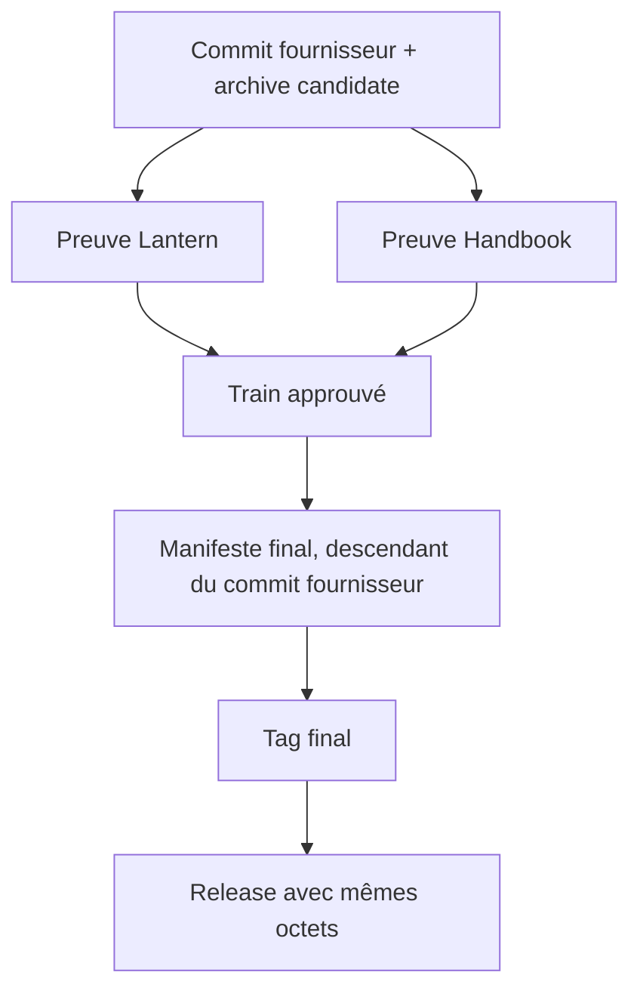
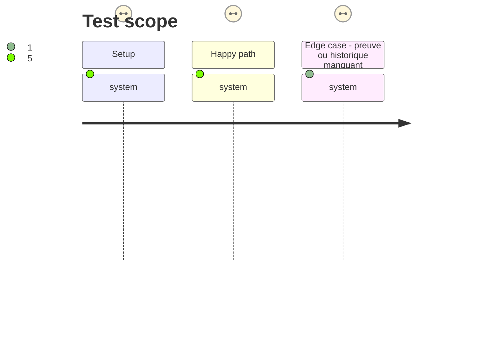

# Instruction: Rendre les publications et le release-train vérifiables

## Architecture projection

> Tree of the final files. ✅ create · ✏️ modify · ❌ delete

```txt
.
├── .github/workflows/ci.yml       ✏️ ne redevient verte qu'avec les assertions locales réparées
├── release-train/                 ✏️ contient le manifeste de la candidate finale
├── .github/workflows/release*.yml ✏️ prouve et promeut l'archive sans reconstruction
└── aidd_docs/tasks/.../plan.md    ✏️ consigne les preuves observées et la clôture des tickets
```

## User Journey



## Test Scope



## Tasks to do

### `1)` Finaliser les préconditions fournisseur

> S'assurer que la CI de `main` est saine avant une nouvelle publication.

1. Pousser les phases précédentes et observer trois runs CI successifs sur `main`.
2. Vérifier qu'une violation locale volontaire continue d'être rejetée par `check`.

### `2)` Réconcilier l'historique des tags et releases

> Faire correspondre le catalogue GitHub aux tags réels sans publier des octets réécrits pour l'historique.

1. Publier les releases complètes compatibles ou retirer les tags prématurés explicitement autorisés par l'issue.
2. Vérifier que `git tag` et `gh release list` sont cohérents, puis publier une release comprenant `cross-tool-provider.json`.

### `3)` Achever la convergence consommateur du train

> Obtenir les preuves propriétaires manquantes sans importer les adaptateurs dans ce dépôt.

1. Faire ajouter dans Lantern et Handbook une commande Adrenaline `release-train:assert` qui produit la preuve JSON convenue.
2. Épingler le commit fournisseur qui a produit la candidate et les commits complets des consommateurs dans le manifeste final. Le tag final porte ce manifeste (il est donc un descendant du commit fournisseur); le workflow compare l'archive candidate au paquet produit à ce tag avant de promouvoir seulement les octets SHA-vérifiés.
3. Fermer les issues uniquement après observation des preuves, de la release et des trois CI vertes.

## Test acceptance criteria

| Task | Acceptance criteria |
| ---- | ------------------- |
| 1 | Trois exécutions CI consécutives de `main` réussissent et une violation de porte reste détectée. |
| 2 | Tous les tags conservés possèdent une release complète et le tarball publié contient `cross-tool-provider.json`. |
| 3 | Lantern et Handbook attestent à leurs commits immuables la même URL, intégrité et version; la release attache strictement ces octets. |
