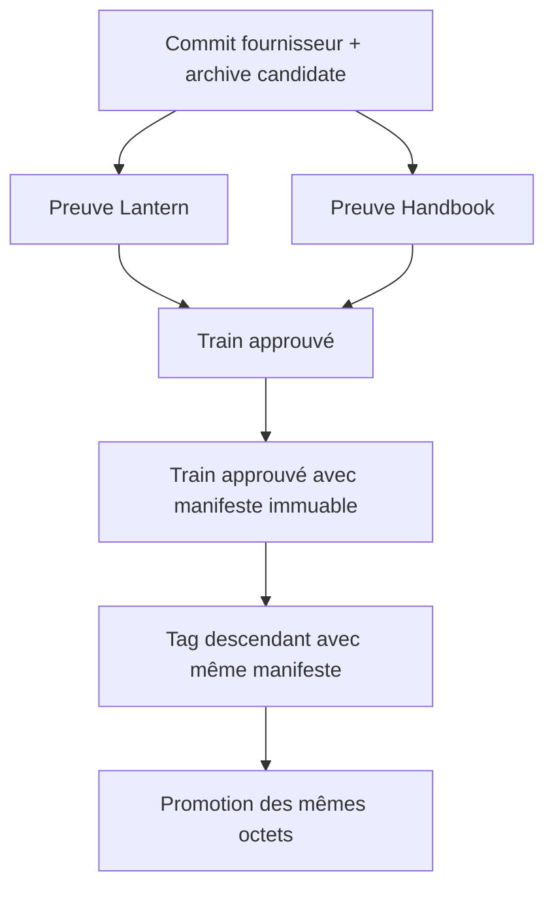
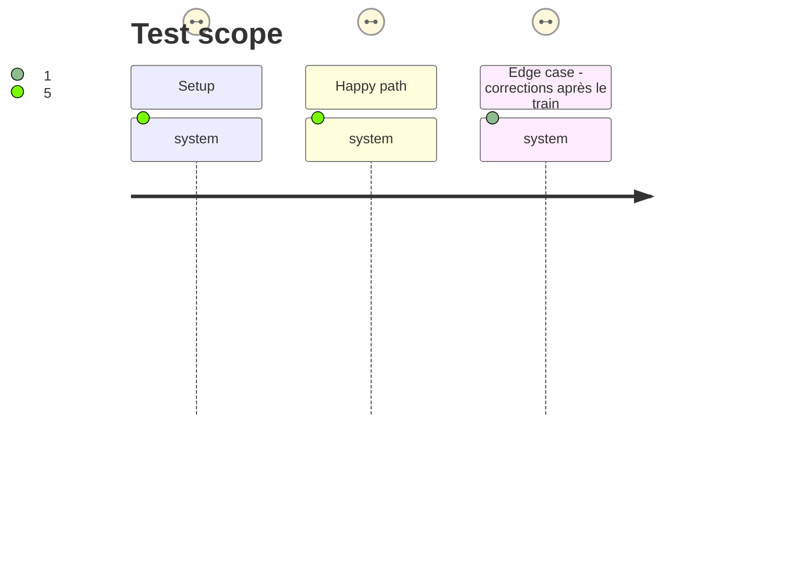

# Instruction: Rendre les publications et le release-train vérifiables

## Architecture projection

> Tree of the final files. ✅ create · ✏️ modify · ❌ delete

```txt
.
├── .github/workflows/ci.yml       ✏️ ne redevient verte qu'avec les assertions locales réparées
├── release-train/                 ✏️ contient le manifeste de la candidate finale
├── .github/workflows/release.yml  ✏️ lit le manifeste du tag sans résolution Node ambiguë
├── .github/workflows/release-train.yml ✏️ installe et isole les consommateurs avant leurs preuves
└── aidd_docs/tasks/.../plan.md    ✏️ consigne les preuves observées et la clôture des tickets
```

## User Journey



## Test Scope



## Tasks to do

### `1)` Lier le train au manifeste, non au SHA du tag

> Accepter uniquement un train vert ancêtre qui contient exactement le manifeste du tag final.

1. Recenser les runs `release-train` réussis et retenir un SHA ancêtre du tag dont le blob du manifeste est identique.
2. Refuser l'absence de train, un train non ancêtre ou un manifeste différent; conserver la vérification d'équivalence octet à octet du tarball.
3. Valider localement les trois cas avant tout nouveau push ou déclenchement distant.

### `2)` Promouvoir une seule fois après validation locale

> Ne déplacer le tag qu'après validation locale et ne lancer qu'une promotion finale explicitement autorisée.

1. Confirmer l'absence de draft et d'asset pour `v2.4.0`, puis déplacer le tag une dernière fois vers le commit corrigé.
2. Observer une seule promotion : SHA-256 de la candidate, tarball local équivalent, deux assets et release immuable.

### `3)` Auditer la clôture des issues


1. Vérifier le catalogue final : chaque tag conservé possède une release complète, et `v2.4.0` expose `cross-tool-provider.json`.
2. Recueillir les preuves Lantern et Handbook de l'exécution de train, puis contrôler les trois CI `main` consécutives demandées.
3. Vérifier issue par issue les critères #11, #13 à #19 et #21 ; fermer uniquement celles dont la preuve est complète.

## Test acceptance criteria

| Task | Acceptance criteria |
| ---- | ------------------- |
| 1 | Le workflow accepte seulement un train vert ancêtre portant le même manifeste et refuse tout autre train. |
| 2 | `v2.4.0` est immuable, comporte exactement le tarball candidat et son checksum, et leurs SHA-256 correspondent au manifeste. |
| 3 | Toutes les issues ciblées ont une preuve d'acceptation actuelle; les issues satisfaites sont fermées seulement après cet audit. |
