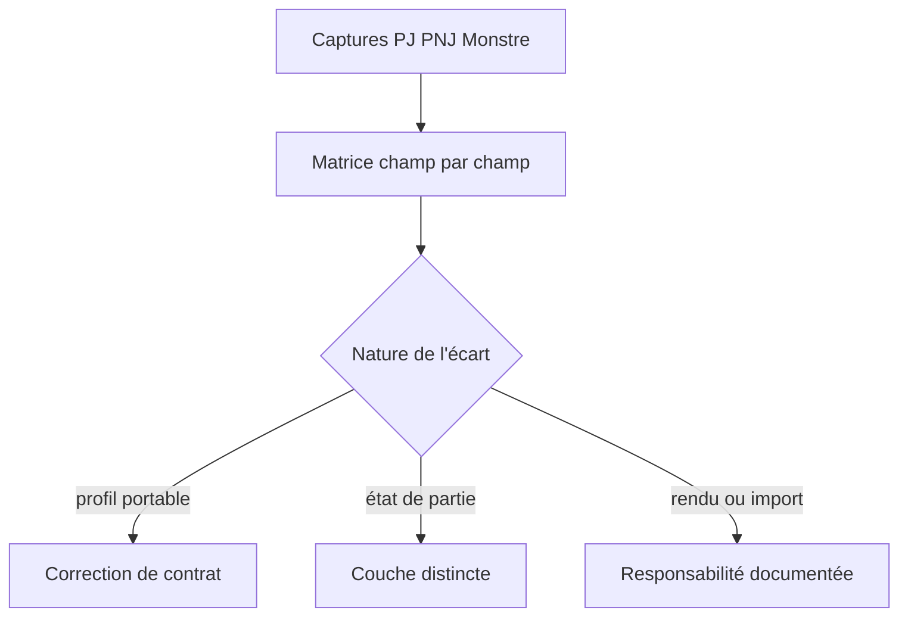
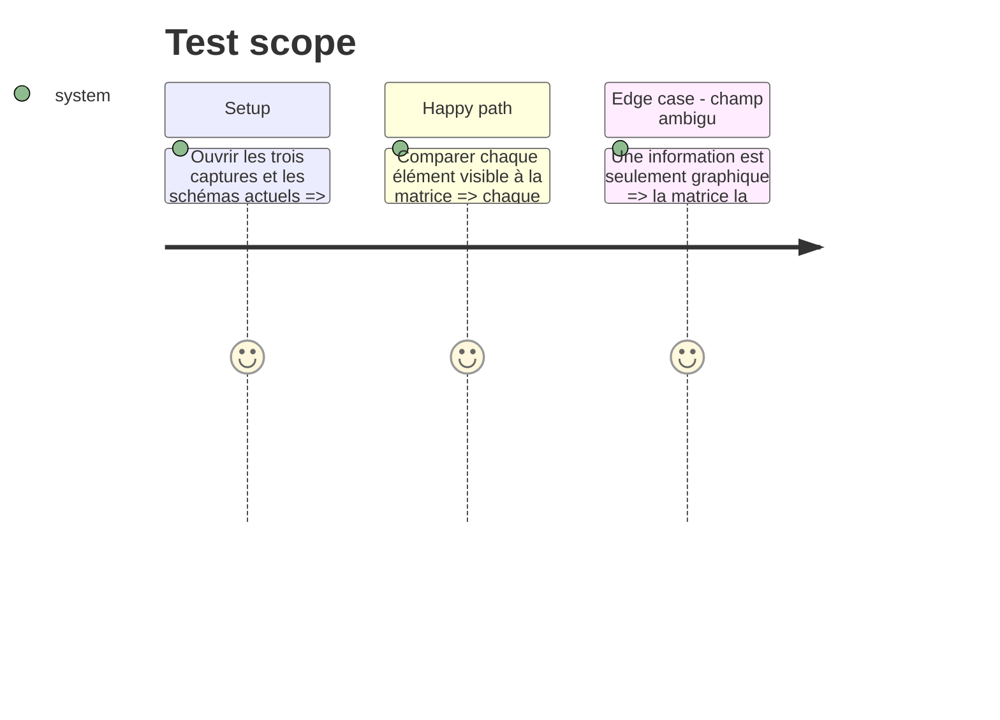

# Instruction: Inventaire normatif et frontières de données

## Architecture projection

> Tree of the final files. ✅ create · ✏️ modify · ❌ delete

```txt
aidd_docs/tasks/2026_09/2026_09_23_zombiology-schema-parity/
├── ✅ ecarts-reference.md              # matrice exhaustive référence → contrat → décision
├── ✏️ plan.md                          # lie les écarts aux phases de correction
├── ✏️ phase-1.md                       # trace les décisions de couverture
└── ✏️ phase-2.md                       # consomme le modèle validé du delta Monstre
aidd_docs/tasks/2026_09/2026_09_08_schemas-personnages-adrenaline/
└── ✏️ reference-fiches.md              # corrige les hypothèses devenues obsolètes par les trois captures Design
```

## User Journey



## Tasks to do

### `1)` Établir la matrice exhaustive des écarts

> Rendre chaque élément visible des trois références traçable vers un champ, une transformation, une exclusion justifiée ou une correction.

1. Lister par fiche les en-têtes, blocs, sous-blocs, valeurs calculées, compteurs et indices de présentation.
2. Faire correspondre chaque élément aux Zod, schémas générés, codecs, exemples et validations actuels.
3. Confirmer les termes non lisibles ou ambigus avec `reference-fiches.md` et ses sources citées ; ne jamais inventer une mécanique depuis la seule mise en page.
4. Classer sans ambiguïté : couvert, couvert après normalisation scalaire → plage, état transitoire, rendu, ou manque de contrat.

### `2)` Fixer les frontières du prochain contrat

> Éviter de mélanger le profil portable, l'état de scène et la présentation consommateur.

1. Définir les données qui appartiennent au profil PJ/PNJ/Monstre et celles qui appartiennent à l'état de partie.
2. Définir les deltas d'un état Monstre : santé, protections, défense, déplacement, actions, comportement, compétences, équipement, traits et contagion.
3. Documenter les éléments qui restent calculés ou affichés par les consommateurs : qualité de caractéristique, totaux, style et placement.

## Test Scope



## Test acceptance criteria

| Task | Acceptance criteria |
| --- | --- |
| 1 | Chaque champ, compteur et état visible sur les trois captures possède une ligne traçable, une classification et une source d'autorité quand son sens n'est pas lisible dans l'image. |
| 2 | Les futurs champs de profil, de delta Monstre et d'état de partie sont distincts ; aucun consommateur ne reçoit de sémantique locale implicite. |
