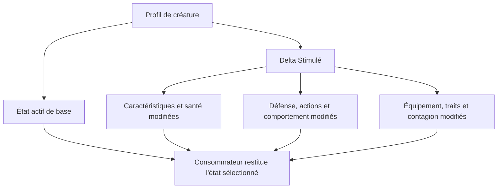
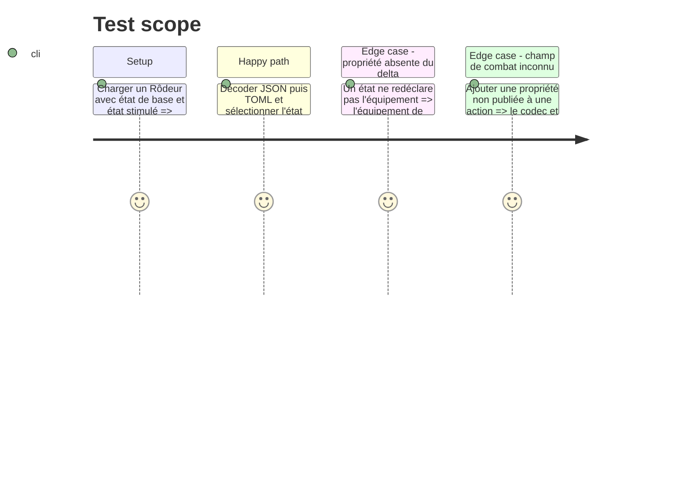

# Instruction: Contrat de profil et deltas d'état Monstre

## Architecture projection

> Tree of the final files. ✅ create · ✏️ modify · ❌ delete

```txt
src/
├── ✅ zod/common/combat.ts              # défense et action de créature structurées
├── ✅ zod/common/etat-monstre.ts        # delta complet, réutilisable et strict d'un état de créature
├── ✏️ zod/adrenaline/monstre.ts         # remplace le delta partiel et expose l'état actif
└── ✏️ codecs/documents.ts                # publie un résolveur déterministe de l'état actif
```

## User Journey



## Tasks to do

### `1)` Structurer le combat observé sur la carte Monstre

> Éviter de cacher défense, attaques, dés de dégâts, effets et conditions dans une chaîne libre.

1. Ajouter des objets stricts pour la défense et les actions de créature, avec leurs valeurs, dégâts, effets et conditions affichables.
2. Préserver `competences` pour les tests génériques et documenter la distinction entre compétence et action de combat.
3. Lier les informations actuellement libres de la référence (`Défense`, attaques, dégâts, bonus, contagion par attaque) à des champs portables.

### `2)` Généraliser l'état alternatif en delta complet

> Permettre de représenter sans perte les blocs « Stimulé » et « Non stimulé » de la référence.

1. Remplacer l'état alternatif réduit par une collection d'états identifiés et un état actif explicite, avec compatibilité de lecture du cas actuel pendant la migration.
2. Autoriser dans un delta chaque propriété pertinente du profil : caractéristiques, santé, protections, défense, détection, déplacement, actions, comportement, compétences, équipement, traits et contagion.
3. Définir précisément l'héritage : absence dans le delta signifie reprise de la base ; présence remplace la valeur correspondante sans fusion implicite ambiguë.
4. Exporter un résolveur fournisseur qui reçoit un Monstre et son état actif, applique les règles d'héritage et retourne une vue prête à rendre ; Lantern et Handbook ne réimplémentent aucune fusion.

### `3)` Définir la compatibilité de migration

> Permettre la lecture des fichiers déjà publiés avant de les geler avec les autres ajouts.

1. Définir la lecture de l'ancien `etatAlternatif` et sa normalisation sans dégrader les documents historiques.
2. Rejeter les documents qui mélangent l'ancien et le nouveau format de manière contradictoire.
3. Reporter le bump et le gel unique après l'ajout de l'état de partie de la phase 3.

## Test Scope



## Test acceptance criteria

| Task | Acceptance criteria |
| --- | --- |
| 1 | Une défense et chaque action de la référence Monstre sont portées par des champs structurés, validés et exportés. |
| 2 | Un état de créature peut différer de sa base sur tous les blocs visibles de la carte sans perdre les valeurs héritées, et le résolveur fournisseur restitue cette vue sans logique locale consommateur. |
| 3 | L'ancien format reste lisible, les formes contradictoires sont refusées et aucun gel n'est créé avant la forme complète. |
