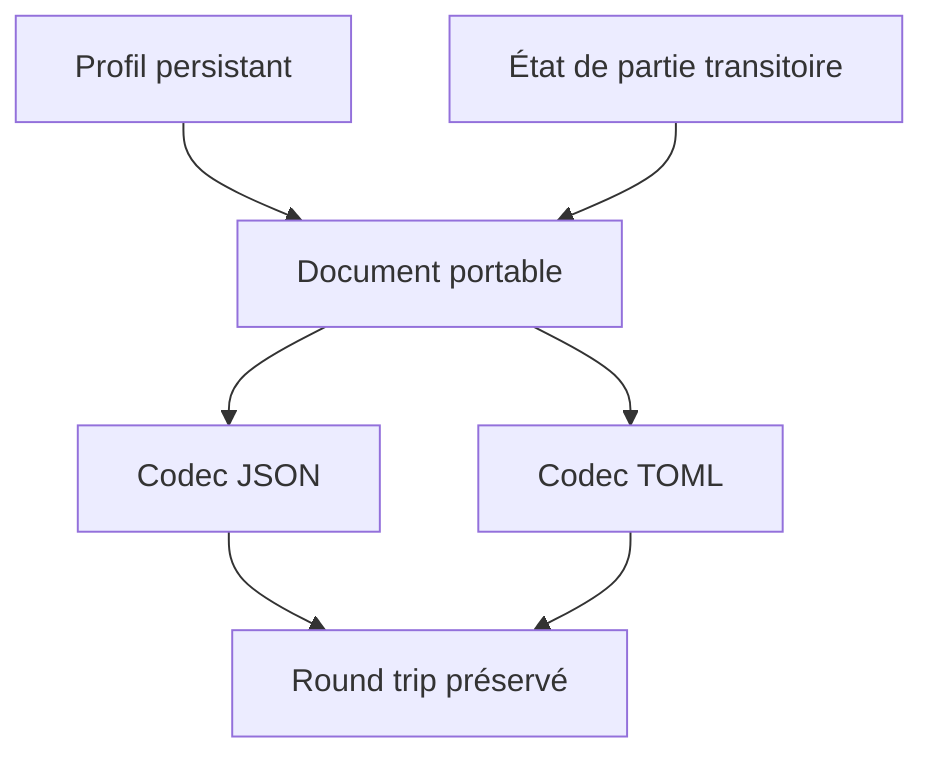
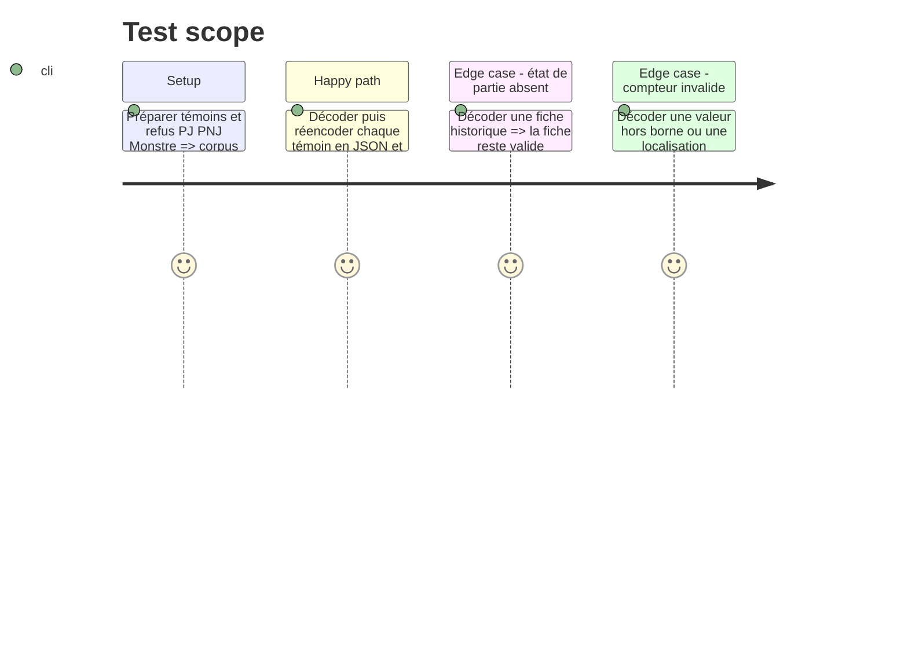

# Instruction: État de partie et corpus canonique

## Architecture projection

> Tree of the final files. ✅ create · ✏️ modify · ❌ delete

```txt
src/
├── ✅ zod/common/etat-de-partie.ts      # stress, malus, états encaissés et localisations de scène
├── ✏️ zod/adrenaline/pj.ts              # référence la couche d'état sans la confondre avec le profil
├── ✏️ zod/adrenaline/pnj.ts             # même capacité pour les trois formes de PNJ
├── ✏️ zod/adrenaline/monstre.ts         # état de scène de créature distinct de son delta de profil
├── ✏️ codecs/documents.ts               # garantit JSON/TOML et les plages sur les nouvelles données
├── ✏️ index.ts                           # exporte schémas, types et résolveur publics
├── ✏️ contract-version.ts                # déclare la baseline immuable complète
└── ✏️ validation/playable-ranges.ts      # couvre les compteurs bornés ajoutés
schemas/adrenaline/
├── ✏️ {pj,pnj,monstre}.schema.json       # dernières formes générées des trois cibles
└── ✅ 2.1.0/{pj,pnj,monstre}.schema.json # gel unique complet, sans modifier 2.0.0
examples/adrenaline/
├── ✏️ pj/survivante-complete.toml        # témoin de compteur et d'état encaissé
├── ✏️ pnj/pnj-majeur.toml                # témoin de carte PNJ active
└── ✏️ monstre/infecte-rodeur.toml        # témoin complet de la carte à deux états
corpus/
├── ✅ temoins/{pj,pnj,monstre}/etat-de-partie.json  # cas canoniques acceptés
├── ✅ refus/{pj,pnj,monstre}/etat-de-partie-invalide.json # frontières rejetées
└── ✏️ cases.json                         # indexe tout le corpus une seule fois
tools/
├── ✏️ validate-contract.ts               # confirme les nouveaux cas et les round trips
└── ✏️ audit-schemas.ts                   # audite descriptions, fermeture et bornes des ajouts
```

## User Journey



## Tasks to do

### `1)` Modéliser les compteurs de partie sans polluer le profil

> Conserver les dés de stress, malus, blessures/états et localisations visibles des fiches en tant qu'état dynamique distinct.

1. Définir les compteurs, niveaux et états avec identifiant, versant, localisation, durée et note lorsque la capture les distingue.
2. Réutiliser les localisations corporelles et émotionnelles publiées, sans inventer de listes propres aux consommateurs.
3. Autoriser l'absence totale de l'état de partie pour une fiche de référence, un export statique ou un figurant.

### `2)` Écrire les témoins et refus représentatifs

> Prouver les trois références plutôt qu'une forme abstraite seulement.

1. Représenter le PJ avec stress et états encaissés, le PNJ avec ses malus, et le Monstre avec son état insensible et son profil à deux états.
2. Ajouter les négatifs pour compteur hors borne, localisation incompatible, propriété inconnue et plage inversée.
3. Indexer chaque fichier dans le manifeste de corpus et contrôler les aller-retours JSON/TOML.

### `3)` Geler et exécuter la régression du contrat complet

> Garantir que la couverture augmente sans assouplir le contrat.

1. Bumper la baseline vers `2.1.0` une fois les évolutions PJ, PNJ et Monstre intégrées, puis régénérer les trois dernières formes et le seul gel `2.1.0`.
2. Lancer typecheck, génération, validations d'exemples, contrat et audit ; vérifier que `2.0.0` demeure bit à bit identique.
3. Vérifier que les anciens exemples restent décodables sans champs d'état ni état actif déclaré, et que chaque valeur numérique nouvelle a description et deux bornes.

## Test Scope



## Test acceptance criteria

| Task | Acceptance criteria |
| --- | --- |
| 1 | Les informations transitoires observées sont représentables sans modifier la signification des propriétés persistantes. |
| 2 | Chaque nouvelle capacité possède au moins un témoin et un refus par cible concernée, intégrés au manifeste. |
| 3 | Les codecs préservent les nouvelles données sur un aller-retour et refusent les formes interdites ; `2.0.0` reste intact tandis que `2.1.0` est le gel unique de la forme complète. |
