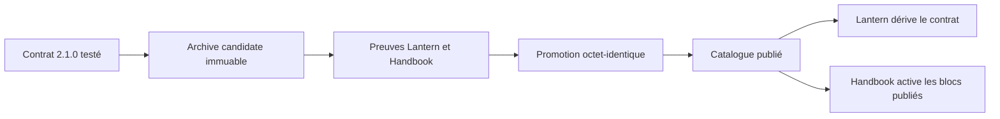
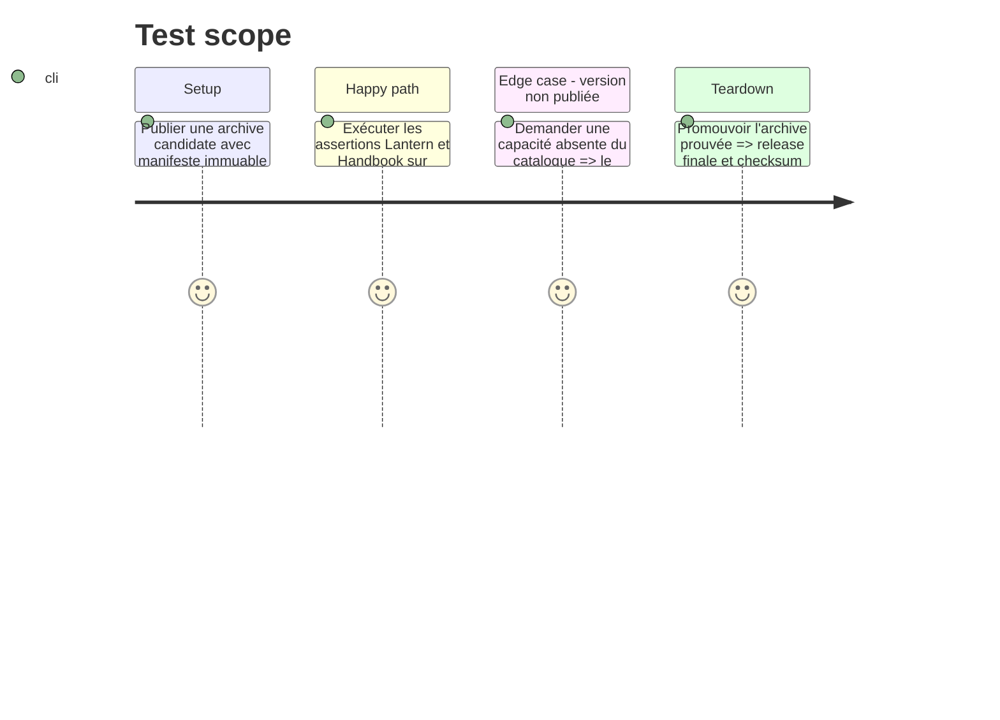

# Instruction: Publication versionnée et adoption des consommateurs

## Architecture projection

> Tree of the final files. ✅ create · ✏️ modify · ❌ delete

```txt
schema-adrenaline/
├── ✏️ package.json                       # version de package et exports de la baseline publiée
├── ✏️ package-lock.json                  # verrouille la version de package publiée
├── ✏️ handbook.json                      # aligne la version du catalogue de pack
├── ✏️ handbook/adrenaline/pack.json      # aligne la version et déclare les capacités consommées
├── ✏️ CHANGELOG.md                       # note l'évolution de contrat et la migration
├── ✏️ README.md                          # documente les profils, états de partie et compatibilité 2.0.0/2.1.0
└── ✏️ release-train/                     # manifeste candidat/final de la version publiée
lantern/                                  # dépôt consommateur, après publication
└── ✏️ assertions et rendu Monstre         # dérivent version/capacités du catalogue publié
obsidian-handbook/                        # dépôt consommateur, après publication
└── ✏️ assertions et rendu Monstre         # active les blocs publiés par capacité `block:*`
```

## User Journey



## Tasks to do

### `1)` Préparer une publication compatible

> Livrer une nouvelle baseline sans altérer les consommateurs de `2.0.0`.

1. Bumper ensemble `package.json`, `package-lock.json`, `handbook.json` et le pack à la prochaine mineure SemVer disponible ; consigner la migration depuis la forme d'état alternative existante.
2. Vérifier que les contrats gelés, le paquet, le catalogue et le pack déclarent les versions et baseline `2.1.0` cohérentes.
3. Préparer le manifeste du train avec archive candidate, SHA-256, commit fournisseur et commits consommateurs immuables.

### `2)` Faire adopter le contrat publié par Lantern et Handbook

> Ajouter le rendu et les assertions au bon endroit, sans repli sémantique local.

1. Dans Lantern, importer le catalogue et le manifeste publiés, puis tester l'état actif et les actions/défense de créature.
2. Dans Handbook, découvrir et activer le bloc Monstre via la capacité publiée existante `block:adrenaline-monstre`, puis rendre profil et état de partie.
3. Ajouter dans les deux dépôts des preuves qui lisent l'archive candidate et valident le contenu rendu, jamais une version codée en dur.

### `3)` Promouvoir une seule fois et vérifier

> Publier exactement les octets qui ont été prouvés par les consommateurs.

1. Exécuter le train candidat et vérifier son manifeste, les SHA-256 et les preuves détachées.
2. Comparer l'archive candidate à `npm pack`, puis attacher les mêmes octets et leur checksum au tag final immuable.
3. Vérifier release, catalogue, adoption Lantern/Handbook et versioning après promotion ; ne créer ni workflow ni exécution supplémentaire hors cette promotion finale explicitement validée.

## Test Scope



## Test acceptance criteria

| Task | Acceptance criteria |
| --- | --- |
| 1 | La nouvelle baseline est publiée sans mutation de `2.0.0` et avec une migration explicite. |
| 2 | Lantern et Handbook dérivent version et capacités de la publication, puis restituent les nouvelles données. |
| 3 | La release finale contient exactement l'archive candidate vérifiée par les deux consommateurs. |
