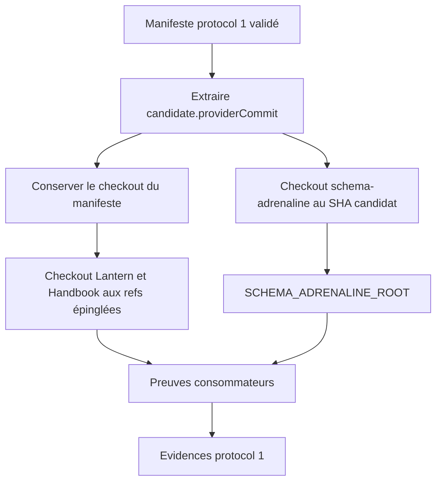
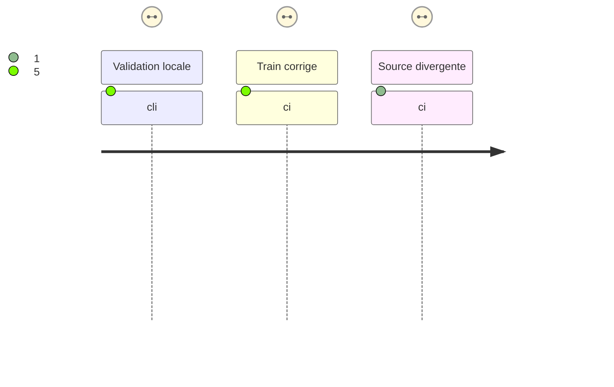

# Instruction: Matérialiser la source fournisseur exacte

## Architecture projection

> Tree of the final files. ✅ create · ✏️ modify

```txt
.
└── .github/workflows/
    └── release-train.yml  ✏️ extraire providerCommit, checkout le fournisseur à ce SHA et injecter ce chemin dans les preuves
```

## User Journey



## Test Scope



## Completed evidence

- Le commit [`cc5d20a`](https://github.com/RebelliousSmile/schema-adrenaline/commit/cc5d20a20cfda8a2d78842c5fdd196b37dc7d5c9) expose `candidate_provider_commit`, checkout `schema-adrenaline` à cette sortie avec l'historique complet, et transmet ce répertoire à `SCHEMA_ADRENALINE_ROOT`.
- Le [run Release train 35988789960](https://github.com/RebelliousSmile/schema-adrenaline/actions/runs/35988789960) a réussi : les trois checkouts, les preuves Lantern et Handbook, la vérification fournisseur, et l'upload de l'artefact ont tous terminé avec succès.

## Tasks to do

### `1)` Exposer le SHA candidat validé au workflow

> Faire sortir `candidate.providerCommit` sous le nom `candidate_provider_commit` après `release-train:assert`, avec le même mécanisme qui expose les refs Lantern et Handbook.

1. Étendre la commande Node de l'étape `Validate committed candidate manifest` pour écrire un output `candidate_provider_commit` contenant exclusivement le SHA complet `candidate.providerCommit`.
2. Garder la validation du chemin et du JSON avant toute utilisation de cet output ; aucun SHA ne doit être fourni par un input, une branche ou un tag mutable.

### `2)` Ajouter le checkout candidat et l'injecter aux consommateurs

> Mettre à disposition un dépôt fournisseur dont `HEAD`, le tag RC et `origin` correspondent tous au contrat Handbook.

1. Ajouter après la validation du manifeste un checkout `actions/checkout` de `RebelliousSmile/schema-adrenaline`, dans un répertoire dédié, avec `ref: ${{ steps.train.outputs.candidate_provider_commit }}` et un historique suffisant pour résoudre `v2.5.0-rc.2^{commit}`.
2. Conserver les checkouts Lantern et Handbook sur les sorties de refs existantes.
3. Remplacer l'environnement global qui pointe vers `${{ github.workspace }}` par le chemin du checkout candidat dédié, uniquement autour des commandes de preuves consommateurs.
4. Conserver la copie du manifeste, les installations verrouillées et la vérification fournisseur des deux fichiers evidence sans modifier leur protocole.

## Test acceptance criteria

| Task | Acceptance criteria |
| ---- | ------------------- |
| 1 | ✓ L'output `candidate_provider_commit` est le SHA complet issu du manifeste déjà accepté ; une candidate mal formée échoue avant le checkout. |
| 2 | ✓ Handbook reçoit un `SCHEMA_ADRENALINE_ROOT` dont `origin` est `RebelliousSmile/schema-adrenaline`, `HEAD` vaut `providerCommit`, et `v2.5.0-rc.2^{commit}` vaut le même SHA. |
| 2 | Le checkout qui contient le manifeste reste disponible pour ses copies et pour `verify-release-train-proofs`. |
| 2 | Une source dont `HEAD` diverge continue à être refusée par l'assertion Handbook ; le workflow ne contourne pas ce garde-fou. |
