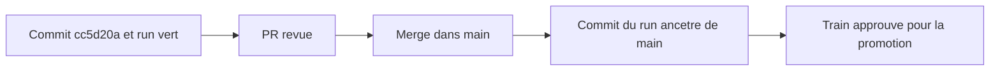
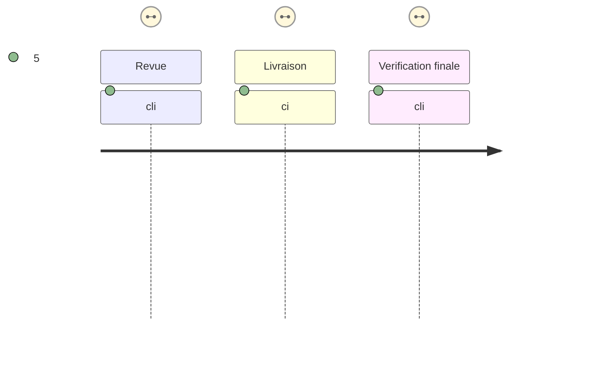

# Instruction: Intégrer le correctif et conserver son attestation

## Architecture projection

> Aucun nouveau fichier suivi : cette phase livre le commit déjà attesté, sans altérer le manifeste ni la candidate.

## User Journey

## Test Scope

## Tasks to do

### `1)` Revoir le correctif déjà attesté

> Confirmer que le commit candidat correspond au contrat, avant de le livrer.

1. Ouvrir une PR depuis `fix/release-train-candidate-source-root` contenant `cc5d20a` et vérifier que son diff se limite au checkout au SHA issu du manifeste et à sa documentation.
2. Rejouer `npm run release-train:self-test` et l'assertion du manifeste `release-train/schema-adrenaline-v2.5.0.json` sur ce commit si la CI de la PR ne les couvre pas.
3. Vérifier que le workflow ne contient ni ref de branche pour le checkout candidat, ni chemin fournisseur ambigu, et que le run vert 35988789960 est bien attaché à `cc5d20a`.

### `2)` Livrer sans invalider le train approuvé

> Rattacher la preuve existante à l'historique qui sera éventuellement tagué.

1. Merger la PR en conservant `cc5d20a` comme ancêtre de `main` ; un merge commit est acceptable car le garde-fou de release vérifie l'ancestry du run, non son égalité stricte avec le tag.
2. Contrôler que le SHA du manifeste dans `main` est identique à celui vu par le run 35988789960 et que `cc5d20a` est ancêtre du commit de livraison.
3. Conserver le lien du run et l'artefact `release-train-proofs` : les deux JSON doivent identifier la candidate `v2.5.0-rc.2`, le `providerCommit` `31c4576bc45e1fc16e4bf6592d3f3d62e7cf8b58` et leurs refs consommateurs épinglées.
4. Reporter le lien du run vert dans l'issue #32, puis seulement reprendre sa phase de promotion stable séparée.

## Test acceptance criteria

| Task | Acceptance criteria |
| ---- | ------------------- |
| 1 | La PR ne contient que le correctif déjà validé, et les auto-tests comme l'assertion du manifeste passent sans modification de la candidate ni de ses consommateurs. |
| 2 | `cc5d20a` est ancêtre du commit de livraison ; le run 35988789960 devient donc un train approuvé pour le garde-fou de release. |
| 2 | L'artefact contient exactement `lantern-proof.json` et `handbook-proof.json`, cohérents avec le manifeste immuable. |
| 2 | Le plan de promotion v2.5.0 reste bloqué tant que l'intégration et la référence de ce run vert dans #32 ne sont pas établies ; aucun tag stable n'est créé dans cette tâche. |
